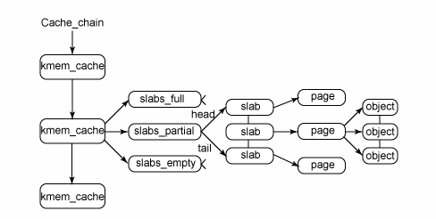

程序在运行时所有的数据结构的分配都是在堆和栈上进行的，而堆和栈都是建立在内存之上。内存作为现代计算机运行的核心，CPU可以直接访问的通用存储只有内存和处理器内置的寄存器，所有的代码都需要装载到内存之后才能让CPU通过指令寄存器找到相应的地址进行访问。

## 地址空间和MMU

内存管理单元(MMU)是硬件提供的最底层的内存管理机制，是CPU的一部分，用来管理内存的控制线路，提供把虚拟地址映射为物理地址的能力。

在x86体系结构下，CPU对内存的寻址都是通过分段方式进行的。其工作流程为：CPU生成逻辑地址并交给分段单元。分段单元为每个逻辑地址生成一个线性地址。然后线性地址交给分页单元，以生成内存的物理地址。因此也就是分段和分页单元组成了内存管理单元(MMU)。


其中： + 虚拟地址：在段中的偏移地址 + 线性地址：在某个段中“基地址+偏移地址”得出的地址 + 物理地址：在x86中，MMU还提供了分页机制，假如没有开启分页机制，那么线性地址就等于物理地址；否则还需要经过分页机制换算后线性地址才能转换成物理地址。 一个段是由“基地址+段界限（该段长度）+类型”组成，主要确定了段的起始地址，段的界限长度和确定段的属性如是否可读、可写、段的基本粒度单位、表述该段是数据段还是代码段等。 分段允许进程的物理地址空间是非连续的，分页则是提供这一优势的另外一种内存管理方案，并且**分页避免了外部碎片和紧缩，分段却不可以**。在x86体系中MMU支持多级的分页模型，主要分为以下三种情况： 1. 32为系统分为2级分页模型 2. 32位系统开启了物理地址扩展模式（PAE），则分为3级分页模型 3. 64位系统分为4级分页模型 80x86的分页机制由CR0中的PG位开启，若PG=0则禁用分页机制，也就是直接将线性地址作为物理地址。32位的线性地址主要分为三个部分：


* 22-31位指向页目录表中的某一项，页目录表中的每一项存有4子节地址指向页表。所以页表目录大小为4 * 2<sup>10</sup> = 4K
* 12-21位指向页表中的某一项，页表大小与页目录表相同为4K
* 一个物理页为4K，刚好0-11位指向页表中的偏移，一个页表刚好4K(2<sup>12</sup>)

页表和页目录表可以存放在内存的任何地方，当分页机制开启后，需要让CR3寄存器指向页目录表的起始地址。

> CR0-CR4这五个寄存器为系统内的控制寄存器，与分页机制密切相关。
> CR0控制寄存器是一些特殊的寄存器，可以控制CPU的一些重要特性；
> CR1是未定义的控制寄存器，供将来使用；
> CR2是页故障线性地址寄存器，保存最后一次出现页故障的全32位线性地址；
> CR3是页目录基址寄存器，保存页目录表的物理地址（页目录表总是放在4k为单位的存储器边界上，因此其低12位总为0不起作用，即使写上内容也不会被理会）
> CR4在Pentium系列（包括486后期版本）处理器中才出现，处理事务包括何时启用虚拟8086模式等。

### Linux中的分段与分页

MMU在保护模式下分段数据主要定义在GDT中。

```c
//arch/x86/kernel/cpu/common.c

DEFINE_PER_CPU_PAGE_ALIGNED(struct gdt_page, gdt_page) = { .gdt = {
...
    [GDT_ENTRY_KERNEL_CS]       = GDT_ENTRY_INIT(0xc09a, 0, 0xfffff), //代码段
    [GDT_ENTRY_KERNEL_DS]       = GDT_ENTRY_INIT(0xc092, 0, 0xfffff), //数据段
    [GDT_ENTRY_DEFAULT_USER_CS] = GDT_ENTRY_INIT(0xc0fa, 0, 0xfffff),
    [GDT_ENTRY_DEFAULT_USER_DS] = GDT_ENTRY_INIT(0xc0f2, 0, 0xfffff),
...
} };
EXPORT_PER_CPU_SYMBOL_GPL(gdt_page);
```

通过代码可知道这些段的基地址都是0，界限为4G。说明Linux只定义了一个段，并没有真正利用分段机制。

Linux中只用了一个段，而且基地址从0开始，那么在程序中使用的虚地址就是线性地址了。Linux为了兼容64位、32位及其PAE扩展情况，在代码中通过4级分页机制来做兼容。

## Linux的内存分配与管理

在32位的x86设备中，Linux为每个进程分配的虚拟地址空间都是0-4GB，其中

* 0-3GB用于用户态使用
* 3GB-3GB+896MB映射到物理地址的0-896MB处，作为内核态地址空间
* 3GB+896MB-4GB之间的128MB空间用于vmalloc保留区域，该区域用于kmalloc、kmap固定地址映射等功能，可以让内核访问高端物理地址空间


Linux中进程的地址空间由mm_struct来描述，一个进程只会有一个mm_struct。系统中的内核态是共享的，不会发生缺页中断或者访问用户进程空间，所以内核线程的task_struct->mm为NULL。

页表的分配分为两个部分：

1、内核页表，也就是在系统启动中，最后会在paging_init函数中，把ZONE_DMA和ZONE_NORMAL区域的物理页面与虚拟地址空间的3GB-3GB+896MB进行直接映射<br>
2、内核高端地址和用户态地址，都是通过MMU机制修改线性地址（虚拟地址）和物理地址的映射关系，然后刷新页表缓存来达到的<br>

> 物理内存中ZONE_DMA的范围是0-16MB，该区域的物理页面专门供IO设备的DMA使用，之所以要单独管理DMA的物理页面，是因为DMA使用物理地址访问内存不经过MMU，并且需要连续的缓冲区。为了能够提供物理上的连续缓冲区，必须从物理地址专门划分出一段区域用于DMA。 ZONE_NORMAL的范围是16MB-896MB，该区域的物理页面是内核能够直接使用的。 ZONE_HIGHMEM的范围是896MB-结束，该区域即高端内存，内核不能直接使用。

### 伙伴系统
对于物理内存经过频繁地申请和释放后会产生外部碎片，Linux通过伙伴系统来解决外部碎片的问题。

满足:<br>
1.具有相同的大小；<br>
2.物理地址连续条件的两个块为伙伴。主要实现思路位伙伴系统在申请内存的时候让最小的块满足申请的需求，在归还的时候，尽量让连续的小块内存伙伴合并成大块，降低外部碎片出现的可能性。<br>

在Linux系统中伙伴系统维护了11个块链表，每个块链表分别包含了大小为2<sup>0</sup>-2<sup>11</sup>个连续的物理页。对1024个页的最大请求对应着4MB大小的连续RAM块。每个快的第一个页框的物理地址就是该块大小的整数倍。如大小为16个页框的块，其起始地址为16×2<sup>12</sup>(2<sup>12</sup>=4KB这是一个页的大小)的倍数。

系统在初始化的时候把内各节点各区域都释放到伙伴系统中，每个区域还维护了per-cpu高速缓存来处理单页的分配，各个区域都通过伙伴算法进行物理内存的分配。

### slab分配器

Linux系统通过伙伴算法解决了外部碎片的问题，此外还提供了slab分配器来处理内部碎片的问题。slab分配器也是一种内存预分配机制，是一种空间换时间的做法，并且其假定从slab分配器中获得的内存都是比页还小的小内存块。



slab的设计思想就是把若干的页框合在一起形成一大存储块——slab，并在这个slab中只存储同一类数据，这样就可以在这个slab内部打破页的界限，以该类型数据的大小来定义分配粒度，存放多个数据，这样就可以尽可能地减少页内碎片了。在Linux中，多个存储同类数据的slab的集合叫做一类对象的缓冲区——cache。注意，这不是硬件的那个cache，只是借用这个名词而已。

Linux中slab的可分为以下三种状态：

1、slabs_full：该链表中slab已经完全分配出去<br>
2、slabs_free：该链表中的slab都是空闲可分配状态<br>
3、labs_partial：该链表中的slab部分已经被分配出去了<br>

其中slab代表物理地址连续的内存块，由1-N个物理页面组成，在一个slab中可以分配多个object对象。

slab的优点：

* 内核通常依赖于对小对象的分配，它们会在系统生命周期内进行无数次分配。slab 缓存分配器通过对类似大小的对象进行缓存而提供这种功能，从而避免了常见的碎片问题；
* slab 分配器还支持通用对象的初始化，从而避免了为同一目的而对一个对象重复进行初始化；
* slab 分配器还可以支持硬件缓存对齐和着色，这允许不同缓存中的对象占用相同的缓存行，从而提高缓存的利用率并获得更好的性能。

slab的缺点：

* 较多复杂的队列管理。在slab分配器中存在众多的队列，例如针对处理器的本地缓存队列，slab中空闲队列，每个slab处于一个特定状态的队列之中。
* slab管理数据和队列的存储开销比较大。每个slab需要一个struct slab数据结构和一个管理者kmem_bufctl_t型的数组。当对象体积较小时，该数组将造成较大的开销（比如对象大小为32字节时，将浪费1/8空间）。同时，缓冲区针对节点和处理器的队列也会浪费不少内存。
* 缓冲区回收、性能调试调优比较复杂。


### 内核态内存管理

根据之前的的Linux的内存管理机制，即伙伴系统和slab分配器。对于内核态的内存分配主要通过函数kmalloc和vmalloc完成。


其中kmalloc函数可以为内核申请连续物理地址的内存空间，由于kmalloc是基于slab分配器实现的，所以比较适合较小块的内存申请。kmalloc函数的调用过程为：`kmalloc->__kmalloc->__do_kmalloc`，其中`__do_kmalloc`的实现主要分为两步：

1、通过`kmalloc_slab`找到一个合适的`kmem_cache`缓存<br>
2、通过`slab_alloc`向slab分配器申请对象内存空间<br>

Linux提供的vmalloc函数可以获得连续的虚拟空间，但是其物理内存不一定连续。vmalloc函数的调用过程为：`vmalloc->__vmalloc_node_flags->__vmalloc_node->__vmalloc_node_range`。其中`__vmalloc_node_range`函数也分为两步：

1、通过`__get_vm_area_node`分配一个可用的虚拟地址空间<br>
2、`__vmalloc_node_range`通过`alloc_pages`一页一页申请物理内存，再为刚才申请的虚拟地址空间分配物理页表映射<br>
