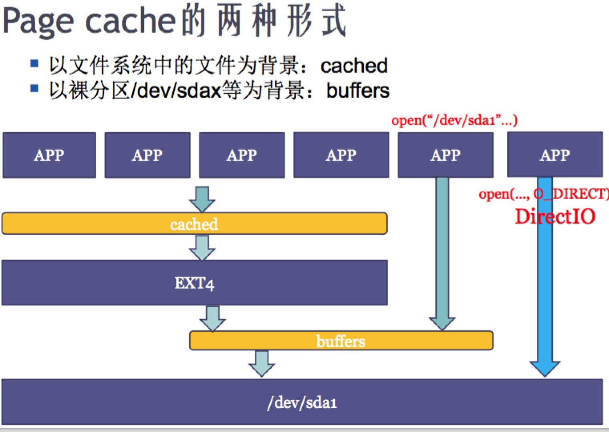
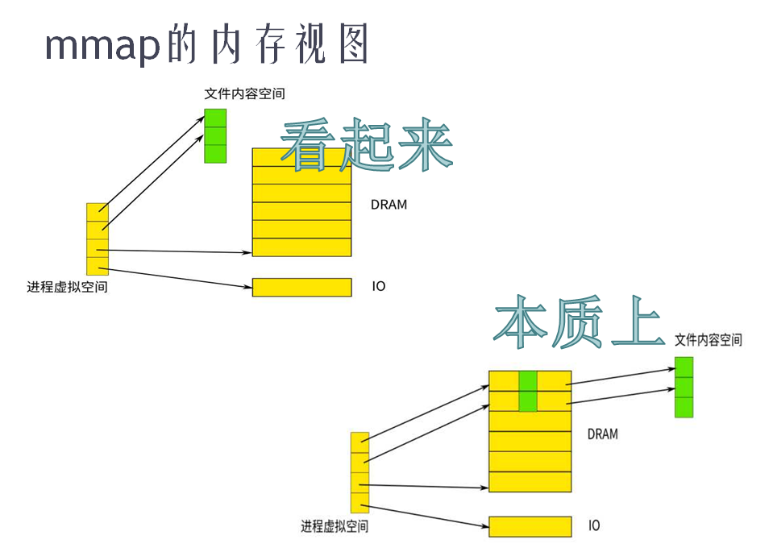
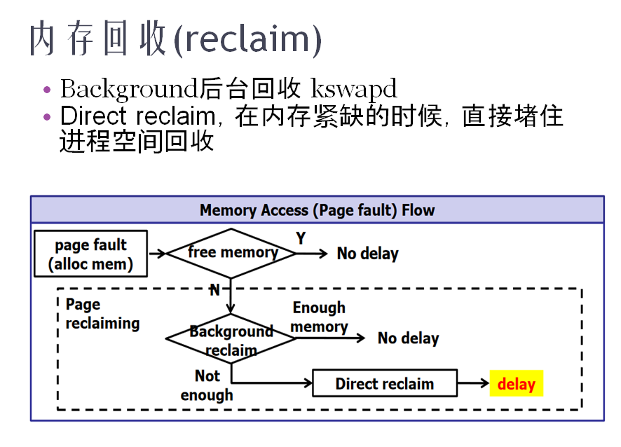
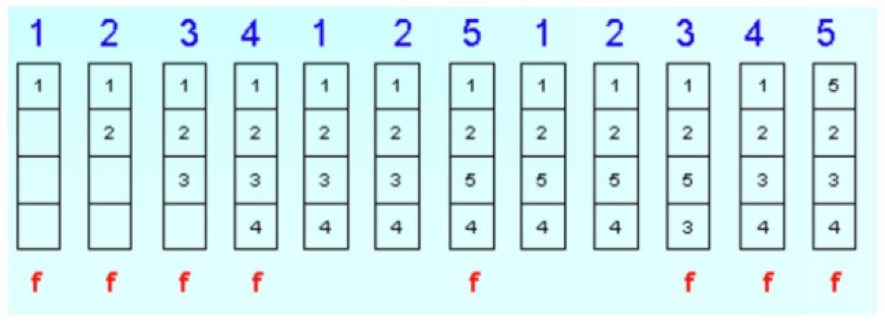
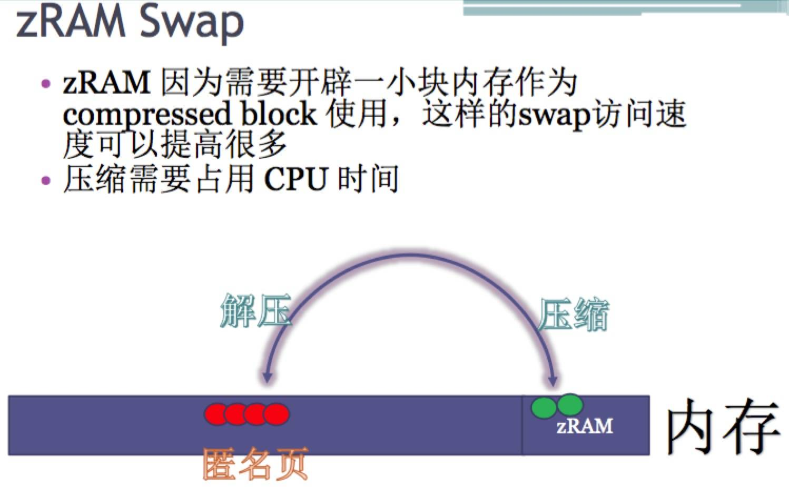

## 内存与I/O的交换
堆、栈、代码段是否常驻内存？本文主要介绍两类不同的页面，以及这两类页面如何在内存和磁盘间进行交换？以及内存和磁盘的颠簸行为- swaping，和硬盘的swap分区。

### page cache

**file-backed的页面**：（有文件背景的页面，比如代码段、比如read/write方法读写的文件、比如mmap读写的文件；他们有对应的硬盘文件，因此如果要交换，可以直接和硬盘对应的文件进行交换），此部分页面进page cache。

**匿名页**：匿名页，如stack，heap，CoW后的数据段等；他们没有对应的硬盘文件，因此如果要交换，只能交换到虚拟内存-swapfile或者Linux的swap硬盘分区），此部分页面，如果系统内存不充分，可以被swap到swapfile或者硬盘的swap分区。


内核通过两种方式打开硬盘的文件，**任何时候打开文件，Linux会申请一个page cache，然后把文件读到page cache里。**page cache 是内存针对硬盘的缓存。

Linux读写文件有两种方式：read/write 和 mmap

1）read/write: read会把内核空间的page cache，往用户空间的buffer拷贝。<br>
参数 fd, buffer, size ，write只是把用户空间的buffer拷贝到内核空间的page cache。

2）mmap：可以避免内核空间到用户空间拷贝的过程，直接把文件映射成一个虚拟地址指针，指向linux内核申请的page cache。也就知道page cache和硬盘里文件的对应关系。

参数 fd,

文件对于应用程序，只是一部分内存。Linux使用write写文件，只是把文件写进内存，并没有sync。而内存的数据和硬盘交换的功能去完成。

ELF可执行程序的头部会记录，从xxx到xxx是代码段。把代码段映射到虚拟地址，0～3 G, 权限是RX。这段地址映射到内核空间的page cache, 这段page cache又映射到可执行程序。

page cache，会根据LRU算法（最近最少使用）进行替换。

demo演示 page cache会多大程度影响程序执行时间。

```
echo 3 > /proc/sys/vm/drop_caches
time python hello.py
\time -v python hello.py

root@whale:/home/gzzhangyi2015# \time -v python hello.py
Hello World! Love, Python
	Command being timed: "python hello.py"
	User time (seconds): 0.01
	System time (seconds): 0.00
	Percent of CPU this job got: 40%
	Elapsed (wall clock) time (h:mm:ss or m:ss): 0:00.03
	Average shared text size (kbytes): 0
	Average unshared data size (kbytes): 0
	Average stack size (kbytes): 0
	Average total size (kbytes): 0
	Maximum resident set size (kbytes): 6544
	Average resident set size (kbytes): 0
	Major (requiring I/O) page faults: 10
	Minor (reclaiming a frame) page faults: 778
	Voluntary context switches: 54
	Involuntary context switches: 9
	Swaps: 0
	File system inputs: 6528
	File system outputs: 0
	Socket messages sent: 0
	Socket messages received: 0
	Signals delivered: 0
	Page size (bytes): 4096
	Exit status: 0
    
root@whale:/home/gzzhangyi2015# \time -v python hello.py
Hello World! Love, Python
	Command being timed: "python hello.py"
	User time (seconds): 0.01
	System time (seconds): 0.00
	Percent of CPU this job got: 84%
	Elapsed (wall clock) time (h:mm:ss or m:ss): 0:00.01
	Average shared text size (kbytes): 0
	Average unshared data size (kbytes): 0
	Average stack size (kbytes): 0
	Average total size (kbytes): 0
	Maximum resident set size (kbytes): 6624
	Average resident set size (kbytes): 0
	Major (requiring I/O) page faults: 0
	Minor (reclaiming a frame) page faults: 770
	Voluntary context switches: 1
	Involuntary context switches: 4
	Swaps: 0
	File system inputs: 0
	File system outputs: 0
	Socket messages sent: 0
	Socket messages received: 0
	Signals delivered: 0
	Page size (bytes): 4096
	Exit status: 0
```

总结：Linux有两种方式读取文件，不管以何种方式读文件，都会产生page cache 。

### free命令的详细解释

```
             total       used       free     shared    buffers     cached
Mem:      49537244    1667532   47869712     146808      21652     421268
-/+ buffers/cache:    1224612   48312632
Swap:      4194300          0    4194300
```



buffers/cache都是文件系统的缓存，当访问ext3/ext4,fat等文件系统中的文件，产生cache。当直接访问裸分区（/dev/sdax）时，产生buffer。

访问裸分区的用户，主要是应用程序直接打开 or 文件系统本身。dd命令 or 硬盘备份 or sd卡，会访问裸分区，产生的缓存就是buffer。而ext4文件系统把硬盘当作裸分区。

buffer和cache没有本质的区别，只是背景的区别。

-/+ buffer/cache 的公式<br>
used buffers/cache = used - buffers - cached<br>
free buffers/cache = free + buffers + cached

新版free<br>
available参数：评估出有多少空闲内存给应用程序使用，free + 可回收的。



### File-backed和Anonymous page

* File-backed映射把进程的虚拟地址空间映射到files
  * 比如 代码段<br>
  * 比如 mmap一个字体文件<br>

* Anonymous映射是进程的虚拟地址空间没有映射到任何file<br>
  * Stack<br>
  * Heap<br>
  * CoW pages<br>

anonymous pages(没有任何文件背景)分配一个swapfile文件或者一个swap分区，来进行交换到磁盘的动作。

read/write和 mmap 本质上都是有文件背景的映射，把进程的虚拟地址空间映射到files。在内存中的副本，只是一个page cache。是page cache就有可能被踢出内存。CPU 内部的cache，当访问新的内存时，也会被踢出cache。

demo：演示进程的代码段是如何被踢出去的？

```
pidof firefox
cat /proc/<pid>/smaps

运行 oom.c

```
### swap以及zRAM

数据段，在未写过时，有文件背景。在写过之后，变成没有文件背景，就被当作匿名页。linux把swap分区，当作匿名页的文件背景。
```
swap(v.)，内存和硬盘之间的颠簸行为。 
swap(n.)，swap分区和swap文件，当作内存中匿名页的交换背景。在windows内，被称作虚拟内存。pagefile.sys
```
### 页面回收和LRU



回收匿名页和 回收有文件背景的页面。<br>
后台慢慢回收：通过kswapd进程，回收到高水位(high)时，才停止回收。从low -> high<br>
直接回收：当水位达到min水位，会在两种页面同时进行回收，回收比例通过swappiness越大，越倾向于回收匿名页；swappiness越小，越倾向于回收file-backed的页面。当然，它们的回收方法都是一样的LRU算法。

### Linux Page Replacement

用LRU算法来进行swap和page cache的页面替换。



```
现在cache的大小是4页，前四次，1，2，3，4文件被一次使用，注意第七次，5文件被使用，系统评估最近最少被使用的文件是3，那么不好意思，3被swap出去，5加载进来，依次类推。

所以LRU可能会触发page cache或者anonymous页与对应文件的数据交换。
```

### 嵌入式系统的zRAM



zRAM: 用内存来做swap分区。从内存中开辟一小段出来，模拟成硬盘分区，做交换分区，交换匿名页，自带透明压缩功能。当应用程序往zRAM写数据时，会自动把匿名页进行压缩。当应用程序访问匿名页时，内存页表里不命中，发生page fault（major）。从zRAM中把匿名页透明解压出来，还到内存。
