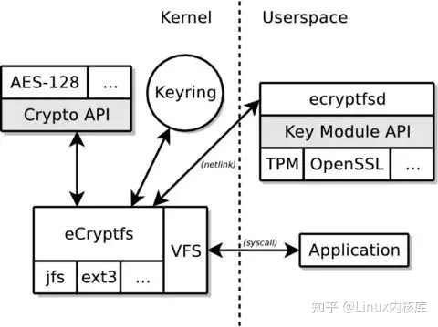
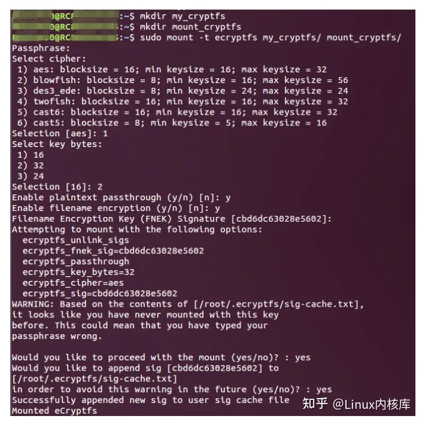
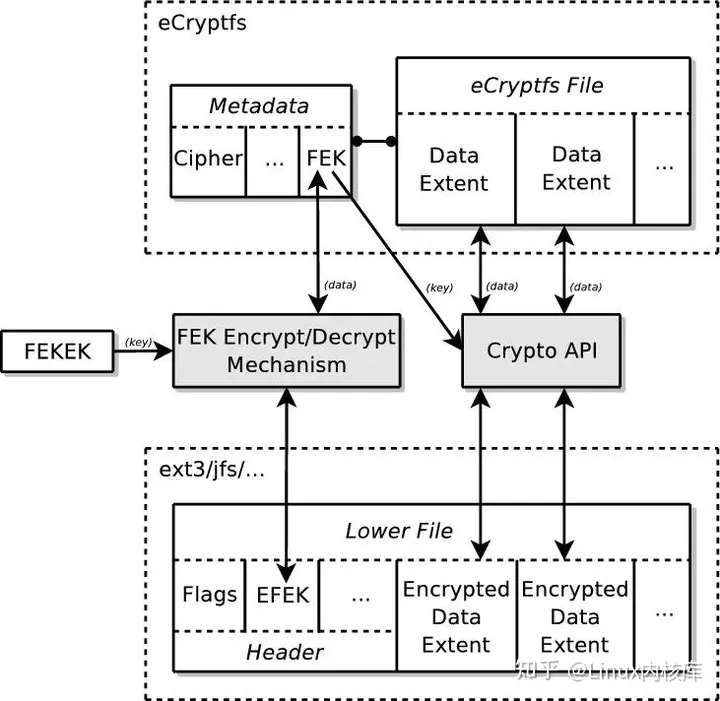
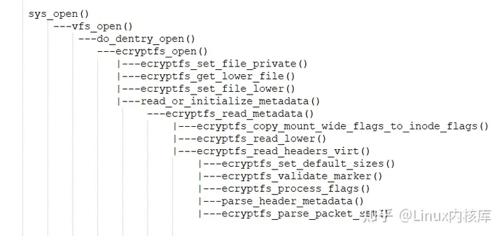
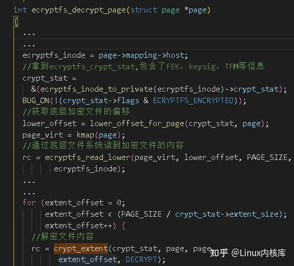
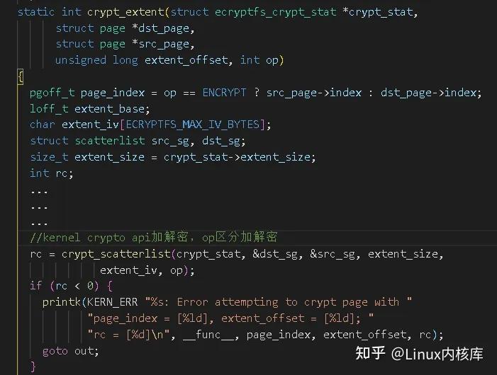
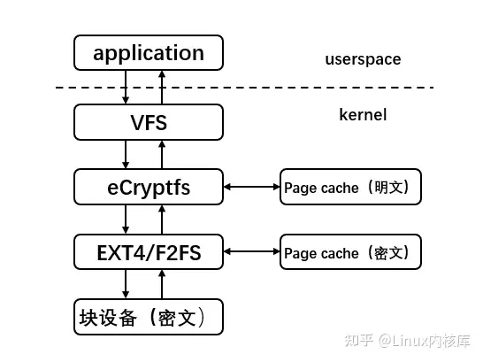

eCryptfs是在Linux内核2.6.19版本中，由IBM公司的Halcrow，Thompson等人引入的一个功能强大的企业级加密文件系统，它支持文件名和文件内容的加密。

## **1、eCryptfs架构设计**

> 图片摘自《eCryptfs: a Stacked Cryptographic Filesystem》

eCryptfs的架构设计如图所示。eCryptfs堆叠在底层文件系统之上，用户空间的eCryptfs daemon和内核的keyring共同负责秘钥的管理，当用户空间发起对加密文件的写操作时，由VFS转发给eCryptfs ，eCryptfs通过kernel Crypto API（AES,DES）对其进行加密操作，再转发给底层文件系统。读则相反。

eCryptfs 的加密设计受到OpenPGP规范的影响，其核心思想有以下两点：

### 1.1文件名与内容的加密

eCryptfs 采用对称秘钥加密算法来加密文件名及文件内容（如AES，DES等），秘钥FEK（FileEncryption Key）是随机分配的。相对多个加密文件使用同一个FEK，其安全性更高。

### 1.2FEK的加密

eCryptfs 使用用户提供的口令（Passphrase）、公开密钥算法（如 RSA 算法）或 TPM（Trusted Platform Module）的公钥来加密保护FEK。加密后的FEK称EFEK（Encrypted File Encryption Key），口令/公钥称为 FEFEK（File Encryption Key Encryption Key）。

## **2、eCryptfs的使用**

这里在ubuntu下演示eCryptfs的建立流程。

1.安装用户空间应用程序ecryptfs-utils

2.发起mount指令，在ecryptfs-utils的辅助下输入用户口令，选择加密算法，完成挂载。挂载成功后，将对my_cryptfs目录下的所有文件进行加密处理。

\3. 在加密目录下新增文件，当umount当前挂载目录后，再次查看该目录下文件时，可以看到文件已被加密处理过。

## **3、eCryptfs的加解密流程**

> 图片摘自《eCryptfs: a Stacked Cryptographic Filesystem》

eCryptfs对数据的加解密流程如图所示，对称密钥加密算法以块为单位进行加解密，如AES-128。eCryptfs 将加密文件分成多个逻辑块，称为 extent，extent 的大小默认等于物理页page的大小。加密文件的头部存放元数据Metadata，包括File Size，Flag，EFEK等等，目前元数据的最小长度是8192个字节。当eCryptfs发起读操作解密时，首先解密FEKEK拿到FEK,然后将加密文件对应的 extent读入到Page Cache，通过 Kernel Crypto API 解密；写操作加密则相反。

下面我们基于eCryptfs代码调用流程，简单跟踪下读写的加解密过程：

### 3.1eCryptfs_open流程

ecryptfs_open的函数调用流程如图所示，open函数主要功能是解析底层文件Head的metadata，从metadata中取出EFEK，通过kernel crypto解密得到FEK，保存在ecryptfs_crypt_stat结构体的key成员中，并初始化ecryptfs_crypt_stat对象，以便后续的读写加解密操作。具体的可以跟踪下ecryptfs_read_metadata函数的逻辑。

\2. eCryptfs_read流程

ecryptfs_decrypt_page()核心代码

crypt_extent()核心代码

## **4、eCryptfs的缺点**

### 4.1性能问题。

我们知道，堆叠式文件系统，对于性能的影响是无法忽略的，并且eCryptfs还涉及了加解密的操作，其性能问题应该更为突出。从公开资料显示，对于读操作影响较小，写操作性能影响很大。这是因为，eCryptfs的Page cache中存放的是明文，对于一段数据，只有首次读取需要解密，后续读操作将没有这些开销。但对于每次写入的数据，涉及的加密操作开销就会较大。

### 4.2安全隐患

上面讲到，eCryptfs的Page cache中存放的是明文，如果用户空间的权限设置不当或被攻破，那么这段数据将会暴露给所有应用程序。这部分是使用者需要考虑优化的方向。

## **5、结语**

本文主要对eCryptfs的整体架构做了简单阐述，可能在一些细节上还不够详尽，有兴趣的同学可以一起学习。近些年，随着处理器和存储性能的不断增强，eCryptfs的性能问题也在一直得到改善，其易部署、易使用、安全高效的优点正在日益凸显。
