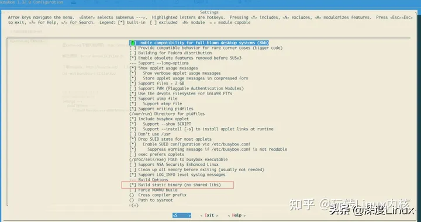
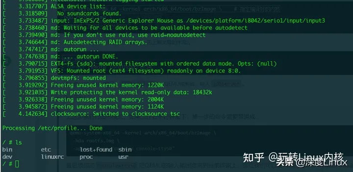
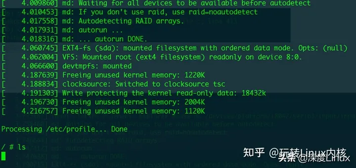

一个最小可运行Linux操作系统需要内核镜像bzImage和rootfs，本文整理了其制作、安装过程，调试命令，以及如何添加共享磁盘。

## 1、编译内核源码

从 The Linux Kernel Archives 网站下载内核源码，本文下载的版本为4.14.191，4.14.191源码下载。

使用wget获取源码。

> wget [https://mirrors.edge.kernel.org/pub/linux/kernel/v4.x/linux-4.14.191.tar.gz](https://link.zhihu.com/?target=https%3A//mirrors.edge.kernel.org/pub/linux/kernel/v4.x/linux-4.14.191.tar.gz)

解压源码：

> tar -xvf linux-4.14.191.tar.gz

解压后进入源码根目录linux-4.14.191，指定编译的架构，依次执行下面的命令，打开配置菜单。

```cpp
1cd linux-4.14.191
2
3export ARCH=x86
4
5make x86_64_defconfig
6
7make menuconfig
```

在配置菜单中，启用内核debug，关闭地址随机化，不然断点处无法停止。

```cpp
1Kernel hacking  ---> 
2    [*] Kernel debugging
3    Compile-time checks and compiler options  --->
4        [*] Compile the kernel with debug info
5        [*]   Provide GDB scripts for kernel debuggin
6
7
8Processor type and features ---->
9    [] Randomize the address of the kernel image (KASLR)
```

开始编译内核，-j 指定并行编译作业数。最终生成
linux-4.14.191/arch/x86_64/boot/bzImage文件。

```text
1make -j 20
```

内核编译完成。

## 2、配置Busybox

启动内核还需要一个具有根文件系统的磁盘镜像文件，根文件系统中提供可供交互的shell程序以及一些常用工具命令。

我们借助busybox工具来制作根文件系统。

本文使用1.32.0版本，下载busybox。

解压：

> tar -jxvf busybox-1.32.0.tar.bz2

进入busybox根目录，配置编译选项。

```cpp
1cd busybox-1.32.0
2make menuconfig
```

把busybox配置为静态编译。

```cpp
1 Settings  --->
2 [*] Build BusyBox as a static binary (no shared libs)
```

配置如下图所示。



## 3、制作rootfs

接下来制作rootfs镜像文件，并把busybox安装到其中。

使用dd命令创建文件，并格式化为ext4文件系统。

```cpp
1szp@r420-PowerEdge-R420:~/busybox-1.32.0$ dd if=/dev/zero of=rootfs.img bs=1M count=10
2
3szp@r420-PowerEdge-R420:~/busybox-1.32.0$ mkfs.ext4 rootfs.img
```

创建用于挂载该镜像文件的目录fs，挂载后才能往里面写入busybox。
使用mount命令将rootfs.img挂载到fs目录，编译busybox并写入fs目录中。

```cpp
1szp@r420-PowerEdge-R420:~$ mkdir fs
2
3szp@r420-PowerEdge-R420:~/busybox-1.32.0$ sudo mount -t ext4 -o loop rootfs.img ./fs
4
5szp@r420-PowerEdge-R420:~/busybox-1.32.0$ sudo make install CONFIG_PREFIX=./fs
```

接下来对写入的busybox进行补充配置。

```cpp
1szp@r420-PowerEdge-R420:~/busybox-1.32.0/fs$ sudo mkdir proc dev etc home mnt
2
3szp@r420-PowerEdge-R420:~/busybox-1.32.0/fs$ sudo cp -r ../examples/bootfloppy/etc/* etc/
4
5szp@r420-PowerEdge-R420:~/busybox-1.32.0$ sudo chmod -R 777 fs/
```

制作完成的rootfs目录如下：


最后，卸载rootfs.img

```text
1szp@r420-PowerEdge-R420:~/busybox-1.32.0$ sudo umount fs
```

至此，一个带有rootfs的磁盘镜像制作完成。

## 4、启动qemu

使用如下命令启动无GUI的qemu，参数含义如下：

> -kernel # 指定编译好的内核镜像
> -hda # 指定硬盘
> -append "root=/dev/sda" 指示根文件系统 console=ttyS0 把QEMU的输入输出定向到当前终端上
> -nographic 不使用图形输出窗口
> -s 是-gdb tcp::1234缩写，监听1234端口，在GDB中可以通过target remote localhost:1234连接

```text
1qemu-system-x86_64 -kernel ./linux-4.14.191/arch/x86_64/boot/bzImage  -hda ./busybox-1.32.0/rootfs.img  -append "root=/dev/sda console=ttyS0" -nographic
```

启动后如下图：



Ctrl+A 松开后按C退出qemu。

## 5、内核函数调试

启动命令中添加-s参数与-S参数启动qemu。

```cpp
1szp@r420-PowerEdge-R420:~$ qemu-system-x86_64 -kernel ~/linux-4.14.191/arch/x86_64/boot/bzImage  -hda ~/busybox-1.32.0/rootfs.img  -append "root=/dev/sda console=ttyS0" -s -S  -smp 1 -nographic
```

启动gdb远程调试。vmlinux文件在编译后的内核源码根目录下。

```cpp
1szp@r420-PowerEdge-R420:~$ gdb ./linux-4.14.191/vmlinux 
2
3(gdb) target remote localhost:1234
```

在new_sync_read函数添加断点，continue。


在系统中执行ls命令，触发new_sync_read函数，




至此，完成了qemu环境下使用gdb进行内核函数的调试。

## 6、添加共享磁盘

有时候需要在宿主机和qemu虚拟机之间共享文件，添加一个共享磁盘将有助于该项工作。

创建64MB磁盘镜像文件，并格式化为ext4，作为共享磁盘备用。

```cpp
1szp@r420-PowerEdge-R420:~/shadisk$ dd if=/dev/zero of=ext4.img bs=512 count=131072
2
3szp@r420-PowerEdge-R420:~/shadisk$ mkfs.ext4 ext4.img
```

修改qemu启动命令，使用-hdb增加一个磁盘。

```cpp
1qemu-system-x86_64 -kernel ~/linux-4.14.191/arch/x86_64/boot/bzImage  -hda ~/busybox-1.32.0/rootfs.img  -append "root=/dev/sda console=ttyS0" -s  -smp 1 -nographic -hdb ~/shadisk/ext4.img
```

进入qemu系统后使用mount命令挂载sdb到mnt目录。


在原系统中挂载ext4.img，实现qemu与原系统的文件共享。

```text
1szp@r420-PowerEdge-R420:~/shadisk$ sudo mount -t ext4 -o loop ext4.img ./share
```


至此，可以在宿主机器share目录下，与qemu中的虚拟机器进行文件共享。
