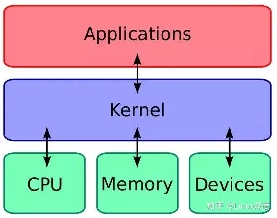
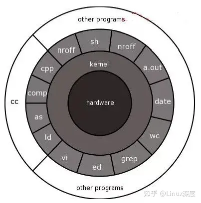
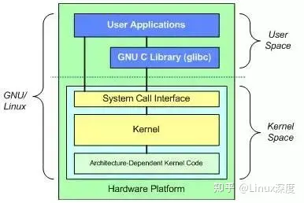
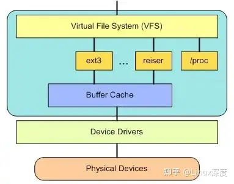
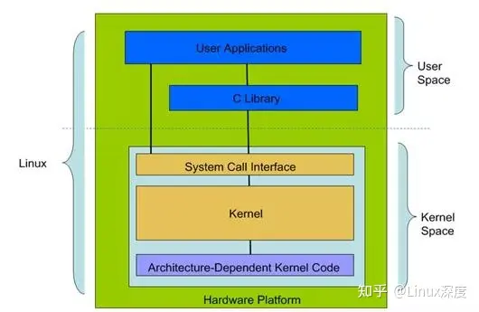
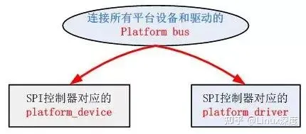
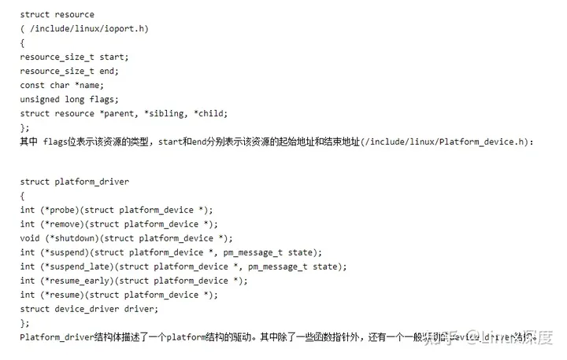
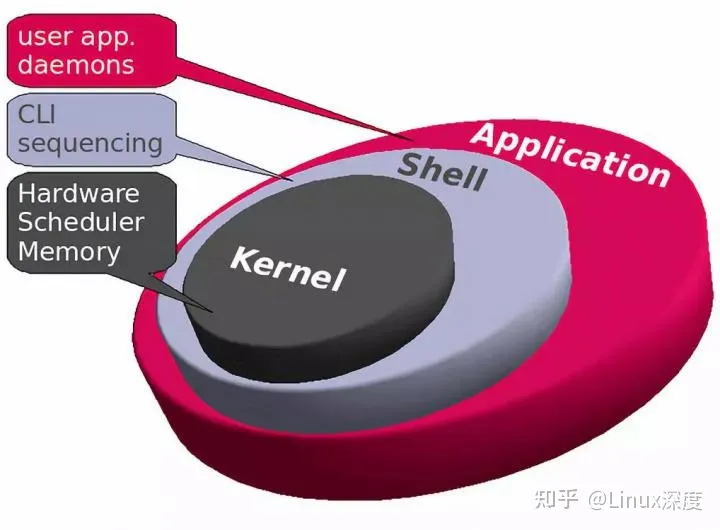

> **前言：**作用是将应用层序的请求传递给硬件，并充当底层驱动程序，对系统中的各种设备和组件进行寻址。目前支持模块的动态装卸(裁剪)。Linux内核就是基于这个策略实现的。Linux进程1.采用层次结构，每个进程都依赖于一个父进程。内核启动init程序作为第一个进程。该进程负责进一步的系统初始化操作。init进程是进程树的根，所有的进程都直接或者间接起源于该进程。virt/ ---- 提供虚拟机技术的支持。

## 1、Linux内核预备工作

**理解Linux内核最好预备的知识点：**

懂C语言
懂一点操作系统的知识
熟悉少量相关算法
懂计算机体系结构

**Linux内核的特点：**

结合了Unix操作系统的一些基础概念

**Linux内核的任务：**

1.从技术层面讲，内核是硬件与软件之间的一个中间层。作用是将应用层序的请求传递给硬件，并充当底层驱动程序，对系统中的各种设备和组件进行寻址。

2.从应用程序的层面讲，应用程序与硬件没有联系，只与内核有联系，内核是应用程序知道的层次中的最底层。在实际工作中内核抽象了相关细节。

3.内核是一个资源管理程序。负责将可用的共享资源(CPU时间、磁盘空间、网络连接等)分配得到各个系统进程。

4.内核就像一个库，提供了一组面向系统的命令。系统调用对于应用程序来说，就像调用普通函数一样。

**内核实现策略：**

1.微内核。最基本的功能由中央内核（微内核）实现。所有其他的功能都委托给一些独立进程，这些进程通过明确定义的通信接口与中心内核通信。

2.宏内核。内核的所有代码，包括子系统（如内存管理、文件管理、设备驱动程序）都打包到一个文件中。内核中的每一个函数都可以访问到内核中所有其他部分。目前支持模块的动态装卸(裁剪)。Linux内核就是基于这个策略实现的。

**哪些地方用到了内核机制？**

1.进程（在cpu的虚拟内存中分配地址空间，各个进程的地址空间完全独立;同时执行的进程数最多不超过cpu数目）之间进行通 信，需要使用特定的内核机制。

2.进程间切换(同时执行的进程数最多不超过cpu数目)，也需要用到内核机制。

进程切换也需要像FreeRTOS任务切换一样保存状态，并将进程置于闲置状态/恢复状态。

3.进程的调度。确认哪个进程运行多长的时间。

**Linux进程**

1.采用层次结构，每个进程都依赖于一个父进程。内核启动init程序作为第一个进程。该进程负责进一步的系统初始化操作。init进程是进程树的根，所有的进程都直接或者间接起源于该进程。

2.通过Pstree命令查询。实际上得系统第一个进程是Systemd，而不是init（这也是疑问点）

3.系统中每一个进程都有一个唯一标识符(ID),用户（或其他进程）可以使用ID来访问进程。

**Linux内核源代码的目录结构**

Linux内核源代码包括三个主要部分：

\1. 内核核心代码，包括第3章所描述的各个子系统和子模块，以及其它的支撑子系统，例如电源管理、Linux初始化等

\2. 其它非核心代码，例如库文件（因为Linux内核是一个自包含的内核，即内核不依赖其它的任何软件，自己就可以编译通过）、固件集合、KVM（虚拟机技术）等

\3. 编译脚本、配置文件、帮助文档、版权说明等辅助性文件。

**使用ls命令看到的内核源代码的顶层目录结构，具体描述如下：**

- include/ ---- 内核头文件，需要提供给外部模块（例如用户空间代码）使用。
- kernel/ ---- Linux内核的核心代码，包含了3.2小节所描述的进程调度子系统，以及和进程调度相关的模块。
- mm/ ---- 内存管理子系统（3.3小节）。
- fs/ ---- VFS子系统（3.4小节）。
- net/ ---- 不包括网络设备驱动的网络子系统（3.5小节）。
- ipc/ ---- IPC（进程间通信）子系统。
- arch// ---- 体系结构相关的代码，例如arm, x86等等。
- arch//mach- ---- 具体的machine/board相关的代码。
- arch//include/asm ---- 体系结构相关的头文件。
- arch//boot/dts ---- 设备树（Device Tree）文件。
- init/ ---- Linux系统启动初始化相关的代码。
- block/ ---- 提供块设备的层次。
- sound/ ---- 音频相关的驱动及子系统，可以看作“音频子系统”。
- drivers/ ---- 设备驱动（在Linux kernel 3.10中，设备驱动占了49.4的代码量）。
- lib/ ---- 实现需要在内核中使用的库函数，例如CRC、FIFO、list、MD5等。
- crypto/ ----- 加密、解密相关的库函数。
- security/ ---- 提供安全特性（SELinux）。
- virt/ ---- 提供虚拟机技术（KVM等）的支持。
- usr/ ---- 用于生成initramfs的代码。
- firmware/ ---- 保存用于驱动第三方设备的固件。
- samples/ ---- 一些示例代码。
- tools/ ---- 一些常用工具，如性能剖析、自测试等。
- Kconfig, Kbuild, Makefile, scripts/ ---- 用于内核编译的配置文件、脚本等。
- COPYING ---- 版权声明。
- MAINTAINERS ----维护者名单。
- CREDITS ---- Linux主要的贡献者名单。
- REPORTING-BUGS ---- Bug上报的指南。
- Documentation, README ---- 帮助、说明文档。

## 2、Linux内核体系结构简析简析

Linux系统层次结构

最上面是用户（或应用程序）空间。这是用户应用程序执行的地方。用户空间之下是内核空间，Linux 内核正是位于这里。GNU C Library （glibc）也在这里。它提供了连接内核的系统调用接口，还提供了在用户空间应用程序和内核之间进行转换的机制。这点非常重要，因为内核和用户空间的应用程序使用的是不同的保护地址空间。每个用户空间的进程都使用自己的虚拟地址空间，而内核则占用单独的地址空间。

Linux 内核可以进一步划分成 3 层。最上面是系统调用接口，它实现了一些基本的功能，例如 read 和 write。系统调用接口之下是内核代码，可以更精确地定义为独立于体系结构的内核代码。这些代码是 Linux 所支持的所有处理器体系结构所通用的。在这些代码之下是依赖于体系结构的代码，构成了通常称为 BSP（Board Support Package）的部分。这些代码用作给定体系结构的处理器和特定于平台的代码。

Linux 内核实现了很多重要的体系结构属性。在或高或低的层次上，内核被划分为多个子系统。Linux 也可以看作是一个整体，因为它会将所有这些基本服务都集成到内核中。这与微内核的体系结构不同，后者会提供一些基本的服务，例如通信、I/O、内存和进程管理，更具体的服务都是插入到微内核层中的。每种内核都有自己的优点，不过这里并不对此进行讨论。

随着时间的流逝，Linux 内核在内存和 CPU 使用方面具有较高的效率，并且非常稳定。但是对于 Linux 来说，最为有趣的是在这种大小和复杂性的前提下，依然具有良好的可移植性。Linux 编译后可在大量处理器和具有不同体系结构约束和需求的平台上运行。一个例子是 Linux 可以在一个具有内存管理单元（MMU）的处理器上运行，也可以在那些不提供 MMU 的处理器上运行。

Linux 内核的 uClinux 移植提供了对非 MMU 的支持。

Linux内核体系结构

Linux内核的主要组件有：系统调用接口、进程管理、内存管理、虚拟文件系统、网络堆栈、设备驱动程序、硬件架构的相关代码。

**（1）系统调用接口**

SCI 层提供了某些机制执行从用户空间到内核的函数调用。正如前面讨论的一样，这个接口依赖于体系结构，甚至在相同的处理器家族内也是如此。SCI 实际上是一个非常有用的函数调用多路复用和多路分解服务。在 ./linux/kernel 中您可以找到 SCI 的实现，并在 ./linux/arch 中找到依赖于体系结构的部分。

**（2）进程管理**

进程管理的重点是进程的执行。在内核中，这些进程称为线程，代表了单独的处理器虚拟化（线程代码、数据、堆栈和 CPU 寄存器）。在用户空间，通常使用进程 这个术语，不过 Linux 实现并没有区分这两个概念（进程和线程）。内核通过 SCI 提供了一个应用程序编程接口（API）来创建一个新进程（fork、exec 或 Portable Operating System Interface [POSIX] 函数），停止进程（kill、exit），并在它们之间进行通信和同步（signal 或者 POSIX 机制）。

进程管理还包括处理活动进程之间共享 CPU 的需求。内核实现了一种新型的调度算法，不管有多少个线程在竞争 CPU，这种算法都可以在固定时间内进行操作。这种算法就称为 O(1) 调度程序，这个名字就表示它调度多个线程所使用的时间和调度一个线程所使用的时间是相同的。O(1) 调度程序也可以支持多处理器（称为对称多处理器或 SMP）。您可以在 ./linux/kernel 中找到进程管理的源代码，在 ./linux/arch 中可以找到依赖于体系结构的源代码。

**（3）内存管理**

内核所管理的另外一个重要资源是内存。为了提高效率，如果由硬件管理虚拟内存，内存是按照所谓的内存页 方式进行管理的（对于大部分体系结构来说都是 4KB）。Linux 包括了管理可用内存的方式，以及物理和虚拟映射所使用的硬件机制。不过内存管理要管理的可不止 4KB 缓冲区。Linux 提供了对 4KB 缓冲区的抽象，例如 slab 分配器。这种内存管理模式使用 4KB 缓冲区为基数，然后从中分配结构，并跟踪内存页使用情况，比如哪些内存页是满的，哪些页面没有完全使用，哪些页面为空。这样就允许该模式根据系统需要来动态调整内存使用。为了支持多个用户使用内存，有时会出现可用内存被消耗光的情况。由于这个原因，页面可以移出内存并放入磁盘中。这个过程称为交换，因为页面会被从内存交换到硬盘上。内存管理的源代码可以在 ./linux/mm 中找到。

**（4）虚拟文件系统**

虚拟文件系统（VFS）是 Linux 内核中非常有用的一个方面，因为它为文件系统提供了一个通用的接口抽象。VFS 在 SCI 和内核所支持的文件系统之间提供了一个交换层（请参看图4）。

Linux文件系统层次结构

在 VFS 上面，是对诸如 open、close、read 和 write 之类的函数的一个通用 API 抽象。在 VFS 下面是文件系统抽象，它定义了上层函数的实现方式。它们是给定文件系统（超过 50 个）的插件。文件系统的源代码可以在 ./linux/fs 中找到。文件系统层之下是缓冲区缓存，它为文件系统层提供了一个通用函数集（与具体文件系统无关）。这个缓存层通过将数据保留一段时间（或者随即预先读取数据以便在需要是就可用）优化了对物理设备的访问。缓冲区缓存之下是设备驱动程序，它实现了特定物理设备的接口。

**（5）网络堆栈**

网络堆栈在设计上遵循模拟协议本身的分层体系结构。回想一下，Internet Protocol (IP) 是传输协议（通常称为传输控制协议或 TCP）下面的核心网络层协议。TCP 上面是 socket 层，它是通过 SCI 进行调用的。socket 层是网络子系统的标准 API，它为各种网络协议提供了一个用户接口。从原始帧访问到 IP 协议数据单元（PDU），再到 TCP 和 User Datagram Protocol (UDP)，socket 层提供了一种标准化的方法来管理连接，并在各个终点之间移动数据。内核中网络源代码可以在 ./linux/net 中找到。

**（6）设备驱动程序**

Linux 内核中有大量代码都在设备驱动程序中，它们能够运转特定的硬件设备。Linux 源码树提供了一个驱动程序子目录，这个目录又进一步划分为各种支持设备，例如 Bluetooth、I2C、serial 等。设备驱动程序的代码可以在 ./linux/drivers 中找到。

**（7）依赖体系结构的代码**

尽管 Linux 很大程度上独立于所运行的体系结构，但是有些元素则必须考虑体系结构才能正常操作并实现更高效率。./linux/arch 子目录定义了内核源代码中依赖于体系结构的部分，其中包含了各种特定于体系结构的子目录（共同组成了 BSP）。对于一个典型的桌面系统来说，使用的是 x86 目录。每个体系结构子目录都包含了很多其他子目录，每个子目录都关注内核中的一个特定方面，例如引导、内核、内存管理等。这些依赖体系结构的代码可以在 ./linux/arch 中找到。

如果 Linux 内核的可移植性和效率还不够好，Linux 还提供了其他一些特性，它们无法划分到上面的分类中。作为一个生产操作系统和开源软件，Linux 是测试新协议及其增强的良好平台。Linux 支持大量网络协议，包括典型的 TCP/IP，以及高速网络的扩展（大于 1 Gigabit Ethernet [GbE] 和 10 GbE）。Linux 也可以支持诸如流控制传输协议（SCTP）之类的协议，它提供了很多比 TCP 更高级的特性（是传输层协议的接替者）。

Linux 还是一个动态内核，支持动态添加或删除软件组件。被称为动态可加载内核模块，它们可以在引导时根据需要（当前特定设备需要这个模块）或在任何时候由用户插入。

Linux 最新的一个增强是可以用作其他操作系统的操作系统（称为系统管理程序）。最近，对内核进行了修改，称为基于内核的虚拟机（KVM）。这个修改为用户空间启用了一个新的接口，它可以允许其他操作系统在启用了 KVM 的内核之上运行。除了运行 Linux 的其他实例之外， Microsoft Windows也可以进行虚拟化。惟一的限制是底层处理器必须支持新的虚拟化指令。

## 3、Linux体系结构和内核结构区别

**1．当被问到Linux体系结构（就是Linux系统是怎么构成的）时，**我们可以参照下图这么回答：从大的方面讲，Linux体系结构可以分为两块：

- （1）用户空间：用户空间中又包含了，用户的应用程序，C库
- （2）内核空间：内核空间包括，系统调用，内核，以及与平台架构相关的代码

**2．Linux体系结构要分成用户空间和内核空间的原因：**

1）现代CPU通常都实现了不同的工作模式，

以ARM为例：ARM实现了7种工作模式，不同模式下CPU可以执行的指令或者访问的寄存器不同：

- （1）用户模式 usr
- （2）系统模式 sys
- （3）管理模式 svc
- （4）快速中断 fiq
- （5）外部中断 irq
- （6）数据访问终止 abt
- （7）未定义指令异常

以（2）X86为例：X86实现了4个不同级别的权限，Ring0—Ring3 ;Ring0下可以执行特权指令，可以访问IO设备；Ring3则有很多的限制

2）所以，Linux从CPU的角度出发，为了保护内核的安全，把系统分成了2部分；

3．用户空间和内核空间是程序执行的两种不同状态，我们可以通过“系统调用”和“硬件中断“来完成用户空间到内核空间的转移

4．Linux的内核结构（注意区分LInux体系结构和Linux内核结构）

## 4、Linux驱动的platform机制

Linux的这种platform driver机制和传统的device_driver机制相比，一个十分明显的优势在于platform机制将本身的资源注册进内核，由内核统一管理，在驱动程序中使用这些资源时通过platform_device提供的标准接口进行申请并使用。这样提高了驱动和资源管理的独立性，并且拥有较好的可移植性和安全性。下面是SPI驱动层次示意图，Linux中的SPI总线可理解为SPI控制器引出的总线：

和传统的驱动一样，**platform机制也分为三个步骤：**

**1、总线注册阶段：**

内核启动初始化时的main.c文件中的kernel_init()→do_basic_setup()→driver_init()→platform_bus_init()→bus_register(&platform_bus_type)，注册了一条platform总线（虚拟总线，platform_bus）。

**2、添加设备阶段：**

设备注册的时候Platform_device_register()→platform_device_add()→(pdev→dev.bus = &platform_bus_type)→device_add()，就这样把设备给挂到虚拟的总线上。

**3、驱动注册阶段：**

Platform_driver_register()→driver_register()→bus_add_driver()→driver_attach()→bus_for_each_dev(), 对在每个挂在虚拟的platform bus的设备作__driver_attach()→driver_probe_device(),判断drv→bus→match()是否执行成功，此时通过指针执行platform_match→strncmp(pdev→name , drv→name , BUS_ID_SIZE),如果相符就调用really_probe(实际就是执行相应设备的platform_driver→probe(platform_device)。)开始真正的探测，如果probe成功，则绑定设备到该驱动。

从上面可以看出，platform机制最后还是调用了bus_register() , device_add() , driver_register()这三个关键的函数。

**下面看几个结构体：**

Platform_device结构体描述了一个platform结构的设备，在其中包含了一般设备的结构体struct device dev;设备的资源结构体struct resource * resource;还有设备的名字const char * name。（注意，这个名字一定要和后面platform_driver.driver àname相同，原因会在后面说明。）

**该结构体中最重要的就是resource结构，这也是之所以引入platform机制的原因。**

**名字要一致的原因：**

上面说的驱动在注册的时候会调用函数bus_for_each_dev(), 对在每个挂在虚拟的platform bus的设备作__driver_attach()→driver_probe_device(),在此函数中会对dev和drv做初步的匹配，调用的是drv->bus->match所指向的函数。platform_driver_register函数中drv->driver.bus = &platform_bus_type，所以drv->bus->match就为platform_bus_type→match,为platform_match函数，该函数如下：

是比较dev和drv的name，相同则会进入really_probe（）函数，从而进入自己写的probe函数做进一步的匹配。所以dev→name和driver→drv→name在初始化时一定要填一样的。

不同类型的驱动，其match函数是不一样的，这个platform的驱动，比较的是dev和drv的名字，还记得usb类驱动里的match吗？它比较的是Product ID和Vendor ID。

**个人总结Platform机制的好处：**

1、提供platform_bus_type类型的总线，把那些不是总线型的soc设备都添加到这条虚拟总线上。使得，总线——设备——驱动的模式可以得到普及。

2、提供platform_device和platform_driver类型的数据结构，将传统的device和driver数据结构嵌入其中，并且加入resource成员，以便于和Open Firmware这种动态传递设备资源的新型bootloader和kernel 接轨。

## 5、Linux内核体系结构

因为Linux内核是单片的，所以它比其他类型的内核占用空间最大，复杂度也最高。这是一个设计特性，在Linux早期引起了相当多的争论，并且仍然带有一些与单内核固有的相同的设计缺陷。

为了解决这些缺陷，Linux内核开发人员所做的一件事就是使内核模块可以在运行时加载和卸载，这意味着您可以动态地添加或删除内核的特性。这不仅可以向内核添加硬件功能，还可以包括运行服务器进程的模块，比如低级别虚拟化，但也可以替换整个内核，而不需要在某些情况下重启计算机。
想象一下，如果您可以升级到Windows服务包，而不需要重新启动……

**内核模块**

如果Windows已经安装了所有可用的驱动程序，而您只需要打开所需的驱动程序怎么办?这本质上就是内核模块为Linux所做的。内核模块，也称为可加载内核模块(LKM)，对于保持内核在不消耗所有可用内存的情况下与所有硬件一起工作是必不可少的。

模块通常向基本内核添加设备、文件系统和系统调用等功能。lkm的文件扩展名是.ko，通常存储在/lib/modules目录中。由于模块的特性，您可以通过在启动时使用menuconfig命令将模块设置为load或not load，或者通过编辑/boot/config文件，或者使用modprobe命令动态地加载和卸载模块，轻松定制内核。

第三方和封闭源码模块在一些发行版中是可用的，比如Ubuntu，默认情况下可能无法安装，因为这些模块的源代码是不可用的。该软件的开发人员(即nVidia、ATI等)不提供源代码，而是构建自己的模块并编译所需的.ko文件以便分发。虽然这些模块像beer一样是免费的，但它们不像speech那样是免费的，因此不包括在一些发行版中，因为维护人员认为它通过提供非免费软件“污染”了内核。

内核并不神奇，但对于任何正常运行的计算机来说，它都是必不可少的。Linux内核不同于OS X和Windows，因为它包含内核级别的驱动程序，并使许多东西“开箱即用”。希望您能对软件和硬件如何协同工作以及启动计算机所需的文件有更多的了解。
