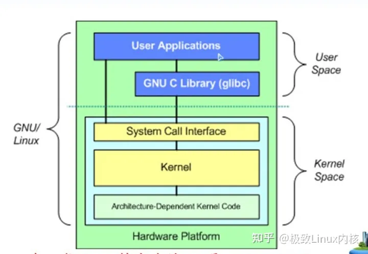
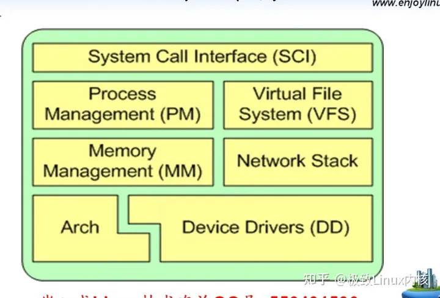

## **1、Linux内核简介**

**linux kernel map：**


**linux 系统体系结构：**



**linux kernel体系结构：**
arm有7种工作模式，x86也实现了4个不同级别RING0-RING3,RING0级别最高，
这样linux用户代码运行在RING3下，内核运行在RING0,这样系统本身就得到了
充分的保护

**用户空间(用户模式)转到内核空间(系统模式)方法：**
·系统调用
·硬件中断

**linux kernel 体系结构：**



**虚拟文件系统VFS:**
VFS(虚拟文件系统)隐藏各种文件系统的具体细节，为文件操作提供统一的接口

## **2、Linux内核源代码**

linux内核下载 [http://www.kernel.org](https://link.zhihu.com/?target=http%3A//www.kernel.org)
**目录结构:**
解压linux kernel tar后目录
·arch:根据cpu体系结构不同而分的代码
·block:部分块设备驱动程序
·crypto:加密，压缩，CRC校验算法
·documentation:内核文档
·drivers:设备驱动程序
·fs(虚拟文件系统vfs):文件系统
·include:内核所需的头文件，(与平台无关的头文件在include/linux中)
·lib:库文件代码(与平台相关的)
·mm:实现内存管理，与硬件体系结构无关的(与硬件体系结构相关的在arch中)
·net:网络协议的代码
·samples:一些内核编程的范例
·scripts:配置内核的脚本
·security:SElinux的模块
·sound:音频设备的驱动程序
·usr:cpio命令实现，用于制作根文件系统的命令(文件系统与内核放到一块的命令)
·virt:内核虚拟机

**linux DOC 编译生成:**

linux源根目录/Documentation/00-INDEX:目录索引
linux源根目录/Documentation/HOWTO:指南
·生成linux内核帮助文档:在linux源根目录(Documentation) 执行make htmldocs

ubuntu16下需要执行sudo apt-get install xmlto安装插件才可生成doc文档

后面开发中经常要改的是arch，drivers中的代码

## **3、Linux内核配置与编译**

**清理文件(在linux源码根目录):**
·make clean:只清理所有产生的文件
·make mrproper:清理所有产生的文件与config配置文件
·make distclean:清理所有产生的文件与config配置文件，并且编辑过的与补丁文件
↓
**配置(收集硬件信息如cpu型号，网卡等...):**
·make config:基于文本模式的交互配置
·make menuconfig:基于文本模式的菜单模式(推荐使用)
·make oldconfig:使用已有的.config,但会询问新增的配置项
·make xconfig:图形化的配置(需要安装图形化系统)
**配置方法：**
1)使用make menuconfig操作方法：
1>按y:编译>连接>镜像文件
2>按m:编译
3>按n:什么都不做
4>按"空格键":y,n轮换
配置完并保存后会在linux源码根目录下生成一个.config文件
注意：在ubuntu11上要执行apt-get install libncurses5-dev来安装支持包
2)利用已有的配置文件模板(.config)
1>linux源码根目录/arch/<cpu架构>/configs/<具体某一的CPU文件>，把里面对应的文件copy并改名为.config至linux源码根目录下
2>利用当前运行已有的文件(要用ls /boot/ -a查看)把/boot/config-2.6.18-53.e15拷贝并改名为.config至linux源码根目录下执行以上操作就可以用make menuconfig在拷贝
.config文件上面修改文件了
↓
**编译内核:**
1)make zImage
2)make bzImage
区别:在X86平台上，zimage只能用于小于512k的内核
获取详细编译信息：make zimage V=1 或 make bzimage V=1
编译好的内核在：arch/<cpu>/boot/目录下
注意：在把.config配置文件cp到根目录编译内核前，必须进入make menuconfig并保存退出(否则生不了效)
↓
**编译并安装模块:**

1)编译内核模块:make modules
2)安装内核模块:make modules_install INSTALL_MOD_PATH=/lib/modules
更换本机器内核:将编译好的内核模块从内核源码目录copy至/lib/modules下
制作init ramdisk():输入执行命令mkinitrd initrd-2.6.39(任意) 2.6.39(可通过查询/lib/modules下的目录得到)
注意：
mkinitrd命令为redhat里面的,ubuntu的命令为:mkinitramfs -k /lib/modules/模块安装位置 -o initrd-2.6.39(任意) 2.6.39(可通过查询/lib/modules下的目录得到)
如果ubuntu里面没有mkinitramfs命令可以用apt-get install initrd-tools进行安装
↓
**安装内核模块:**
1)手动
1>cp linux根目录/arch/x86/boot/bzImage /boot/mylinux-2.6.39
2>cp linux根目录/initrd-2.6.39 /boot/initrd-2.6.39
最后修改/etc/grub.conf或/etc/lilo.conf文件
2)自动
1>make install:这个命令会自动完成上面的操作(查看当前内核版本：uname -r)
\-----------------------------------------------------------------------------

## **4、linux内核模块开发**

描述：
linux内核组件非常庞大，内核ximage并不包含某组件，而是在该组件需要被使用的时候，动态的添加到正在运行的内核中(也可以卸载)，这种机制叫做“内核模块”的机制。内核模块通常通过使用makefile文件对模块进行编译

**模块安装与卸载:**
1)加载：insmod hello.ko
2)卸载：rmmod hello
3)查看：lsmod
4)加载(自动寻找模块依赖)：modprobe hello
modprobe会根据文件/lib/modules/version/modules.dep来查看要加载的模块，看它是否还依赖于其他模块，如果是,会先找到这些模块，把它们先加载到内核

**实例分析：**
1)moduleDep/1(一个模块的编译)

```text
#include <linux/module.h>
#include <linux/init.h>

//模块入口函数
//__init:表示代码段中的子段,里面的内容只运行一次并且回收内存.
static int __init hello_init(void)
{
    printk(KERN_EMERG "hello world!\n");
    return 0;
}
//模块卸载函数
//__exit:
static void __exit hello_exit(void)
{
    printk(KERN_EMERG "hello exit!\n");
}
//内核符号导出 函数
int add_integar(int a,int b)
{
    return a+b;
}
int sub_integar(int a,int b)
{
    return a-b;
}

module_init(hello_init);
module_exit(hello_exit);
//函数导出
EXPORT_SYMBOL(add_integar);
EXPORT_SYMBOL(sub_integar);
```

makefile:

```text
#第一次执行KERNELRELEASE是空的,所以执行else里面的
ifneq ($(KERNELRELEASE),)

obj-m :=hello.o

#else块
else

KDIR:= /lib/modules/2.6.18-53.el5/build

all:
#KDIR    依赖内核模块源代码路径(内核编译安装路径)
#PWD     表示内核代码在哪(当前目录)
#modules 编译的是模块
    make -C $(KDIR) M=$(PWD) modules 

clean:
    rm -f *.ko *.o *.mod.o *.mod.c *.symvers *.order

endif
```

2)moduleDep/2(两个模块的编译)

```text
#include <linux/module.h>
#include <linux/init.h>
//模块可选信息
MODULE_LICENSE("GPL");//许可证声明
MODULE_AUTHOR("liyuan");//作者声明
MODULE_DESCRIPTION("This module is a param example.");//模块描述
MODULE_VERSION("V1.0");//模块别名
MODULE_ALIAS("a simple module");//模块别名

//模块参数
static char *name = "liyuan arg";
static int age = 30;
//S_IRUGO是参数权限，也可以用数字
module_param(age,int,S_IRUGO);
module_param(name,charp,S_IRUGO);


//使用外部文件函数
extern int add(int a,int b);


//声明 外部内核符号 函数
extern int add_integar(int a,int b);
extern int sub_integar(int a,int b);

static int __init mains_init(void)
{
     //多文件编译

    printk(KERN_EMERG"param hi");
    int vle=add(1,2);
    printk(KERN_EMERG"add value:%d\n",vle);
    //模块参数

     printk(KERN_EMERG" name : %s\n",name);
     printk(KERN_EMERG" age : %d\n",age);

    //使用其他模块的函数(内核符号导出)
    int adds=add_integar(3,1);
    int subs=sub_integar(3,1);
    printk(KERN_EMERG" add_integar : %d\n",adds);
    printk(KERN_EMERG" sub_integar : %d\n",subs);
    return 0;
}

static void __exit mains_exit(void)
{
    printk("param exit!");
}

module_init(mains_init);
module_exit(mains_exit);
```

add.c

```text
int add(int a,int b)
{
    return a+b;
}
```

makefile

```text
ifneq ($(KERNELRELEASE),)
#两个以上内核源文件 生成单独的内核模块名ma

#内核ma
obj-m :=ma.o
#下面的ma-objs前面必须和上面一样为ma
ma-objs := mains.o add.o

else

KDIR:= /lib/modules/2.6.18-53.el5/build

all:
        make -C $(KDIR) M=$(PWD) modules 
clean:
    rm -f *.ko *.o *.mod.o *.mod.c *.symvers *.order

endif
```

**运行带参模块**：insmod hello.ko name=yuan age=12
内核符号导出(/proc/kallsyms记录了内核中所有导出的符号的名字与地址):
一个内核模块的运行依赖另一个内核模块的函数实现，必须先运行第一个内核模块，这样就需要进行内核符号导出。

**注意：**
错误信息:disagrees about version of symbol struct_module insmod:error inserting ...
开发内核模块时会出现，内核模块不匹配的情况.是你当前运行的linux内核与编译连接所依赖的
内核版本不匹配，解决方法：
·使用modprobe --force-modversion强行插入
·可使用uname -r进行查看当前运行的内核版本

**printk内核打印:**
在<linux/kernel.h>中printk有8个优先级，按优先级递减的是：
·KERN_EMERG 0
用于紧急的消息，常常是那些崩溃的消息
·KERN_ALERT 1
需要立刻行动的消息
·KERN_CRIT 2
严重情况
·KERN_ERR 3
错误情况
·KERN_WARNING(printk默认级别) 4
有问题的警告
·KERN_NOTICE 5
正常情况，但是仍然值得注意
·KERN_INFO 6
信息消息
·KERN_DEBUG 7
用作调试消息

不管是哪个级别的都会在/var/log/messages里面打印出来(messages可以删除后，运行内核进行测试内核打印情况)控制台打印(优先级配置/proc/sys/kernel/printk)

6 4 1 7
·Console_loglevel
·Default_message_loglevel
·Minimum_console_level
·Default_console_loglevel

在vm+redhat安装2.6.39内核时出现的错误
启动时报could not find filesystem '/dev/root'
解决方法
a.通过make menuconfig选中以下对应的选项
General setup -->
[*] enable deprecated sysfs features to support old userspace tools
成功时下面那个也*了的
b.修改.config文件
修改.config文件中CONFIG_SYSFS_DEPRECATED_V2，将原本被注释掉的
CONFIG_SYSFS_DEPRECATED_V2 改成CONFIG_SYSFS_DEPRECATED_V2=y
