## 1、操作系统是什么

操作系统(Operating System,OS)是控制应用程序执行和充当硬件系统和应用程序之间的界面的软件。

计算机系统由硬件和软件两部分组成。操作系统(OS，Operating System)是配置在计算机硬件上的第一层软件，是对硬件系统的首次扩充。它在计算机系统中占据了特别重要的地位；

而其它的诸如汇编程序、编译程序、数据库管理系统等系统软件，以及大量的应用软件，都将依赖于操作系统的支持，取得它的服务。操作系统已成为现代计算机系统(大、中、小及微型机)、多处理机系统、计算机网络、多媒体系统以及嵌入式系统中都必须配置的、最重要的系统软件。

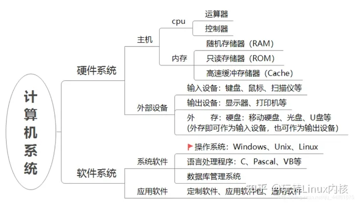

### 1.1初步认识操作系统及其功能

当前比较流行的操作系统有：

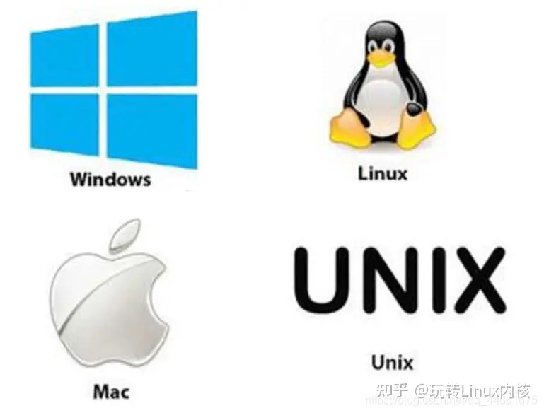

操作系统具体能做什么？毫无疑问，我们都知道的有 运行程序、控制多个程序并发运行、管理系统资源、监控系统状态、 提供图形化交互界面、 存储文件，读取文件

**进程管理**

1. 进程控制：创建、暂停、唤醒、撤销等；
2. 进程调度：调度策略、优先级；
3. 进程通信：进程之间怎么通信。

**设备管理**

1. 设备的分配和调度；
2. 设备的无关性动作；
3. 设备的传输控制；
4. 设备的驱动管理

**内存管理**

1. 内存分配；
2. 内存共享；
3. 内存保护；
4. 虚拟内存——我们运行程序从来因为内存过小而失败，只会变慢、卡。

**文件管理**

1. 存储的空间管理；
2. 文件的操作；
3. 目录的操作；
4. 文件和目录的存取权限管理等

### 1.2操作系统的地位

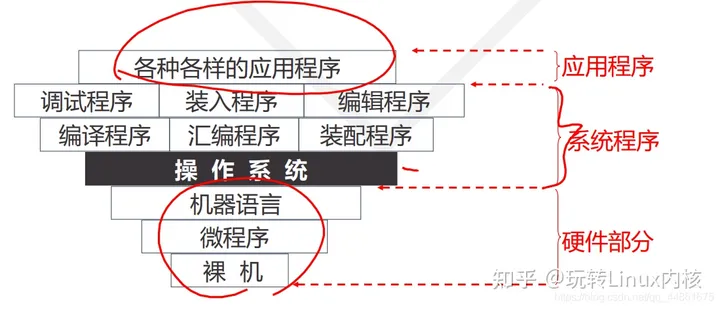

## 2，为什么需要操作系统

**一般地说，在计算机硬件上配置的 OS，其目标有以下几点：**

**1．有效性**

在早期(20 世纪 50～60 年代)，由于计算机系统非常昂贵，操作系统最重要的目标无疑是有效性。事实上，那时有效性是推动操作系统发展最主要的动力。操作系统的有效性可包含如下两方面的含义：

- (1) 提高系统资源利用率。在未配置 OS 的计算机系统中，诸如 CPU、I/O 设备等各种资源，都会因它们经常处于空闲状态而得不到充分利用；内存及外存中所存放的数据太少或者无序而浪费了大量的存储空间。配置了 OS 之后，可使 CPU 和 I/O 设备由于能保持稳定的状态而得到有效的利用，且可使内存和外存中存放的数据因有序而节省了存储空间。
- (2) 提高系统的吞吐量。操作系统还可以通过合理地组织计算机的工作流程，而进一步改善资源的利用率，加速程序的运行，缩短程序的运行周期，从而提高系统的吞吐量。

**2．方便性**

配置 OS 后者可使计算机系统更容易使用。一个未配置 OS 计算机系统是极难使用的，因为计算机硬件只能识别 0 和 1 这样的机器代码。用户要直接在计算机硬件上运行自己所编写的程序，就必须用机器语言书写程序；如果我们在计算机硬件上配置了 OS，用户便可通过 OS 所提供的各种命令来使用计算机系统。比如，用编译命令可方便地把用户用高级语言书写的程序翻译成机器代码，大大地方便了用户，从而使计算机变得易学易用。方便性和有效性是设计操作系统时最重要的两个目标。

**3．可扩充性**

随着 VLSI 技术和计算机技术的迅速发展，计算机硬件和体系结构也随之得到迅速发展，相应地，它们也对 OS 提出了更高的功能和性能要求。此外，多处理机系统、计算机网络，特别是 Internet 的发展，又对 OS 提出了一系列更新的要求。因此，OS 必须具有很好的可扩充性，方能适应计算机硬件、体系结构以及应用发展的要求。这就是说，现代 OS 应采用新的 OS 结构，如微内核结构和客户服务器模式，以便于方便地增加新的功能和模块，并能修改老的功能和模块。

**4．开放性**

自 20 世纪 80 年代以来，由于计算机网络的迅速发展，特别是 Internet 的应用的日益普及，使计算机操作系统的应用环境已由单机封闭环境转向开放的网络环境。为使来自不同厂家的计算机和设备能通过网络加以集成化，并能正确、有效地协同工作，实现应用的可移植性和互操作性，要求操作系统必须提供统一的开放环境，进而要求 OS 具有开放性。开放性是指系统能遵循世界标准规范，特别是遵循开放系统互连(OSI)国际标准。凡遵循国际标准所开发的硬件和软件，均能彼此兼容，可方便地实现互连。开放性已成为20世纪 90 年代以后计算机技术的一个核心问题，也是一个新推出的系统或软件能否被广泛应用的至关重要的因素。


**硬件发展时代划分：**

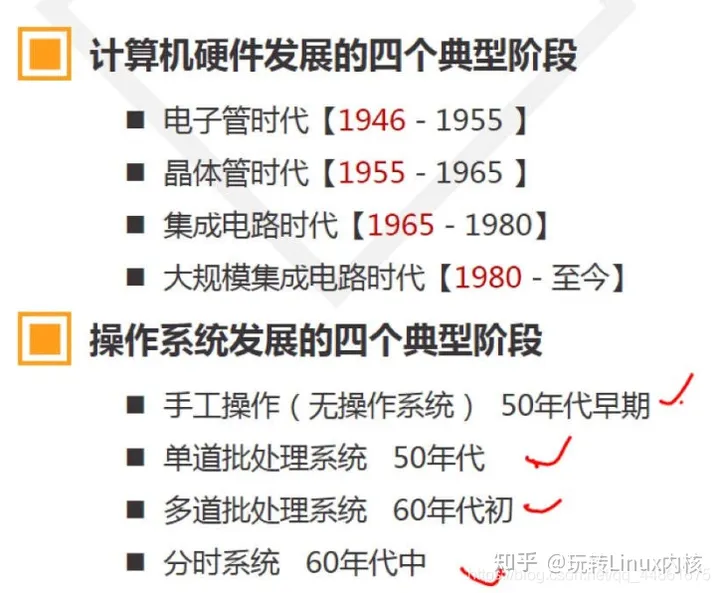

## 3，操作系统的发展史

### 3.1手工操作时代

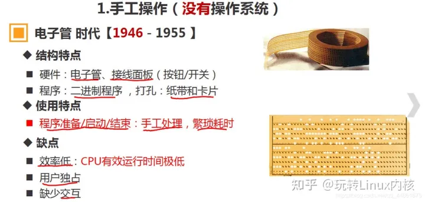

### 3.2 单批道处理系统


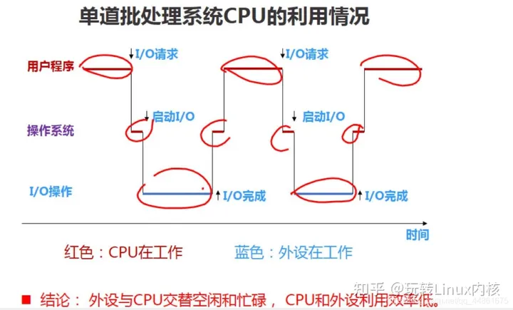

### 3.3 多批道处理系统


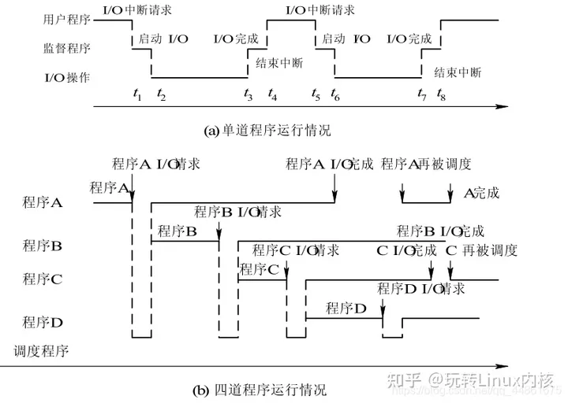


### 3.4分时技术和分时操作系统

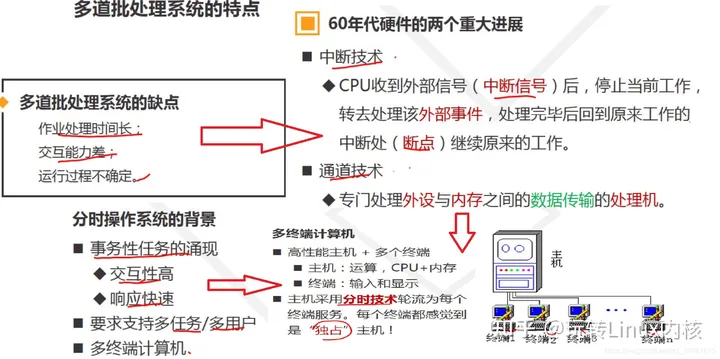

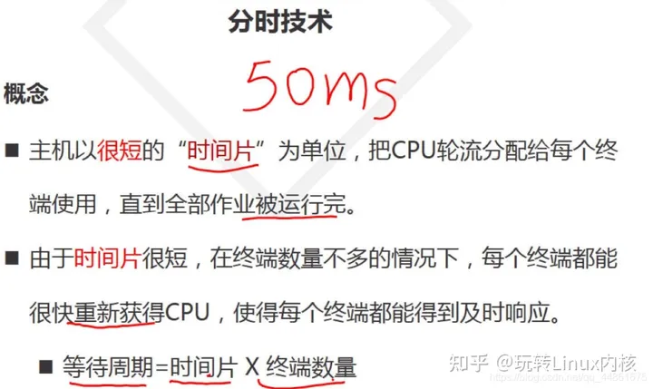

**分时系统实例**


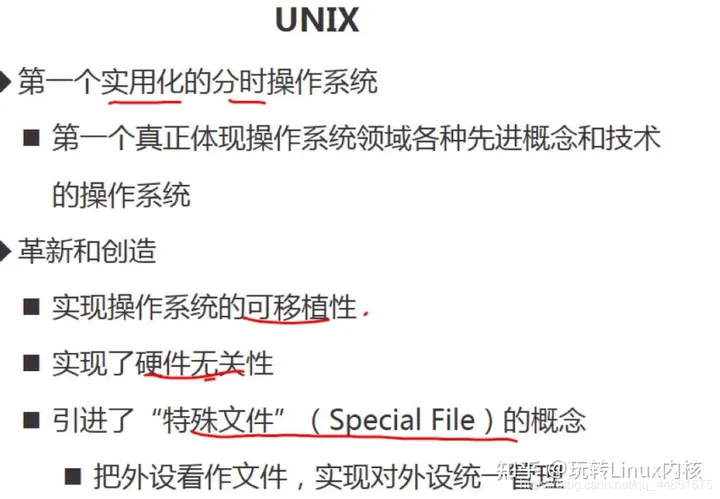

## 4，典型的操作系统


### 4.1微机操作系统

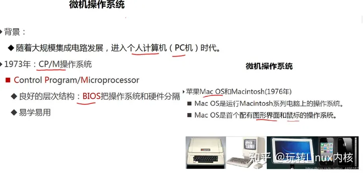

### 4.2实时操作系统

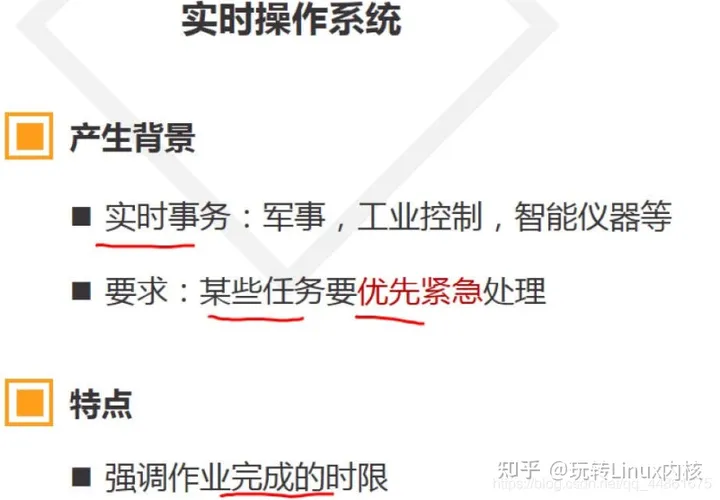

所谓“实时”，是表示“及时”，而实时系统(Real Time System)是指系统能及时(或即时)响应外部事件的请求，在规定的时间内完成对该事件的处理，并控制所有实时任务协调一致地运行。

**1、需求：**

虽然多道批处理系统和分时系统已能获得较为令人满意的资源利用率和响应时间，从而使计算机的应用范围日益扩大，但它们仍然不能满足以下某些应用领域的需要。

- (1) 实时控制。当把计算机用于生产过程的控制，以形成以计算机为中心的控制系统时，系统要求能实时采集现场数据，并对所采集的数据进行及时处理，进而自动地控制相应的执行机构，使某些(个)参数(如温度、压力、方位等)能按预定的规律变化，以保证产品的质量量和提高产量。类似地，也可将计算机用于对武器的控制，如火炮的自动控制系统、飞机自动驾驶系统，以及导弹的制导系统等。此外，随着大规模集成电路的发展，已制作出各种类型的芯片，并可将这些芯片嵌入到各种仪器和设备中，用来对设备的工作进行实施控制，这就构成了所谓的智能仪器和设备。在这些设备中也需要配置某种类型的、能进行实时控制的系统。通常把用于进行实时控制的系统称为实时系统。
- (2) 实时信息处理。通常，人们把用于对信息进行实时处理的系统称为实时信息处理系统统。该系统由一台或多台主机通过通信线路连接到成百上千个远程终端上，计算机接收从远程终端上发来的服务请求，根据用户提出的请求对信息进行检索和处理，并在很短的时间内为用户做出正确的响应。典型的实时信息处理系统有早期的飞机或火车的订票系统、情报检索系统等。

**2、实时任务**

在实时系统中必然存在着若干个实时任务，这些任务通常与某个(些)外部设备相关，能反应或控制相应的外部设备，因而带有某种程度的紧迫性。可以从不同的角度对实时任务加以分类。

**按任务执行时是否呈现周期性来划分**

(1) 周期性实时任务。外部设备周期性地发出激励信号给计算机，要求它按指定周期循环执行，以便周期性地控制某外部设备。

(2) 非周期性实时任务。外部设备所发出的激励信号并无明显的周期性，但都必须联系着一个截止时间(Deadline)。它又可分为开始截止时间(某任务在某时间以前必须开始执行)和完成截止时间(某任务在某时间以前必须完成)两部分。

**根据对截止时间的要求来划分**

(1) 硬实时任务(Hard real-time Task)。系统必须满足任务对截止时间的要求，否则可能出现难以预测的结果。

(2) 软实时任务(Soft real-time Task)。它也联系着一个截止时间，但并不严格，若偶尔错过了任务的截止时间，对系统产生的影响也不会太大。

**3、实时系统与分时系统特征的比较**

实时系统有着与分时系统相似但并不完全相同的特点，下面从五个方面对这两种系统

加以比较。

(1) 多路性。实时信息处理系统也按分时原则为多个终端用户服务。实时控制系统得多路性则主要表现在系统周期性地对多路现场信息进行采集，以及对多个对象或多个执行机构进行控制。而分时系统中的多路性则与用户情况有关，时多时少。

(2) 独立性。实时信息处理系统中的每个终端用户在向实时系统提出服务请求时，是彼此独立地操作，互不干扰；而实时控制系统中，对信息的采集和对对象的控制也都是彼此互不干扰。

(3) 及时性。实时信息处理系统对实时性的要求与分时系统类似，都是所有人所能接受的等待时间来确定的；而实时控制系统的及时性，则是以控制对象所要求的开始截止时间为准完成截止时间来确定的，一般为秒级到毫秒级，甚至有的要低于 100 微秒。

(4) 交互性。实时信息处理系统虽然也具有交互性，但这里人与系统的交互仅限于访问系统中某些特定的专用服务程序。它不像分时系统那样能向终端用户提供数据处理和资源共享等服务。

(5) 可靠性。分时系统虽然也要求系统可靠，但相比之下，实时系统则要求系统更高度的可靠性。因为任何差错都可能带来巨大的经济损失，甚至是无法预料的灾难性后果，所以在实时系统中，往往都采取了多级容错措施来保障系统的安全性及数据的安全性。


### 4.3嵌入式系统

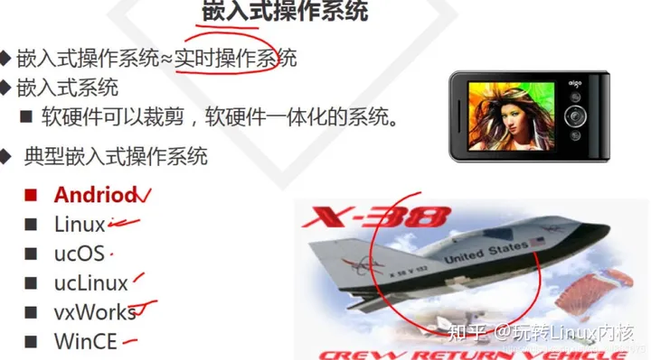

### 4.4网络系统

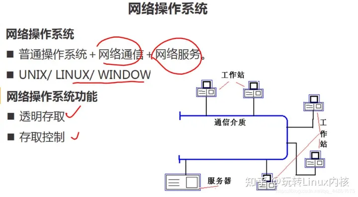

## 5，操作系统的功能

**4.1、OS 作为用户与计算机硬件系统之间的接口**

OS 作为用户与计算机硬件系统之间接口的含义是：OS 处于用户与计算机硬件系统之间间，用户通过 OS 来使用计算机系统。或者说，用户在 OS 帮助下，能够方便、快捷、安全、可靠地操纵计算机硬件和运行自己的程序。应注意，OS 是一个系统软件，因而这种接口是软件接口。图 1-1 是 OS 作为接口的示意图。由图可看出，用户可通过以下三种方式使用计算机。

1、命令方式。这是指由 OS 提供了一组联机命令接口，以允许用户通过键盘输入有关命令来取得操作系统的服务，并控制用户程序的运行。

2、系统调用方式。OS提供了一组系统调用，用户可在自己的应用程序中通过相应的系统调用，来实现与操作系统的通信，并取得它的服务。

3、 图形、窗口等方式。这是当前使用最为方便、最为广泛的接口，它允许用户通过屏幕上的窗口和图标来实现与操作系统的通信，并取得它的服务。

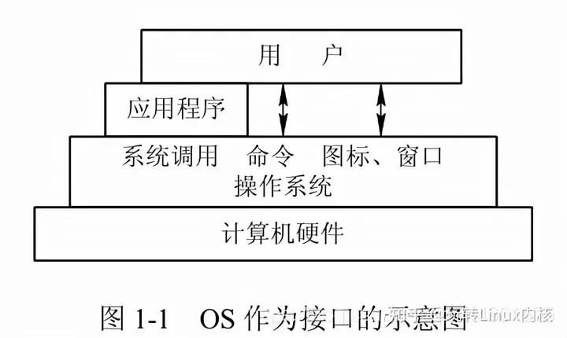


**4.2、OS 作为计算机系统资源的管理者**

在一个计算机系统中，通常都含有各种各样的硬件和软件资源。归纳起来可将资源分为四类：处理器、存储器、I/O 设备以及信息(数据和程序)。相应地，OS 的主要功能也正是针对这四类资源进行有效的管理，即：

1. 处理机管理，用于分配和控制处理机；
2. 存储器管理，主要负责内存的分配与回收；
3. I/O 设备管理，负责 I/O 设备的分配与操纵；
4. 文件管理，负责文件的存取、共享和保护。

可见，OS 的确是计算机系统资源的管理者。事实上，当今世界上广为流行的一个关于 OS 作用的观点，正是把 OS 作为计算机系统的资源管理者。值得进一步说明的是，当一个计算机系统同时供多个用户使用时，用户对系统中共享资源的需求(包括数量和时间)可能发生冲突，为了管理好这些共享资源(包括硬件和信息)的使用，操作系统必须记录下各种资源的使用情况，对使用资源的请求进行授权，协调诸用户对共享资源的使用，避免发生冲突，并计算使用资源的费用等

**4.3、OS 实现了对计算机资源的抽象**

对于一个完全无软件的计算机系统(即裸机)，它向用户提供的是实际硬件接口(物理接口)，用户必须对物理接口的实现细节有充分的了解，并利用机器指令进行编程，因此该物理机器必定是难以使用的。为了方便用户使用 I/O 设备，人们在裸机上覆盖上一层 I/O 设备管理软件，如图 1-2 所示，由它来实现对 I/O 设备操作的细节，并向上提供一组 I/O 操作命令，如 Read 和 Write 命令，用户可利用它来进行数据输入或输出，而无需关心 I/O 是如何实现的。

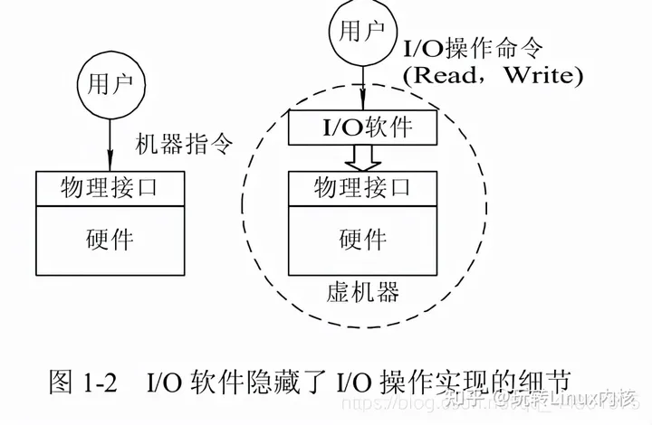

## 6、操作系统的基本特性

### 6.1、并发性

并发性是指同一时间间隔内发生两个或多个事件。并行性是指同一时刻内发生两个或多个事件

1．并行与并发：并行性和并发性 (Concurrence) 是既相似又有区别的两个概念，并行性是指两个或多个事件在同一时刻发生；而并发性是指两个或多个事件在同一时间间隔内发生。在多道程序环境下，并发性是指在一段时间内宏观上有多个程序在同时运行，但在单处理机系统中每一时刻却仅能有一道程序执行，故微观上这些程序只能是分时地交替执行。倘若在计算机系统中有多个处理机，则这些可以并发执行的程序便可被分配到多个处理机上，实现并行执行，即利用每个处理机来处理一个可并发执行的程序，这样，多个程序便可同时执行。

2．引入进程：应当指出，通常的程序是静态实体(Passive Entity)，在多道程序系统中，它们是不能独立运行的，更不能和其它程序并发执行。在操作系统中引入进程的目的，就是为了使多个程序能并发执行。例如，在一个未引入进程的系统中，在属于同一个应用程序的计算程序和 I/O 程序之间，两者只能是顺序执行，即只有在计算程序执行告一段落后，才允许 I/O 程序执行；反之，该程序执行 I/O 操作时，计算程序也不能执行，这意味着处理机处于空闲状态 。但在引入进程后，若分别为计算程序和 I/O 程序各建立一个进程，则这两个进程便可并发执行。由于在系统中具备计算程序和 I/O 程序同时运行的硬件条件，因而可将系统中的 CPU 和 I/O 设备同时开动起来，实现并行工作，从而有效地提高了系统资源的利用率和系统吞吐量，并改善了系统的性能。引入进程的好处远不止于此，事实上可以在内存中存放多个用户程序，分别为它们建立进程后，这些进程可以并发执行，亦即实现前面所说的多道程序运行。这样便能极大地提高系统资源的利用率，增加系统的吞吐量。为使多个程序能并发执行，系统必须分别为每个程序建立进程(Process)。简单说来，进程是指在系统中能独立运行并作为资源分配的基本单位，它是由一组机器指令、数据和堆栈等组成的，是一个能独立运行的活动实体。多个进程之间可以并发执行和交换信息。一个进程在运行时需要一定的资源，如 CPU、存储空间及 I/O 设备等。OS 中程序的并发执行将使系统复杂化，以致在系统中必须增设若干新的功能模块，分别用于对处理机、内存、I/O 设备以及文件系统等资源进行管理，并控制系统中所有作业的运行。事实上，进程和并发是现代操作系统中最重要的基本概念，也是操作系统运行的基础

3．引入线程：长期以来，进程都是操作系统中可以拥有资源并作为独立运行的基本单位。当一个进程因故不能继续运行时，操作系统便调度另一个进程运行。由于进程拥有自己的资源，故使调度付出的开销较大。直到 20 世纪 80 年代中期，人们才又提出了比进程更小的单位——线程(Threads)。通常在一个进程中可以包含若干个线程，它们可以利用进程所拥有的资源。在引入线程的 OS 中，通常都是把进程作为分配资源的基本单位，而把线程作为独立运行和独立调度的基本单位。由于线程比进程更小，基本上不拥有系统资源，故对它的调度所付出的开销就会小得多，能更高效地提高系统内多个程序间并发执行的程度。因而近年来推出的通用操作系统都引入了线程，以便进一步提高系统的并发性，并把它视作现代操作系统的一个重要标致。

### 6.2、共享性

在操作系统环境下，所谓共享 (Sharing)， 是指系统中的资源可供内存中多个并发执行的进程(线程)共同使用，相应地，把这种资源共同使用称为资源共享，或称为资源复用。由于各种资源的属性不同，进程对资源复用的方式也不同，目前主要实现资源共享的方式有如下两种。

1．互斥共享方式：系统中的某些资源，如打印机、磁带机，虽然它们可以提供给多个进程(线程)使用，但为使所打印或记录的结果不致造成混淆，应规定在一段时间内只允许一个进程(线程)访问该资源。为此，系统中应建立一种机制，以保证对这类资源的互斥访问。当一个进程 A 要访问某资源时，必须先提出请求。如果此时该资源空闲，系统便可将之分配给请求进程 A 使用。此后若再有其它进程也要访问该资源时(只要 A 未用完)，则必须等待。仅当 A 进程访问完并释放该资源后，才允许另一方进程对该资源进行访问。我们把这种资源共享方式称为互斥式共享，而把在一段时间内只允许一个进程访问的资源称为临界资源或独占资源。计算机系统中的大多数物理设备，以及某些软件中所用的栈、变量和表格，都属于临界资源，它们要求被互斥地共享。为此，在系统中必须配置某种机制来保证诸进程互斥地使用独占资源。

2．同时访问方式：系统中还有另一类资源，允许在一段时间内由多个进程“同时”对它们进行访问。这里所谓的“同时”，在单处理机环境下往往是宏观上的，而在微观上，这些进程可能是交替地对该资源进行访问。典型的可供多个进程“同时”访问的资源是磁盘设备，一些用重入码编写的文件也可以被“同时”共享，即若干个用户同时访问该文件。并发和共享是操作系统的两个最基本的特征，它们又是互为存在的条件。一方面，资源共享是以程序(进程)的并发执行为条件的，若系统不允许程序并发执行，自然不存在资源共享问题；另一方面，若系统不能对资源共享实施有效管理，协调好诸进程对共享资源的访问，也必然影响到程序并发执行的程度，甚至根本无法并发执行。

### 6.3、虚拟技术

操作系统中的所谓“虚拟” (Virtual) ，是指通过某种技术把一个物理实体变为若干个逻辑上的对应物。物理实体(前者)是实的，即实际存在的，而后者是虚的，仅是用户感觉上的东西。相应地，用于实现拟的技术称为虚拟技术。在操作系统中利用了两种方式实现虚拟技术，即时分复用技术和空分复用技术。

**1、时分复用技术**

时分复用，亦即分时使用方式，它最早用于电信业中。为了提高信道的利用率，人们利用时分复用方式，将一条物理信道虚拟为多条逻辑信道，将每条信道供一对用户通话。在计算机领域中，广泛利用该技术来实现虚拟处理机、虚拟设备等，以提高资源的利用率。

```text
虚拟处理机技术
虚拟设备技术
```

**2．空分复用技术**

早在上世纪初，电信业中就使用频分复用技术来提高信道的利用率。它是将一个频率范围非常宽的信道，划分成多个频率范围较窄的信道，其中的任何一个频道都只供一对用户通话。早期的频分复用只能将一条物理信道划分为十几条到几十条话路，后来又很快发展成上万条话路，每条话路也只供一对用户通话。之后，在计算机中也使用了空分复用技术来提高存储空间的利用率。

```text
虚拟磁盘技术
虚拟存储器技术
```

应当着重指出：如果虚拟的实现是通过时分复用的方法来实现的，即对某一物理设备进行分时使用，设 N 是某物理设备所对应的虚拟的逻辑设备数，则每台虚拟设备的平均速度必然等于或低于物理设备速度的 1/N。类似地，如果是利用空分复用方法来实现虚拟，此时一台虚拟设备平均占用的空间必然也等于或低于物理设备所拥有空间的 1/N。

### 6.4、异步性

在多道程序环境下允许多个进程并发执行，但只有进程在获得所需的资源后方能执行。在单处理机环境下，由于系统中只有一台处理机，因而每次只允许一个进程执行，其余进程只能等待。当正在执行的进程提出某种资源要求时，如打印请求，而此时打印机正在为其它某进程打印，由于打印机属于临界资源，因此正在执行的进程必须等待，且放弃处理机，直到打印机空闲，并再次把处理机分配给该进程时，该进程方能继续执行。可见，由于资源等因素的限制，使进程的执行通常都不是“一气呵成”，而是以“停停走走”的方式运行。

内存中的每个进程在何时能获得处理机运行，何时又因提出某种资源请求而暂停，以及进程以怎样的速度向前推进，每道程序总共需多少时间才能完成，等等，这些都是不可预知的。由于各用户程序性能的不同，比如，有的侧重于计算而较少需要 I/O，而有的程序其计算少而 I/O 多，这样，很可能是先进入内存的作业后完成，而后进入内存的作业先完成。或者说，进程是以人们不可预知的速度向前推进，此即进程的异步性(Asynchronism)。尽管如此，但只要在操作系统中配置有完善的进程同步机制，且运行环境相同，作业经多次运行都会获得完全相同的结果。因此，异步运行方式是允许的，而且是操作系统的一个重要特征。
