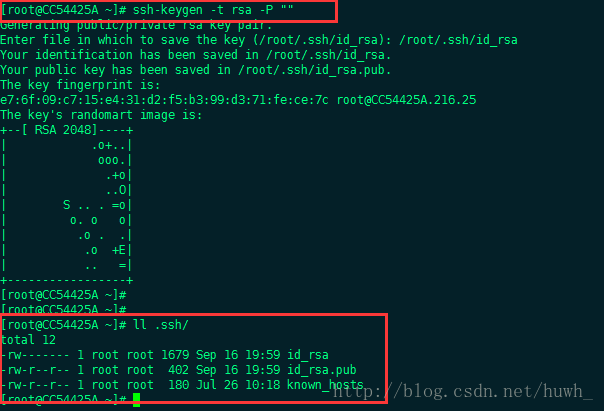

# 1. ssh/scp免密码

A服务器地址：10.8.216.25，下面简称A 

B服务器地址：10.8.216.26，下面简称B

实现A登录B免密码。

## 1.1. 在A生成密钥对

无密码方式：

```bash
ssh-keygen -t rsa -P 
```

自定义密码参数：

```bash
ssh-keygen -C <comment> -f <keyfile> -t rsa -P "<passphrase>"
```

执行上述命令，一路回车，会在当前登录用户的home目录下的.ssh目录下生成id_rsa和id_rsa.pub两个文件，分别代表密钥对的私钥和公钥，如下图所示：



## 1.2. 拷贝A的公钥（id_rsa.pub）到B

这里拷贝到B的root用户home目录下为例：

```bash
scp /root/.ssh/id_rsa.pub root@10.8.216.26:/root
```

## 1.3. 登录B

拷贝A的id_rsa.pub内容到.ssh目录下的authorized_keys文件中

```bash
cd /root
cat id_rsa.pub >> .ssh/authorized_keys
```

如图：


## 1.4. 登录或拷贝

此时在A中用SSH登录B或向B拷贝文件，将不需要密码

```bash
ssh root@10.8.216.26
scp abc.txt root@10.8.216.26:/root
```

# 2. 配置跳板机快速登录

## 2.1. 配置ssh config文件

ssh config 路径：~/.ssh/config

```bash
AddKeysToAgent yes
ServerAliveInterval 3
Host jump
        HostName {jump_ip}
        Port    {port}
        User    {username}
        forwardagent yes
        identityfile ~/.ssh/id_rsa
Host *.gw
        user {username}
        port {port}
        proxycommand ssh -W $(echo %h | sed -e "s/.gw$//"):%p jump
Host bj*
        User    {username}
        Port    {port}
        proxycommand ssh -W 192.168.123.$(echo %h | awk -F 'bj' '{print $2}'):%p jump    
```

多层跳板机

```bash
Host jump1
        Hostname {jump1_ip}
        Port  {port}
        User  {username}
        forwardagent yes
        identityfile ~/.ssh/id_rsa
Host jump2
        Hostname {jump2_ip}
        Port {port}
        User {username}
        ProxyCommand ssh -q -x -W %h:%p jump1
Host *
        Hostname %h
        Port  {port}
        User  {username}
        ProxyCommand ssh -q -x -W %h:%p jump2
```

## 2.2. 记录机器文件

将关键字和IP写入文件记录，例如 `~/.my_hosts`。

示例：可以是IP + 环境等关键字，中间用空格隔开。

```bash
# release
192.168.123.11 rel-node-11
192.168.123.12 rel-node-12

# pre
192.168.321.13 pre-node-13
192.168.321.14 pre-node-14
192.168.321.15 pre-node-15

# dev
192.168.111.16 dev-node-16
192.168.111.17 dev-node-17
```

## 2.3. 安装fzf

```bash
# for mac
brew install fzf
```

## 2.4. 设置命令别名

设置 alias 到shell rc 文件(.bashrc / .zshrc) 

```bash
alias goto="ssh \$(cat ~/.my_hosts | fzf | awk '{ printf(\"%s.gw\", \$1)}')"
```

## 2.5. 使用

使用别名命令，输入关键字搜索，点击回车进入指定机器。

也可以使用ssh命令登录机器别名。

```bash
ssh bj11
```

# 3. ssh配置项说明

可以通过man查看ssh配置说明

```bash
man ssh_config
```

配置文件示例：

```bash
Host jump
  port 22

Host * !jump
  StrictHostKeyChecking no
  HostName %h
  UserKnownHostsFile /dev/null
  LogLevel ERROR
  IdentityFile ~/.ssh/id_rsa
  ProxyCommand ssh -p 22 -F /dev/null jump -W %h:%p
  SendEnv LANG LC_*
```

配置项说明：

- Host: 标识设备，`*`表示通配所有字符，`!`表示例外通配。

- StrictHostKeyChecking no：连接时不进行公钥交互确认操作。

- UserKnownHostsFile /dev/null：不提示确认known_hosts文件。

- ProxyCommand：代理命令

如果使用命令加参数的方式：

```bash
ssh -o StrictHostKeyChecking=no -o UserKnownHostsFile=/dev/null -o ProxyCommand="ssh -p 22 jump -W %h:%p" 
```
