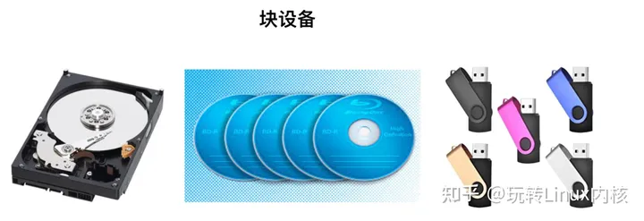
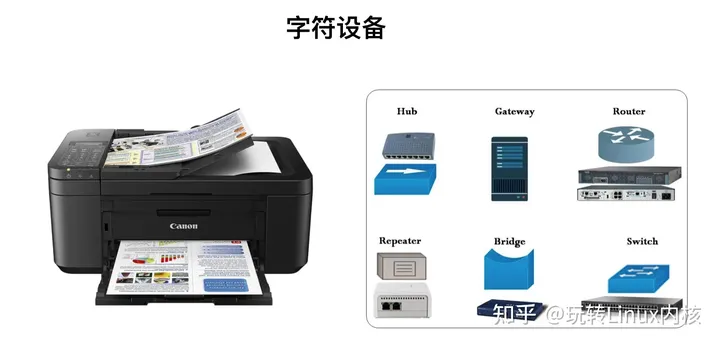
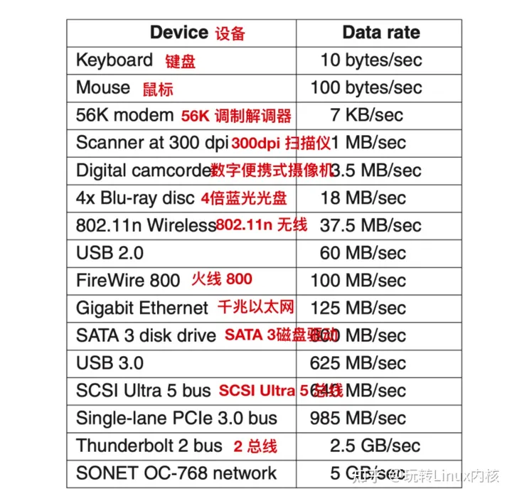
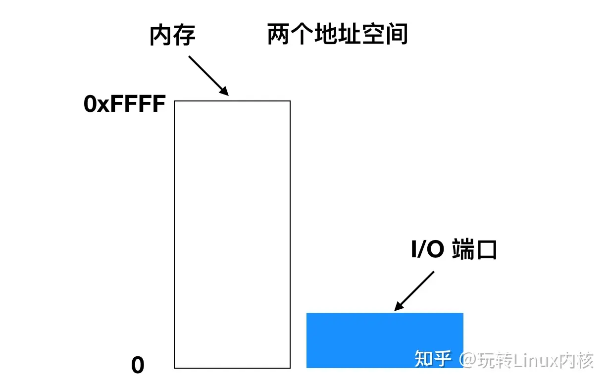
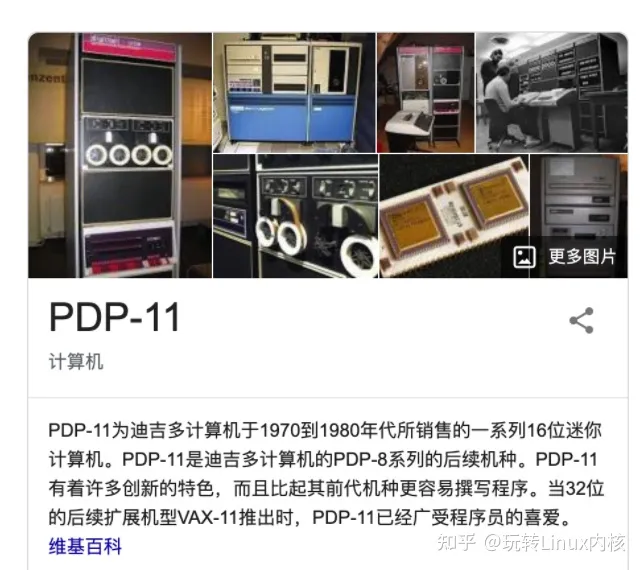
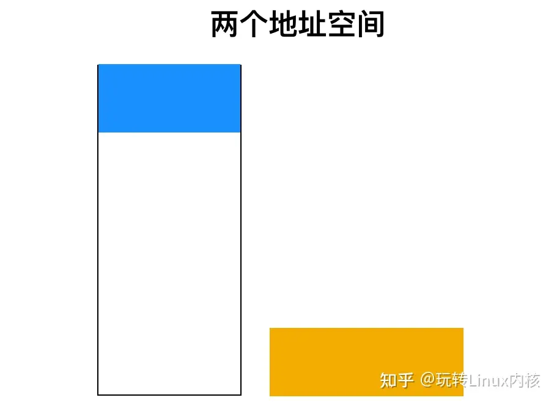
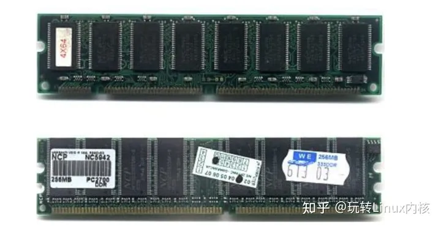
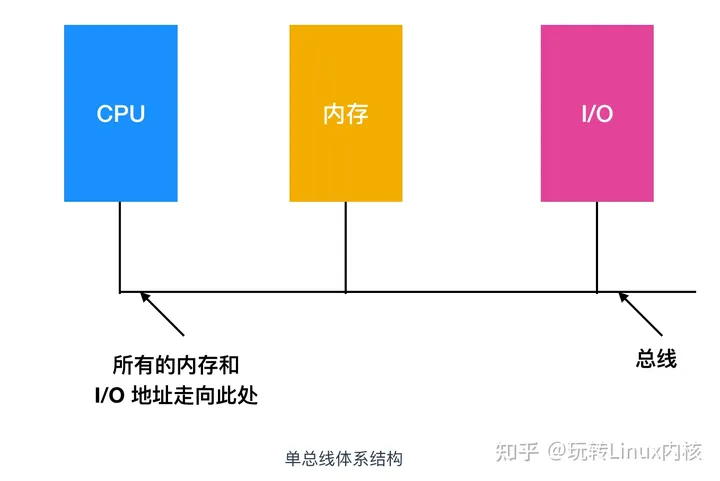
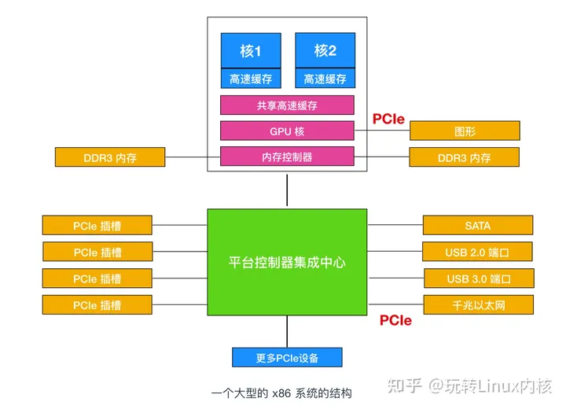
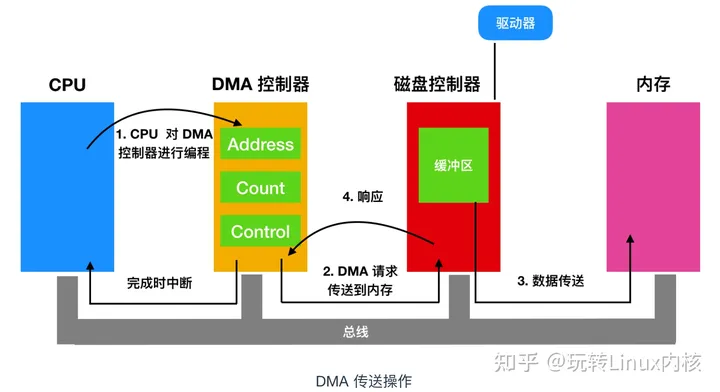

前言：我们之前的文章提到了操作系统的三个抽象，它们分别是进程、地址空间和文件，除此之外，操作系统还要控制所有的 I/O 设备。操作系统必须向设备发送命令，捕捉中断并处理错误。它还应该在设备和操作系统的其余部分之间提供一个简单易用的接口。操作系统如何管理 I/O 是我们接下来的重点。

不同的人对 I/O 硬件的理解也不同。对于电子工程师而言，I/O 硬件就是芯片、导线、电源和其他组成硬件的物理设备。而我们程序员眼中的 I/O 其实就是硬件提供给软件的接口，比如硬件接受到的命令、执行的操作以及反馈的错误。我们着重探讨的是如何对硬件进行编程，而不是其工作原理。

## 1，I/O 设备

什么是 I/O 设备？I/O 设备又叫做输入/输出设备，它是人类用来和计算机进行通信的外部硬件。输入/输出设备能够向计算机发送数据（输出）并从计算机接收数据（输入）。

I/O 设备(I/O devices)可以分成两种：块设备(block devices) 和 字符设备(character devices)。

## 2，块设备

块设备是一个能存储固定大小块信息的设备，它支持以固定大小的块，扇区或群集读取和（可选）写入数据。每个块都有自己的物理地址。通常块的大小在 512 - 65536 之间。所有传输的信息都会以连续的块为单位。块设备的基本特征是每个块都较为对立，能够独立的进行读写。常见的块设备有 硬盘、蓝光光盘、USB盘与字符设备相比，块设备通常需要较少的引脚。



### 2.1块设备的缺点

基于给定固态存储器的块设备比基于相同类型的存储器的字节寻址要慢一些，因为必须在块的开头开始读取或写入。所以，要读取该块的任何部分，必须寻找到该块的开始，读取整个块，如果不使用该块，则将其丢弃。要写入块的一部分，必须寻找到块的开始，将整个块读入内存，修改数据，再次寻找到块的开头处，然后将整个块写回设备。

**字符设备**

另一类 I/O 设备是字符设备。字符设备以字符为单位发送或接收一个字符流，而不考虑任何块结构。字符设备是不可寻址的，也没有任何寻道操作。常见的字符设备有 打印机、网络设备、鼠标、以及大多数与磁盘不同的设备。



**下面显示了一些常见设备的数据速率：**



### 2.2设备控制器

首先需要先了解一下设备控制器的概念：

设备控制器是处理 CPU 传入和传出信号的系统。设备通过插头和插座连接到计算机，并且插座连接到设备控制器。设备控制器从连接的设备处接收数据，并将其存储在控制器内部的一些特殊目的寄存器(special purpose registers) 也就是本地缓冲区中。

特殊用途寄存器，顾名思义是仅为一项任务而设计的寄存器。例如，cs，ds，gs 和其他段寄存器属于特殊目的寄存器，因为它们的存在是为了保存段号。 eax，ecx 等是一般用途的寄存器，因为你可以无限制地使用它们。 例如，你不能移动 ds，但是可以移动 eax，ebx。

1. 通用目的寄存器比如有：eax、ecx、edx、ebx、esi、edi、ebp、esp
2. 特殊目的寄存器比如有：cs、ds、ss、es、fs、gs、eip、flag

每个设备控制器都会有一个应用程序与之对应，设备控制器通过应用程序的接口通过中断与操作系统进行通信。设备控制器是硬件，而设备驱动程序是软件。

I/O 设备通常由机械组件(mechanical component)和电子组件(electronic component)构成。电子组件被称为 设备控制器(device controller)或者 适配器(adapter)。在个人计算机上，它通常采用可插入（PCIe）扩展插槽的主板上的芯片或印刷电路卡的形式。


**机械设备就是它自己，它的组成如下：**


控制器卡上通常会有一个连接器，通向设备本身的电缆可以插入到这个连接器中，很多控制器可以操作 2 个、4 个设置 8 个相同的设备。

控制器与设备之间的接口通常是一个低层次的接口。例如，磁盘可能被格式化为 2,000,000 个扇区，每个磁道 512 字节。然而，实际从驱动出来的却是一个串行的比特流，从一个前导符(preamble)开始，然后是一个扇区中的 4096 位，最后是一个校验和 或 ECC（错误码，Error-Correcting Code）。前导符是在对磁盘进行格式化的时候写上去的，它包括柱面数和扇区号，扇区大小以及类似的数据，此外还包含同步信息。

控制器的任务是把串行的位流转换为字节块，并进行必要的错误校正工作。字节块通常会在控制器内部的一个缓冲区按位进行组装，然后再对校验和进行校验并证明字节块没有错误后，再将它复制到内存中。

## 3，内存映射 I/O

每个控制器都会有几个寄存器用来和 CPU 进行通信。通过写入这些寄存器，操作系统可以命令设备发送数据，接收数据、开启或者关闭设备等。通过从这些寄存器中读取信息，操作系统能够知道设备的状态，是否准备接受一个新命令等。

为了控制寄存器，许多设备都会有数据缓冲区(data buffer)，来供系统进行读写。例如，在屏幕上显示一个像素的常规方法是使用一个视频 RAM，这一 RAM 基本上只是一个数据缓冲区，用来供程序和操作系统写入数据。

那么问题来了，CPU 如何与设备寄存器和设备数据缓冲区进行通信呢？存在两个可选的方式。第一种方法是，每个控制寄存器都被分配一个 I/O 端口(I/O port)号，这是一个 8 位或 16 位的整数。所有 I/O 端口的集合形成了受保护的 I/O 端口空间，以便普通用户程序无法访问它（只有操作系统可以访问）。使用特殊的 I/O 指令像是

```text
IN REG,PORT
```

CPU 可以读取控制寄存器 PORT 的内容并将结果放在 CPU 寄存器 REG 中。类似的，使用

```text
OUT PORT,REG
```

CPU 可以将 REG 的内容写到控制寄存器中。大多数早期计算机，包括几乎所有大型主机，如 IBM 360 及其所有后续机型，都是以这种方式工作的。

控制寄存器是一个处理器寄存器而改变或控制的一般行为 CPU 或其他数字设备。控制寄存器执行的常见任务包括中断控制，切换寻址模式，分页控制和协处理器控制。

**在这一方案中，内存地址空间和 I/O 地址空间是不相同的，如下图所示：**



**指令：**

```text
IN R0,4
```

和

```text
MOV R0,4
```

这一设计中完全不同。**前者读取 I/O端口 4 的内容并将其放入 R0，而后者读取存储器字 4 的内容并将其放入 R0**。这些示例中的 4 代表不同且不相关的地址空间。

第二个方法是 PDP-11 引入的，

**什么是 PDP-11?**



它将**所有控制寄存器映射到内存空间**中，如下图所示：


`内存映射的 I/O`是在 CPU 与其连接的外围设备之间交换数据和指令的一种方式，这种方式是处理器和 IO 设备共享同一`内存位置`的内存，即处理器和 IO 设备使用内存地址进行映射。

在大多数系统中，分配给控制寄存器的地址位于或者靠近地址的顶部附近。

**下面是采用的一种混合方式：**



这种方式具有与内存映射 I/O 的数据缓冲区，而控制寄存器则具有单独的 I/O 端口。x86 采用这一体系结构。在 IBM PC 兼容机中，除了 0 到 64K - 1 的 I/O 端口之外，640 K 到 1M - 1 的内存地址保留给设备的数据缓冲区。

这些方案是如何工作的呢？当 CPU 想要读入一个字的时候，无论是从内存中读入还是从 I/O 端口读入，它都要将需要的地址放到总线地址线上，然后在总线的一条控制线上调用一个 READ 信号。还有第二条信号线来表明需要的是 I/O 空间还是内存空间。如果是内存空间，内存将响应请求。如果是 I/O 空间，那么 I/O 设备将响应请求。如果只有内存空间，那么每个内存模块和每个 I/O 设备都会将地址线和它所服务的地址范围进行比较。如果地址落在这一范围之内，它就会响应请求。绝对不会出现地址既分配给内存又分配给 I/O 设备，所以不会存在歧义和冲突。

**内存映射 I/O 的优点和缺点：**

这两种寻址控制器的方案具有不同的优缺点。先来看一下内存映射 I/O 的优点。

1. 第一，如果需要特殊的 I/O 指令读写设备控制寄存器，那么访问这些寄存器需要使用汇编代码，因为在 C 或 C++ 中不存在执行 IN 和 OUT指令的方法。调用这样的过程增加了 I/O 的开销。在内存映射中，控制寄存器只是内存中的变量，在 C 语言中可以和其他变量一样进行寻址。
2. 第二，对于内存映射 I/O ，不需要特殊的保护机制就能够阻止用户进程执行 I/O 操作。操作系统需要保证的是禁止把控制寄存器的地址空间放在用户的虚拟地址中就可以了。
3. 第三，对于内存映射 I/O，可以引用内存的每一条指令也可以引用控制寄存器，便于引用。

在计算机设计中，几乎所有的事情都要权衡。内存映射 I/O 也是一样，它也有自己的缺点。首先，大部分计算机现在都会有一些对于内存字的缓存。缓存一个设备控制寄存器的代价是很大的。为了避免这种内存映射 I/O 的情况，硬件必须有选择性的禁用缓存，例如，在每个页面上禁用缓存，这个功能为硬件和操作系统增加了额外的复杂性，因此必须选择性的进行管理。

第二点，如果仅仅只有一个地址空间，那么所有的内存模块(memory modules)和所有的 I/O 设备都必须检查所有的内存引用来推断出谁来进行响应。

什么是内存模块？在计算中，存储器模块是其上安装有存储器集成电路的印刷电路板。



**如果计算机是一种单总线体系结构的话，如下图所示：**



让每个内存模块和 I/O 设备查看每个地址是简单易行的。

然而，现代个人计算机的趋势是专用的高速内存总线，如下图所示：


装备这一总线是为了优化内存访问速度，x86 系统还可以有多种总线（内存、PCIe、SCSI 和 USB）。如下图所示：



在内存映射机器上使用单独的内存总线的麻烦之处在于，I/O 设备无法通过内存总线查看内存地址，因此它们无法对其进行响应。此外，必须采取特殊的措施使内存映射 I/O 工作在具有多总线的系统上。一种可能的方法是首先将全部内存引用发送到内存，如果内存响应失败，CPU 再尝试其他总线。

第二种设计是在内存总线上放一个探查设备，放过所有潜在指向所关注的 I/O 设备的地址。此处的问题是，I/O 设备可能无法以内存所能达到的速度处理请求。

第三种可能的设计是在内存控制器中对地址进行过滤，这种设计与上图所描述的设计相匹配。这种情况下，内存控制器芯片中包含在引导时预装载的范围寄存器。这一设计的缺点是需要在引导时判定哪些内存地址而不是真正的内存地址。因而，每一设计都有支持它和反对它的论据，所以折中和权衡是不可避免的。

**直接内存访问**

无论一个 CPU 是否具有内存映射 I/O，它都需要寻址设备控制器以便与它们交换数据。CPU 可以从 I/O 控制器每次请求一个字节的数据，但是这么做会浪费 CPU 时间，所以经常会用到一种称为直接内存访问(Direct Memory Access) 的方案。为了简化，我们假设 CPU 通过单一的系统总线访问所有的设备和内存，该总线连接 CPU 、内存和 I/O 设备，如下图所示



现代操作系统实际更为复杂，但是原理是相同的。如果硬件有DMA 控制器，那么操作系统只能使用 DMA。有时这个控制器会集成到磁盘控制器和其他控制器中，但这种设计需要在每个设备上都装有一个分离的 DMA 控制器。单个的 DMA 控制器可用于向多个设备传输，这种传输往往同时进行。

不管 DMA 控制器的物理地址在哪，它都能够独立于 CPU 从而访问系统总线，如上图所示。它包含几个可由 CPU 读写的寄存器，其中包括一个内存地址寄存器，字节计数寄存器和一个或多个控制寄存器。控制寄存器指定要使用的 I/O 端口、传送方向（从 I/O 设备读或写到 I/O 设备）、传送单位（每次一个字节或者每次一个字）以及在一次突发传送中要传送的字节数。

为了解释 DMA 的工作原理，我们首先看一下不使用 DMA 该如何进行磁盘读取。

首先，控制器从磁盘驱动器串行地、一位一位的读一个块（一个或多个扇区），直到将整块信息放入控制器的内部缓冲区。

读取校验和以保证没有发生读错误。然后控制器会产生一个中断，当操作系统开始运行时，它会重复的从控制器的缓冲区中一次一个字节或者一个字地读取该块的信息，并将其存入内存中。
