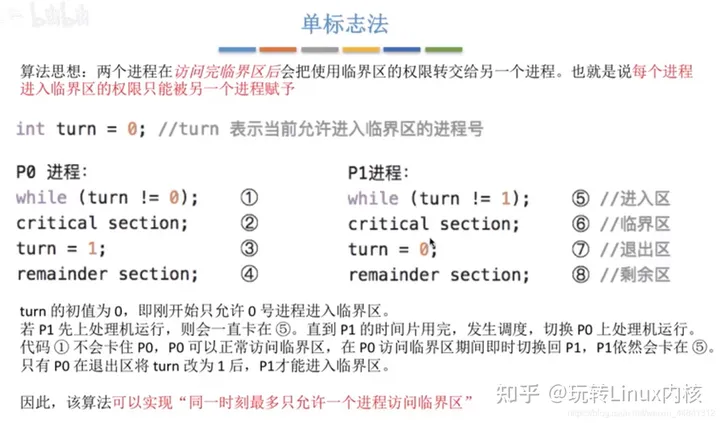
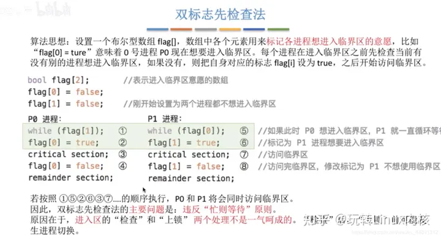
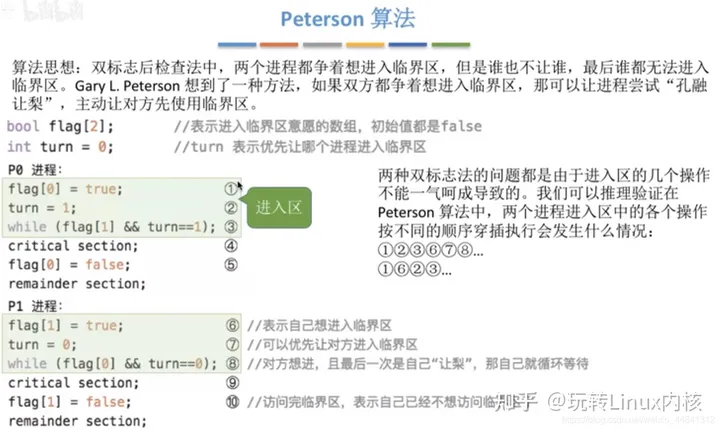

## 1，进程同步的几种方式

### 1.1信号量

用于进程间传递信号的一个整数值。在信号量上只有三种操作可以进行：初始化，P操作和V操作，这三种操作都是原子操作。

**P操作(递减操作)可以用于阻塞一个进程，V操作(增加操作)可以用于解除阻塞一个进程。**

基本原理是两个或多个进程可以通过简单的信号进行合作，一个进程可以被迫在某一位置停止，直到它接收到一个特定的信号。该信号即为信号量s。

为通过信号量s传送信号，进程可执行原语semSignal(s);为通过信号量s接收信号，进程可执行原语semWait(s);如果相应的信号仍然没有发送，则进程会被阻塞，直到发送完为止。

**可把信号量视为一个具有整数值的变量，在它之上定义三个操作：**

- 一个信号量可以初始化为非负数
- semWait操作使信号量s减1.若值为负数，则执行semWait的进程被阻塞。否则进程继续执行。
- semSignal操作使信号量加1，若值大于或等于零，则被semWait操作阻塞的进程被解除阻塞。

### 1.2管程

管程是由一个或多个过程、一个初始化序列和局部数据组成的软件模块，**其主要特点如下：**

- 局部数据变量只能被管程的过程访问，任何外部过程都不能访问。
- 一个进程通过调用管程的一个过程进入管程。
- 在任何时候，只能有一个进程在管程中执行，调用管程的任何其他进程都被阻塞，以等待管程可用。

管程通过使用条件变量提供对同步的支持，这些条件变量包含在管程中，并且只有在管程中才能被访问。有两个函数可以操作条件变量：

- cwait(c)：调用进程的执行在条件c上阻塞，管程现在可被另一个进程使用。
- csignal(c)：恢复执行在cwait之后因为某些条件而阻塞的进程。如果有多个这样的进程，选择其中一个；如果没有这样的进程，什么以不做。

### 1.3消息传递

**消息传递的实际功能以一对原语的形式提供：**

- send(destination,message)
- receive(source,message)

这是进程间进程消息传递所需要的最小操作集。

一个进程以消息的形式给另一个指定的目标进程发送消息；

进程通过执行receive原语接收消息，receive原语中指明发送消息的源进程和消息。

## 2、进程互斥

由于进程具有独立性和异步性等并发特征，计算机的资源有限，导致了进程之间的资源竞争和共享，也导致了对进程执行过程的制约。

**1.临界区相关概念：**
**临界资源**：也就是一次只允许一个进程操作使用的计算机资源，这里的资源可以是物理资源，也可以是逻辑上的变量等。
**临界区**：把不允许多个并发进程交叉执行的一段程序称为临界区（critical region）或临界部分（critical section）。
**当一个进程使用该临界资源时，其他需要访问该资源的进程必须阻塞，直到占用者释放该资源。**

**2、间接制约**
把这种由于共享某一公有资源而引起的在临界区内不允许并发进程交叉执行的现象，称为由共享公有资源而造成的对并发进程执行速度的间接制约。这里的“间接”二字主要是指各种并发进程的速度受公有资源的制约，而非进程之间的直接制约。

**3.进程互斥**
在并发进程中，一个或多个进程要对公用资源进行访问时，必须确保该资源处于空闲状态，也就是说，在并发进程中，临界区只允许一个进程进入，而其他进程阻塞，等待该共享临界资源释放。

**4.并发进程之间必须满足以下特征：**

- **平等竞争：**即各并发进程享有平等地、独立地竞争共有资源的权利，且在不采取任何措施的条件下，在临界区内任意指令结束时，其他并发进程可以进入临界区。
- **互斥使用**：当并发进程中的时候 多个进程同时申请进入临界区时，它只允许一个进程进入临界区。
- **不可独占：**当进程不在临界区后，它不能阻止其他进程进入临界区。
- **有限等待：**也就是在就绪队列中的进程等待资源时间必须是有限的。并发进程中的某个进程从申请进入临界区时开始，应在有限时间内得以进入临界区。

## 3、互斥的实现

### 2.1互斥的加锁实现

对互斥的临界区进行加锁处理，即当一个进程进入了 临界区之后，对此临界区进行加锁，直到该进程退出临界区为止。而其他并发进程在申请进入临界区之前，必须测试该临界区是否加锁，如果是，则阻塞等待！
加锁实现是系统的原语：lock(key[S])和Unlock(key([S]))均保持原子操作。系统实现时锁定位key[S]总是设置在公有资源所对应的数据结构中的。

### 2.2互斥加锁实现的缺点

1.在进行锁测试和定位中将耗费CPU资源
2、进程加锁实现可能会对进程不公平
**例如：**

```cpp
进程A:
lock(key[S])
<S>
unlock(key[S])
Goto A


进程B：
lock(key[S])
<S>
unlock(key[S])
Goto B
```

如上面所示，进程A和B之间的一个进程运行到Goto之后，会使得另一个进程无法得到处理机资源运行。而处于永久饥饿状态（starvation）。

分析可以知道，一个进程能否进入临界区取决于进程自己调用lock过程去测试相应的锁定位。也就是说，每个进程能否进入临界区是依靠进程自己的测试判断。这样，没有获得执行机会的进程当然无法判断，从而出现不公平现象。

那么是否有办法解决这个问题呢？当然，很明显，办法是有的，我们可以为临界区设置一个管理员，由这个管理员来管理相应临界区的公有资源，它代表可用资源的实体，这个管理员就是**信号量**。

### 2.3信号量和P、V操作

信号量和P、V原语是荷兰科学家E. W. Dijkstra提出来的。
**P原语：\**P是荷兰语Proberen（\***测试*）的首字母。为阻塞原因，负责把当前进程由运行状态转换为阻塞状态，直到另外一个进程唤醒它。操作方法：申请一个空闲资源（把信号量减1），若成功，则退出；若失败，则该进程会被阻塞；

**V原语**：V是荷兰语Verhogen（**增加**）的首字母。为**唤醒原语**，负责把一个被阻塞的进程唤醒，它有一个参数表，存放着等待被唤醒的进程信息。操作为：释放一个被占用的资源（把信号量加1），如果发现有被阻塞的进程，则选择一个唤醒之。

**【信号量semaphore】** 在操作系统中，信号量sem是一个整数。

- **sem >= 0时**，代表可供并发进程使用的资源实体数；
- **sem < 0时**，表示正在等待使用临界区的进程数。

显然，用于互斥的信号量sem的初值应该大于0，而建立一个信号量必须说明所建信号量代表的意义，赋初值，以及建立相应的数据结构，以便指向那些等待使用该临界区的进程。sem初值为1。

**【P、V原语】**
信号量的数值仅能由P、V原语操作改变。采用P、V原语，可以把类名为S的临界区描述为：When S do P(sem) 临界区 V(sem) od。

- 一次**P原语操作使信号量sem减1**
- 一次**V原语操作使信号量sem加1**

**P原语操作：**

sem减1；
若sem减1后仍大于或等于0，则P原语返回，该进程继续执行；
若sem减1后小于0，则该进程被阻塞后进入与该信号相对应的队列中，然后转进程调度。

**V原语操作：**

sem加1；
若相加结果大于0，V原语停止执行，该进程返回调用处，继续执行；
若相加结果小于或等于0，则从该信号的等待队列中唤醒一个等待进程，然后再返回原进程继续执行或转进程调度。

**这里给出一个使用加锁法的软件实现方法来实现P、V原语：**

```cpp
P(sem):
    begin
        封锁中断;
        lock(lockbit)
        val[sem]=val[sem]-1
        if val[sem]<0
            保护当前进程CPU现场
            当前进程状态置为“等待”
            将当前进程插入信号sem等待队列
            转进程调度
        fi
        unlock(lockbit);开放中断
    end
V(sem):
    begin
        封锁中断;
        lock(lockbit)
        val[sem]=val[sem]+1
        if val[sem]<=0
            local k
            从sem等待队列中选取一个等待进程，将其指针置入k中
            将k插入就绪队列
            进程状态置位“就绪”
        fi
        unlock(lockbit);开放中断
    end
```

**2.3用P、V原语实现进程互斥**
设信号量sem是用于互斥的信号量，且其初始值为1表示没有并发进程使用该临界区。显然，由前面论述可知，只要把临界区置于P(sem)和V(sem)之间，即可实现进程之间的互斥。

用信号量实现两个并发进程PA和PB互斥的描述如下：
（1）设sem为互斥信号量，其取值范围为（1，0，-1）。其中sem=1表示进程PA和PB都未进入类名为S的临界区，sem=0表示进程PA或PB已进入类名为S的临界区，sem=-1表示进程PA和PB中，一个进程已进入临界区，而另一个进程等待进入该临界区。
（2）实现过程：

```cpp
Pa:
    P(sem)
    <S>
    V(sem)
    .
    .
    .
Pb:
    P(sem)
    <S>
    V(sem)
    .
    .
    .
```

## 4，进程互斥的软件实现方法：

**1，单标志法**

1）在进入区只检查，不上锁

2）在退出区把临界资源的使用权交给另一个进程

3）主要问题：不遵循空闲让进的原则



**2，双标志先检查**

1）在进入区先检查后上锁，退出区解锁

2）主要问题：不遵循原则等待原则



**3，双标志后检查**

1）在进入区先

上锁后检查，退出区解锁

2）主要问题：不遵循空闲让进，有限等待原则，可能导致饥饿


**4，Peterson算法**

1）在进入区主动争取——》主动谦让——》检查对方是否想进，己方是否谦让

2）主要问题：不遵循让则等待原则，会发送忙等



## 5、进程同步

**【进程间的直接制约】**：一组在异步环境下的并发进程，各自的执行结果互为对方的执行条件，从而限制各进程的执行速度的过程称为并发进程间的直接制约。这里的异步环境主要是指各并发进程的执行起始时间的随机性和执行速度的独立性。

**【进程间的同步】**：把异步环境下的一组并发进程因直接制约而互相发送消息而进行互相合作、互相等待，使得各进程按一定的速度执行的过程称为进程间的同步。具有同步关系的一组并发进程称为合作进程，合作进程间相互发送的信号称为消息或事件。
**用消息实现进程同步：**

> 用
> wait(消息名)
> 表示进程等待合作进程发来的消息。
> 用
> signal(消息名)
> 表示向合作进程发送消息。
> 过程wait的功能是等待到消息名为true的进程继续执行，而signal的功能则是向合作进程发送合作进程所需要的消息名，并将其值置为true。

**进程互斥和进程同步】**：
进程同步不同于进程互斥，进程互斥时它们的执行顺序可以是任意的。一般来说，也可以把个进程之间发送的消息作为信号量看待。与进程互斥时不同的是，这里的信号量只与制约进程及被制约进程有关，而不是与整租并发进程有关。因此，称该信号量为私用信号量（private semaphore）。一个进程Pi的私用信号量semi是从制约进程发送来的进程Pi的执行条件所需要的信息。与私用信号量相对应，称互斥时使用的信号量为公用信号量。

【**用P、V原语实现进程同步】：**
首先为各并发进程设置私用信号量，然后为私用信号量赋初值，最后利用P、V原语和私用信号量规定各进程的执行顺序。
