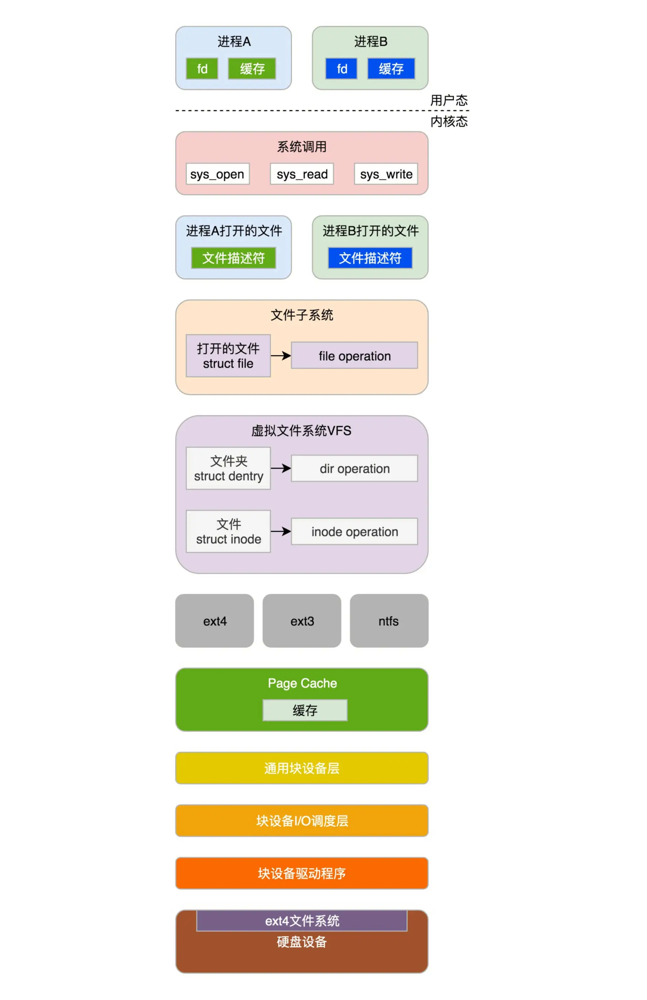
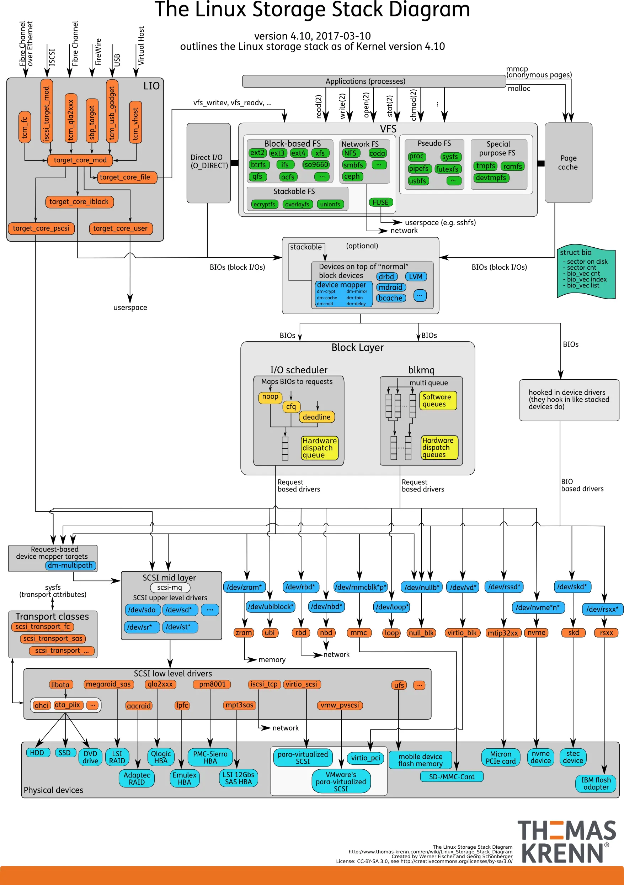
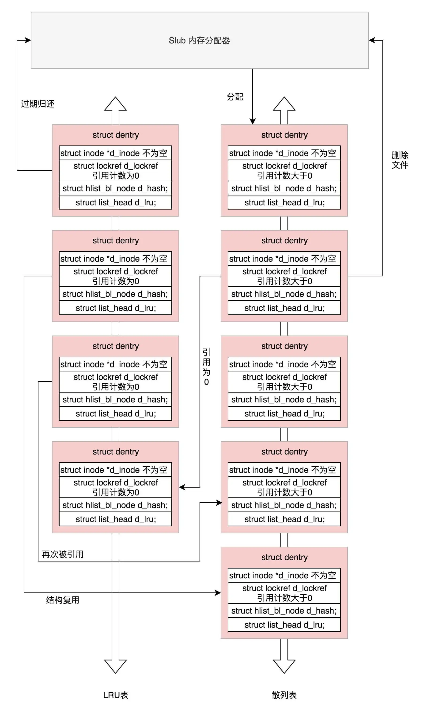
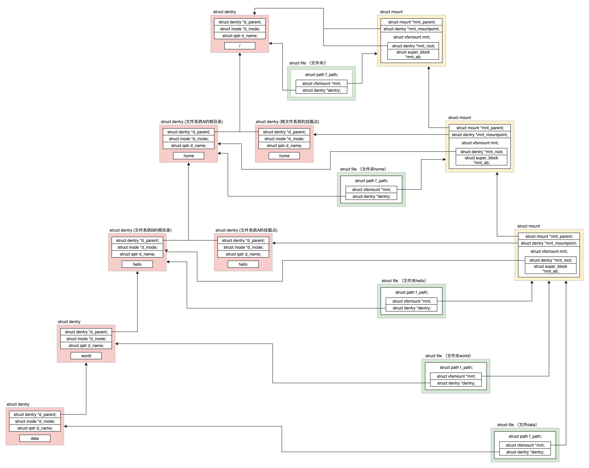

## 一. 前言

基于上文介绍的文件系统的基本结构，本文将继续深入Linux文件系统的精髓所在：虚拟文件系统。操作文件的本质是将磁盘文件数据映射到进程中，上文的文件系统是如何存储文件数据，而从进程如何映射到该文件系统，中间还有一系列的过程，主要包括

* 进程发出文件操作命令，通过系统调用如sys_open、sys_read、sys_write调用相应内核函数
* 在内核中为进程打开的文件和系统文件创建数据结构进行维护
* 通过虚拟文件系统对各种不同的文件系统操作，如I/O设备、管道、进程间通信、网络等进行抽象并统一接口
* 实现虚拟文件系统和实际文件系统如ext4的挂载
* 提供文件系统和I/O设备层的设备驱动接口及加快读写效率的缓存



整体层次如上图所示，其实可以概括为文件系统层、通用快层和设备层，如下图所示。



* 文件系统层，包括虚拟文件系统和其他各种文件系统的具体实现。它为上层的应用程序，提供标准的文件访问接口；对下会通过通用块层，来存储和管理磁盘数据。
* 通用块层，包括块设备 I/O 队列和 I/O 调度器。它会对文件系统的 I/O 请求进行排队，再通过重新排序和请求合并，然后才要发送给下一级的设备层。
* 设备层，包括存储设备和相应的驱动程序，负责最终物理设备的 I/O 操作。

下面就此展开详细叙述虚拟文件系统打开文件的整个过程。

## 二. dentry介绍

在介绍从用户态调用至打开文件执行操作的流程前，我们先分析一下虚拟文件系统中的重要结构体，然后再分析映射关系的建立，以便于后文的理解。通过上文我们知道磁盘中实际的文件系统有ext4, NTFS等类型，通过超级块、块描述符、块位图、块列表等结构构成，其中一系列的文件块由文件系统对应的结构体如ext4_inode构成。虚拟文件系统是对文件系统的抽象，保存在内存之中，由dentry结构体和inode构成。

* 索引节点，即 inode，用来记录文件的元数据，比如 inode 编号、文件大小、访问权限、修改日期、数据的位置等。索引节点和文件一一对应，它跟文件内容一样，都会被持久化存储到磁盘中。所以记住，索引节点同样占用磁盘空间。
* 目录项，即 dentry，用来记录文件的名字、索引节点指针以及与其他目录项的关联关系。多个关联的目录项，就构成了文件系统的目录结构。不过，不同于索引节点，目录项是由内核维护的一个内存数据结构，所以通常也被叫做目录项缓存。

  inode对应于实际的索引节点如ext4_inode，而dentry则表示了不同层级之间的关系，也是链接所使用的结构体。dentry通过d_parent来和上级目录构成链接关系，通过d_op来存储对应的实际文件系统的文件操作，如创建、删除、打开、读写等。d_sb指向实际文件系统的超级块，该结构在上文已详细介绍。d_inode指向对应的inode，d_name表示该文件的文件名。

```c
struct dentry {
......
    struct hlist_bl_node d_hash;	/* lookup hash list */
    struct dentry *d_parent;	/* parent directory */
    struct qstr d_name;    
    struct inode *d_inode;		/* Where the name belongs to - NULL is negative */    
    const struct dentry_operations *d_op;
    struct super_block *d_sb;	/* The root of the dentry tree */    
......
    union {
        struct list_head d_lru;		/* LRU list */
        wait_queue_head_t *d_wait;	/* in-lookup ones only */
    };
......
} __randomize_layout;
```

  除此之外，dentry有两个特殊的成员变量d_lru和d_hash。这其实关联于两张dentry cache表，顾名思义，该表保存的是一系列已分配过的dentry的缓存池，用于文件操作中快速的查找和使用。

* 哈希表 dentry_hashtable：dcache 中的所有 dentry 对象都通过 d_hash 指针链到相应的 dentry 哈希链表中；

* 未使用的 dentry 对象链表 s_dentry_lru：dentry 对象通过其 d_lru 指针链入 LRU 链表中。

这两个列表之间会产生复杂的关系：

* 引用为 0：一个在散列表中的 dentry 变成没有人引用了，就会被加到 LRU 表中去；

* 再次被引用：一个在 LRU 表中的 dentry 再次被引用了，则从 LRU 表中移除；

* 分配：当 dentry 在散列表中没有找到，则从 Slub 分配器中分配一个；

* 过期归还：当 LRU 表中最长时间没有使用的 dentry 应该释放回 Slub 分配器；

* 文件删除：文件被删除了，相应的 dentry 应该释放回 Slub 分配器；

* 结构复用：当需要分配一个 dentry，但是无法分配新的，就从 LRU 表中取出一个来复用。



## 三. 文件系统挂载

我们通过虚拟文件系统映射到对应的实际文件系统，该操作称之为文件系统的挂载。以ext4文件系统为例，我们需要通过 register_filesystem() 进行注册，传入的参数是 ext4_fs_type，表示注册的是 ext4 类型的文件系统，这里面最重要的一个成员变量就是 ext4_mount。

```
register_filesystem(&ext4_fs_type);

static struct file_system_type ext4_fs_type = {
    .owner    = THIS_MODULE,
    .name    = "ext4",
    .mount    = ext4_mount,
    .kill_sb  = kill_block_super,
    .fs_flags  = FS_REQUIRES_DEV,
};
```

mount() 系统调用的定义如下，主要调用链为do_mount()->do_new_mount()->do_new_mount_fc()。

```c
SYSCALL_DEFINE5(mount, char __user *, dev_name, char __user *, dir_name, char __user *, type, unsigned long, flags, void __user *, data)
{
......
    ret = do_mount(kernel_dev, dir_name, kernel_type, flags, options);
......
}
do_new_mount_fc()先是调用vfs_create_mount()创建 struct mount 结构，每个挂载的文件系统都对应于这样一个结构，接着调用 do_add_mount()完成挂载操作。

/*
 * Create a new mount using a superblock configuration and request it
 * be added to the namespace tree.
 */
static int do_new_mount_fc(struct fs_context *fc, struct path *mountpoint,
               unsigned int mnt_flags)
{
    struct vfsmount *mnt;
......
    mnt = vfs_create_mount(fc);
......
    error = do_add_mount(real_mount(mnt), mountpoint, mnt_flags);
......
}
```

首先看看fs_context结构体，该结构体用于保存超级块的信息的root，而超级块本身包含了该实际文件系统的信息，因此通过该结构体，我们可以使该文件系统和mount结构体建立联系。在旧版的Linux源码中，我们需要使用mount_fs()函数去获取对应的root，而新版则可以通过fs_context直接获取。

```c
struct fs_context {
......
    struct dentry		*root;		/* The root and superblock */
......
};
```

接着我们来看看mount结构体和vfsmount结构体。每个文件系统会创建一个mount结构体表示其挂载的信息，其中mnt_parent指向该文件系统挂载的父文件系统，mnt_mountpoint 是装载点在父文件系统中的 dentry。vfsmount结构体中mnt_root 是当前文件系统根目录的 dentry，mnt_sb 是指向超级块的指针。这里之所以会有mnt_mountpoint和mnt_root，是因为在挂载时该文件系统的根目录同时成为了其父文件系统的一个子目录（挂载点）。

```c
struct vfsmount {
    struct dentry *mnt_root;	/* root of the mounted tree */
    struct super_block *mnt_sb;	/* pointer to superblock */
    int mnt_flags;
} __randomize_layout;

struct mount {
    struct hlist_node mnt_hash;
    struct mount *mnt_parent;
    struct dentry *mnt_mountpoint;
    struct vfsmount mnt;
    union {
        struct rcu_head mnt_rcu;
        struct llist_node mnt_llist;
    };
......
    struct list_head mnt_mounts;	/* list of children, anchored here */
    struct list_head mnt_child;	/* and going through their mnt_child */
    struct list_head mnt_instance;	/* mount instance on sb->s_mounts */
    const char *mnt_devname;	/* Name of device e.g. /dev/dsk/hda1 */
    struct list_head mnt_list;
......
} __randomize_layout;

```

由此，我们完成了挂载，并和目录系统dentry构成了对应关系。下面举个简单的例子。在Linux内核启动时，首先会挂载根目录文件系统，因此创建了一个mount结构体和根目录dentry。假设我们挂载一个文件系统A，该文件系统A包含一个文件夹home(由dentry表示)，则会创建一个新的mount结构体指向根目录的mount，并创建一个dentry表示该处为此文件系统A的挂载点。假设还有新的文件系统B包括了一个目录hello/world/data，则会采用同样的方式进行挂载和映射关系的建立，如下图所示。
  


在图中，我们还标出了一个结构体file，该结构体保存了指针分别指向dentry和mount，由此可以方便的进行虚拟文件系统的管理。而实际上，我们在用户态调用GLIBC函数获取的文件描述符也是直接和file结构体映射，并由此对虚拟文件系统中的文件进行方便的操作。

## 四. 打开/创建文件操作

  从用户态发起的文件操作主要包括创建、删除、打开、读写、权限管理等，这里以open()为例来解读。在系统调用一文中，我们同样以open()为例说明了其从GLIBC调用到到DO_CALL()，通过80软中断陷入内核，并最终通过查找系统调用表sys_call_talbe调用对应的系统调用do_sys_open()。本文就从do_sys_open()开始深入介绍其实现。

  do_sys_open()函数首先调用build_open_flags()将传递进来的flags进行解析并存在op中，接着调用get_unused_fd_flags()获取一个可用的文件描述符fd，接着调用do_file_open()创建文件结构f，并通过fd_install()将f其和文件描述符fd关联起来。这里的文件结构f即上文所述的结构体file。

```c
long do_sys_open(int dfd, const char __user *filename, int flags, umode_t mode)
{
    struct open_flags op;
    int fd = build_open_flags(flags, mode, &op);
......
    fd = get_unused_fd_flags(flags);
    if (fd >= 0) {
        struct file *f = do_filp_open(dfd, tmp, &op);
        if (IS_ERR(f)) {
            put_unused_fd(fd);
            fd = PTR_ERR(f);
        } else {
            fsnotify_open(f);
            fd_install(fd, f);
        }
    }
    putname(tmp);
    return fd;
}
```

get_unused_fd_flags()函数实际调用__alloc_fd()函数，源码如下所示。这里传参files_struct来源于当前运行的task_struct中的files指针，该结构体最关键的是携带了文件描述符表struct file __rcu * fd_array[NR_OPEN_DEFAULT]。对于任何一个任务，默认情况下文件描述符 0 表示 stdin 标准输入，文件描述符 1 表示 stdout 标准输出，文件描述符 2 表示 stderr 标准错误输出，除此之外打开的文件都会从这个列表中找一个空闲位置分配给它。文件描述符列表的每一项都是一个指向 struct file 的指针，也就是说每打开一个文件都会有一个 struct file 对应。

传入文件描述符表后，首先将fd赋值为files->next_fd，然后通过find_next_fd()去检查是否可用，如果不可用则会继续自增直至找到可用的文件描述符。找到之后，会将files->next_fd赋值为fd + 1以备下次使用，最后调用__set_open_fd()将fd位表的修改赋给fdt并保存。

```c
/*
 * allocate a file descriptor, mark it busy.
 */
int __alloc_fd(struct files_struct *files,
           unsigned start, unsigned end, unsigned flags)
{
    unsigned int fd;
    struct fdtable *fdt;
......
    fdt = files_fdtable(files);
    fd = start;
    if (fd < files->next_fd)
        fd = files->next_fd;
    if (fd < fdt->max_fds)
        fd = find_next_fd(fdt, fd);
......
    if (start <= files->next_fd)
        files->next_fd = fd + 1;
    __set_open_fd(fd, fdt);
......
}
```

do_file_open()首先初始化了 struct nameidata 结构，该结构用于解析和查找文件路径。接着调用path_openat()，该函数会创建文件结构file，对文件路径进行解析和处理，并最终获取文件对应的索引节点inode并初始化file文件对象。

```c
struct file *do_filp_open(int dfd, struct filename *pathname,
        const struct open_flags *op)
{
    struct nameidata nd;
    struct file *filp;
    set_nameidata(&nd, dfd, pathname);
    filp = path_openat(&nd, op, flags | LOOKUP_RCU);
......
    restore_nameidata();
    return filp;
}
```c

首先展开看看nameidata结构体，这里主要包括了如路径相关的path，last和root，虚拟文件系统的索引节点inode，标记位flags，序列号seq, m_seq，类型last_type，文件层级深度depth，链接相关的total_link_count和结构体stack，文件名filename *name等。

```c
struct nameidata {
    struct path	path;
    struct qstr	last;
    struct path	root;
    struct inode	*inode; /* path.dentry.d_inode */
......
} __randomize_layout;
```

这里展开看一下结构体path，其中struct vfsmount 即上节所述的挂载变量，而dentry则为对应的目录结构体。

```c
struct path {
    struct vfsmount *mnt;
    struct dentry *dentry;
} __randomize_layout;
```

path_openat()函数主要逻辑如下

* 调用alloc_empty_filp() 生成一个 struct file 结构体，实际最终调用kmem_cache_alloc()分配，即采用前文所述的slab分配器分配；
* 调用path_init() 初始化 nameidata，准备开始节点路径查找；
* 调用link_path_walk()对于路径名逐层进行节点路径查找，这里面有一个大的循环，用“/”分隔逐层处理。例如，文件“/root/hello/world/data”，link_path_walk 会解析前面的路径部分“/root/hello/world”，解析完毕的时候 nameidata 的 dentry 为路径名的最后一部分的父目录“/root/hello/world”，而 nameidata 的 filename 为路径名的最后一部分“data”。
* 调用do_last() 获取文件对应的 inode 对象，并且初始化 file 对象。
* 调用terminate_walk()返回路径保存在nd中

```c
static struct file *path_openat(struct nameidata *nd,
            const struct open_flags *op, unsigned flags)
{
    struct file *file;
    int error;
    file = alloc_empty_file(op->open_flag, current_cred());
......
        const char *s = path_init(nd, flags);
        while (!(error = link_path_walk(s, nd)) &&
            (error = do_last(nd, file, op)) > 0) {
            nd->flags &= ~(LOOKUP_OPEN|LOOKUP_CREATE|LOOKUP_EXCL);
            s = trailing_symlink(nd);
        }
        terminate_walk(nd);
......
}
```

do_last()函数如其名字一样，完成了最后一部分的解析和处理工作。首先调用lookup_fast()查找文件路径最后一部分对应的dentry，接着使用lookup_open()判断是否需要创建新的dentry，最终将dentry赋值给path。最后调用vfs_open()真正的打开文件。

```c
/*
 * Handle the last step of open()
 */
static int do_last(struct nameidata *nd,
           struct file *file, const struct open_flags *op)
{
......
    error = lookup_fast(nd, &path, &inode, &seq);
......
    error = lookup_open(nd, &path, file, op, got_write);
......
    error = vfs_open(&nd->path, file);
......
}
```

首先来看看lookup_fast()部分，Linux 为了提高目录项对象的处理效率，设计与实现了目录项高速缓存 dentry cache，简称 dcache，在上节中已有详细描述。lookup_fast()会在dcache中去试图找到该对应的dentry，实际最终会调用hlist_bl_for_each_entry_rcu轮询列表进行查找。

```c
static int lookup_fast(struct nameidata *nd,
               struct path *path, struct inode **inode,
               unsigned *seqp)
{
    struct vfsmount *mnt = nd->path.mnt;
    struct dentry *dentry, *parent = nd->path.dentry;
......
        dentry = __d_lookup_rcu(parent, &nd->last, &seq);
......
        dentry = __d_lookup(parent, &nd->last);
......
}
```

lookup_open()会针对没有找到的情况创建一个新的 dentry，并且调用上一级目录的 Inode 的 inode_operations 的 lookup 函数，对于 ext4 来讲，调用的是 ext4_lookup，会到文件系统里面去找对应的ext4_inode。最终找到后将新生成的 dentry 赋给 path 变量。

```c
static int lookup_open(struct nameidata *nd, struct path *path,
      struct file *file,
      const struct open_flags *op,
      bool got_write, int *opened)
{
......
    dentry = d_alloc_parallel(dir, &nd->last, &wq);
......
    struct dentry *res = dir_inode->i_op->lookup(dir_inode, dentry,
                   nd->flags);
......
    path->dentry = dentry;
    path->mnt = nd->path.mnt;
}

const struct inode_operations ext4_dir_inode_operations = {
  .create    = ext4_create,
  .lookup    = ext4_lookup,
...
```

do_last() 的最后一步是调用 vfs_open() 真正打开文件，实际调用 f_op->open，也就是调用 ext4_file_open()。另外一件重要的事情是将打开文件的所有信息填写到 struct file 这个结构里面，从而完成了整个打开的过程。

```c
int vfs_open(const struct path *path, struct file *file,
       const struct cred *cred)
{
  struct dentry *dentry = d_real(path->dentry, NULL, file->f_flags, 0);
......
  file->f_path = *path;
  return do_dentry_open(file, d_backing_inode(dentry), NULL, cred);
}

static int do_dentry_open(struct file *f,
        struct inode *inode,
        int (*open)(struct inode *, struct file *),
        const struct cred *cred)
{
......
    f->f_mode = OPEN_FMODE(f->f_flags) | FMODE_LSEEK |
        FMODE_PREAD | FMODE_PWRITE;
    path_get(&f->f_path);
    f->f_inode = inode;
    f->f_mapping = inode->i_mapping;
......
    f->f_op = fops_get(inode->i_fop);
......
    open = f->f_op->open;
......
    error = open(inode, f);
......
    f->f_flags &= ~(O_CREAT | O_EXCL | O_NOCTTY | O_TRUNC);
    file_ra_state_init(&f->f_ra, f->f_mapping->host->i_mapping);
    return 0;
......
}

const struct file_operations ext4_file_operations = {
......
    .open    = ext4_file_open,
......
};
```

我们总结一下open()函数的执行流程：其核心在于创建文件描述符和分配对应的file结构体并将二者结合起来，最后返回文件描述符以供后续使用。从这里面我们能看出虚拟文件系统所起到的作用：

* 对每个task_struct建立一个文件描述符表管理该任务对应的文件
* 使用mount, vfsmount和dentry建立虚拟文件系统和实际文件系统的关联
* 创建file结构体来表述dentry和mount，并建立和文件描述符的关系以便使用
* 通过dentry查找对应inode，分配file结构体并完成初始化工作
* 通过虚拟文件系统和实际文件系统的映射，调用实际文件系统如ext4对应的函数完成打开操作

由此可见，虚拟文件实际是一层中间的抽象层，将具体的文件系统以及磁盘文件抽象为dentry和对应的inode，对上层的用户态封装为统一的文件描述符（磁盘文件，网络文件等），通过文件描述符和文件的绑定关系进行操作、处理。下图是对上文的一个总结。


## 五. 读写文件操作

有了上文的基础，文件的读写就容易理解了。首先给出读写对应的系统调用。

```c
SYSCALL_DEFINE3(read, unsigned int, fd, char __user *, buf, size_t, count)
{
    struct fd f = fdget_pos(fd);
......
    loff_t pos = file_pos_read(f.file);
    ret = vfs_read(f.file, buf, count, &pos);
......
}

SYSCALL_DEFINE3(write, unsigned int, fd, const char __user *, buf,
    size_t, count)
{
    struct fd f = fdget_pos(fd);
......
    loff_t pos = file_pos_read(f.file);
      ret = vfs_write(f.file, buf, count, &pos);
......
}
```

对于 read() 来讲，里面调用 vfs_read()->__vfs_read()。对于 write() 来讲，里面调用 vfs_write()->__vfs_write()。每一个打开的文件都有一个 struct file 结构。这里面有一个 struct file_operations f_op，用于定义对这个文件做的操作。__vfs_read() 会调用相应文件系统的 file_operations 里面的 read() 操作，__vfs_write() 会调用相应文件系统 file_operations 里的 write() 操作。

```c
ssize_t __vfs_read(struct file *file, char __user *buf, size_t count,
           loff_t *pos)
{
    if (file->f_op->read)
        return file->f_op->read(file, buf, count, pos);
    else if (file->f_op->read_iter)
        return new_sync_read(file, buf, count, pos);
    else
        return -EINVAL;
}

static ssize_t __vfs_write(struct file *file, const char __user *p,
               size_t count, loff_t *pos)
{
    if (file->f_op->write)
        return file->f_op->write(file, p, count, pos);
    else if (file->f_op->write_iter)
        return new_sync_write(file, p, count, pos);
    else
        return -EINVAL;
}
```

对于 ext4 文件系统来讲，内核定义了一个 ext4_file_operations。由于 ext4 没有定义 read() 和 write() 函数，于是会调用 ext4_file_read_iter() 和 ext4_file_write_iter()。ext4_file_read_iter() 会调用 generic_file_read_iter()，ext4_file_write_iter() 会调用 __generic_file_write_iter()。

```c
const struct file_operations ext4_file_operations = {
......
    .read_iter  = ext4_file_read_iter,
    .write_iter  = ext4_file_write_iter,
......
}

ssize_t
generic_file_read_iter(struct kiocb *iocb, struct iov_iter *iter)
{
......
    if (iocb->ki_flags & IOCB_DIRECT) {
......
        struct address_space *mapping = file->f_mapping;
......
        retval = mapping->a_ops->direct_IO(iocb, iter);
    }
......
    retval = generic_file_buffered_read(iocb, iter, retval);
}

ssize_t __generic_file_write_iter(struct kiocb *iocb, struct iov_iter *from)
{
......
    if (iocb->ki_flags & IOCB_DIRECT) {
......
        written = generic_file_direct_write(iocb, from);
......
    } else {
......
        written = generic_perform_write(file, from, iocb->ki_pos);
......
    }
}
```

generic_file_read_iter() 和 __generic_file_write_iter() 有相似的逻辑，就是要区分是否用缓存。缓存其实就是内存中的一块空间。因为内存比硬盘快得多，Linux 为了改进性能，有时候会选择不直接操作硬盘，而是读写都在内存中，然后批量读取或者写入硬盘。一旦能够命中内存，读写效率就会大幅度提高。因此，根据是否使用内存做缓存，我们可以把文件的 I/O 操作分为两种类型。

* 第一种类型是缓存 I/O。大多数文件系统的默认 I/O 操作都是缓存 I/O，缓存需要文件和内存页进行关联，这就要用到 address_space。address_space 的相关操作定义在 struct address_space_operations 结构中。对于 ext4 文件系统来讲， address_space 的操作定义在 ext4_aops，direct_IO 对应的函数是 ext4_direct_IO。
  * 对于读操作来讲，操作系统会先检查内核的缓冲区有没有需要的数据。如果已经缓存了，那就直接从缓存中返回；否则从磁盘中读取，然后缓存在操作系统的缓存中。
  * 对于写操作来讲，操作系统会先将数据从用户空间复制到内核空间的缓存中。这时对用户程序来说，写操作就已经完成。至于什么时候再写到磁盘中由操作系统决定，除非显式地调用了 sync 同步命令。
* 第二种类型是直接 IO，就是应用程序直接访问磁盘数据，而不经过内核缓冲区，从而减少了在内核缓存和用户程序之间数据复制。在读写逻辑中如果设置了IOCB_DIRECT，则会调用address_space的direct_IO函数实现。
  
  ext4_direct_IO 最终会调用到 __blockdev_direct_IO->do_blockdev_direct_IO，这就跨过了缓存层，到了通用块层，最终到了文件系统的设备驱动层。由于文件系统是块设备，所以这个调用的是 blockdev 相关的函数，有关块设备驱动程序的原理我们会在设备驱动一节详细分析，这一节我们就讲到文件系统到块设备的分界线部分。

下面看看带缓冲的读写generic_perform_write()和generic_file_buffered_read()。

### 5.1 带缓冲的写操作
  generic_perform_write()需要找出这次写入影响的所有的页，然后依次写入。对于每一个循环，主要做四件事情：

* 对于每一页先调用 address_space 的 write_begin() 做一些准备；
* 调用 iov_iter_copy_from_user_atomic()将写入的内容从用户态拷贝到内核态的页中；
* 调用 address_space 的 write_end() 完成写操作；
* 调用 balance_dirty_pages_ratelimited()看脏页是否太多需要写回硬盘。所谓脏页就是写入到缓存但是还没有写入到硬盘的页面。

```c
ssize_t generic_perform_write(struct file *file,
                struct iov_iter *i, loff_t pos)
{
    struct address_space *mapping = file->f_mapping;
    const struct address_space_operations *a_ops = mapping->a_ops;
......
    do {
        struct page *page;
        unsigned long offset;	/* Offset into pagecache page */
        unsigned long bytes;	/* Bytes to write to page */
......
        status = a_ops->write_begin(file, mapping, pos, bytes, flags,
                        &page, &fsdata);
......
        copied = iov_iter_copy_from_user_atomic(page, i, offset, bytes);
......
        status = a_ops->write_end(file, mapping, pos, bytes, copied,
                        page, fsdata);
......
        balance_dirty_pages_ratelimited(mapping);
    } while (iov_iter_count(i));
    return written ? written : status;
}
EXPORT_SYMBOL(generic_perform_write);
```

第一步，对于ext4 来讲调用的是 ext4_write_begin()函数。ext4有着以下几种模式

* 日志（Journal）模式。日志文件系统比非日志文件系统多了一个 Journal 区域。文件在 ext4 中分两部分存储，一部分是文件的元数据，另一部分是数据。元数据和数据的操作日志 Journal 也是分开管理的。你可以在挂载 ext4 的时候，选择 Journal 模式。这种模式在将数据写入文件系统前，必须等待元数据和数据的日志已经落盘才能发挥作用。这样性能比较差，但是最安全。
* order 模式。这个模式不记录数据的日志，只记录元数据的日志，但是在写元数据的日志前必须先确保数据已经落盘。这个折中是默认模式。
* writeback，不记录数据的日志，仅记录元数据的日志，并且不保证数据比元数据先落盘。这个性能最好，但是最不安全。
  
  在 ext4_write_begin()，我们能看到对于 ext4_journal_start() 的调用就是在做日志相关的工作。在 ext4_write_begin() 中，还做了另外一件重要的事情，就是调用 grab_cache_page_write_begin()来得到应该写入的缓存页。
```c
static int ext4_write_begin(struct file *file, struct address_space *mapping,
                loff_t pos, unsigned len, unsigned flags,
                struct page **pagep, void **fsdata)
{
......
    page = grab_cache_page_write_begin(mapping, index, flags);
......
    handle = ext4_journal_start(inode, EXT4_HT_WRITE_PAGE, needed_blocks);
......
}

struct page *grab_cache_page_write_begin(struct address_space *mapping,
          pgoff_t index, unsigned flags)
{
    struct page *page;
    int fgp_flags = FGP_LOCK|FGP_WRITE|FGP_CREAT;
    page = pagecache_get_page(mapping, index, fgp_flags,
        mapping_gfp_mask(mapping));
    if (page)
      wait_for_stable_page(page);
    return page;
}
```

在内核中，缓存以页为单位放在内存里面，为了知道文件的哪些数据已经存放在内存中，我们需要使用address space。每一个打开的文件都有一个 struct file 结构，每个 struct file 结构都有一个 struct address_space 用于关联文件和内存，就是在这个结构里面，有一棵树用于保存所有与这个文件相关的的缓存页，这就是radix tree。我们查找的时候，往往需要根据文件中的偏移量找出相应的页面，而基数树 radix tree 这种数据结构能够快速根据一个长整型查找到其相应的对象，因而这里缓存页就放在 radix 基数树里面。pagecache_get_page() 就是根据 pgoff_t index 这个长整型，在这棵树里面查找缓存页，如果找不到就会创建一个缓存页。

```c
struct address_space {
    struct inode    *host;    /* owner: inode, block_device */
    struct radix_tree_root  page_tree;  /* radix tree of all pages */
    spinlock_t    tree_lock;  /* and lock protecting it */
......
}
  第二步，调用 iov_iter_copy_from_user_atomic()。先将分配好的页面调用 kmap_atomic() 映射到内核里面的一个虚拟地址，然后将用户态的数据拷贝到内核态的页面的虚拟地址中，调用 kunmap_atomic() 把内核里面的映射删除。

size_t iov_iter_copy_from_user_atomic(struct page *page,
    struct iov_iter *i, unsigned long offset, size_t bytes)
{
    char *kaddr = kmap_atomic(page), *p = kaddr + offset;
    iterate_all_kinds(i, bytes, v,
      copyin((p += v.iov_len) - v.iov_len, v.iov_base, v.iov_len),
      memcpy_from_page((p += v.bv_len) - v.bv_len, v.bv_page,
      v.bv_offset, v.bv_len),
      memcpy((p += v.iov_len) - v.iov_len, v.iov_base, v.iov_len)
    )
    kunmap_atomic(kaddr);
    return bytes;
}
```

第三步，调用 ext4_write_end() 完成写入。这里面会调用 ext4_journal_stop() 完成日志的写入，会调用 block_write_end->__block_commit_write->mark_buffer_dirty，将修改过的缓存标记为脏页。可以看出，其实所谓的完成写入，并没有真正写入硬盘，仅仅是写入缓存后，标记为脏页。

第四步，调用 balance_dirty_pages_ratelimited()，回写脏页。

```c
/**
 * balance_dirty_pages_ratelimited - balance dirty memory state
 * @mapping: address_space which was dirtied
 *
 * Processes which are dirtying memory should call in here once for each page
 * which was newly dirtied.  The function will periodically check the system's
 * dirty state and will initiate writeback if needed.
  */
void balance_dirty_pages_ratelimited(struct address_space *mapping)
{
    struct inode *inode = mapping->host;
    struct backing_dev_info *bdi = inode_to_bdi(inode);
    struct bdi_writeback *wb = NULL;
    int ratelimit;
......
    if (unlikely(current->nr_dirtied >= ratelimit))
        balance_dirty_pages(mapping, wb, current->nr_dirtied);
......
}
```

在 balance_dirty_pages_ratelimited() 里面，发现脏页的数目超过了规定的数目，就调用 balance_dirty_pages()->wb_start_background_writeback()，启动一个背后线程开始回写。

```c
void wb_start_background_writeback(struct bdi_writeback *wb)
{
      /*
       * We just wake up the flusher thread. It will perform background
       * writeback as soon as there is no other work to do.
       */
      wb_wakeup(wb);
}

static void wb_wakeup(struct bdi_writeback *wb)
{
    spin_lock_bh(&wb->work_lock);
    if (test_bit(WB_registered, &wb->state))
      mod_delayed_work(bdi_wq, &wb->dwork, 0);
    spin_unlock_bh(&wb->work_lock);
}

/* bdi_wq serves all asynchronous writeback tasks */
struct workqueue_struct *bdi_wq;

/**
 * mod_delayed_work - modify delay of or queue a delayed work
 * @wq: workqueue to use
 * @dwork: work to queue
 * @delay: number of jiffies to wait before queueing
 *
 * mod_delayed_work_on() on local CPU.
 */
static inline bool mod_delayed_work(struct workqueue_struct *wq,
            struct delayed_work *dwork,
            unsigned long delay)
{....
```

通过上面的代码我们可以看出，bdi_wq 是一个全局变量，所有回写的任务都挂在这个队列上。mod_delayed_work() 函数负责将一个回写任务 bdi_writeback 挂在这个队列上。bdi_writeback 有个成员变量 struct delayed_work dwork，bdi_writeback 就是以 delayed_work 的身份挂到队列上的，并且把 delay 设置为 0，意思就是一刻不等，马上执行。这里的 bdi 的意思是 backing device info，用于描述后端存储相关的信息。每个块设备都会有这样一个结构，并且在初始化块设备的时候，调用 bdi_init() 初始化这个结构，在初始化 bdi 的时候，也会调用 wb_init() 初始化 bdi_writeback。

```c
static int wb_init(struct bdi_writeback *wb, struct backing_dev_info *bdi,
       int blkcg_id, gfp_t gfp)
{
    wb->bdi = bdi;
    wb->last_old_flush = jiffies;
    INIT_LIST_HEAD(&wb->b_dirty);
    INIT_LIST_HEAD(&wb->b_io);
    INIT_LIST_HEAD(&wb->b_more_io);
    INIT_LIST_HEAD(&wb->b_dirty_time);
    wb->bw_time_stamp = jiffies;
    wb->balanced_dirty_ratelimit = INIT_BW;
    wb->dirty_ratelimit = INIT_BW;
    wb->write_bandwidth = INIT_BW;
    wb->avg_write_bandwidth = INIT_BW;
    spin_lock_init(&wb->work_lock);
    INIT_LIST_HEAD(&wb->work_list);
    INIT_DELAYED_WORK(&wb->dwork, wb_workfn);
    wb->dirty_sleep = jiffies;
......
}

#define __INIT_DELAYED_WORK(_work, _func, _tflags)      \
  do {                \
    INIT_WORK(&(_work)->work, (_func));      \
    __setup_timer(&(_work)->timer, delayed_work_timer_fn,  \
            (unsigned long)(_work),      \
```

  这里面最重要的是 INIT_DELAYED_WORK。其实就是初始化一个 timer，也即定时器，到时候我们就执行 wb_workfn() 这个函数。接下来的调用链为：wb_workfn->wb_do_writeback->wb_writeback->writeback_sb_inodes->__writeback_single_inode->do_writepages，写入页面到硬盘。在调用 write 的最后，当发现缓存的数据太多的时候会触发回写，这仅仅是回写的一种场景。另外还有几种场景也会触发回写：

* 用户主动调用 sync，将缓存刷到硬盘上去，最终会调用 wakeup_flusher_threads，同步脏页；
* 当内存十分紧张，以至于无法分配页面的时候，会调用 free_more_memory，最终会调用 wakeup_flusher_threads，释放脏页；
* 脏页已经更新了较长时间，时间上超过了 timer，需要及时回写，保持内存和磁盘上数据一致性。

### 5.2 带缓冲的读操作

  带缓存的写分析完了，接下来，我们看带缓存的读，对应的是函数 generic_file_buffered_read()。

```c
static ssize_t generic_file_buffered_read(struct kiocb *iocb,
    struct iov_iter *iter, ssize_t written)
{
    struct file *filp = iocb->ki_filp;
    struct address_space *mapping = filp->f_mapping;
    struct inode *inode = mapping->host;
    for (;;) {
        struct page *page;
        pgoff_t end_index;
        loff_t isize;
        page = find_get_page(mapping, index);
        if (!page) {
            if (iocb->ki_flags & IOCB_NOWAIT)
                goto would_block;
            page_cache_sync_readahead(mapping,
                ra, filp,
                index, last_index - index);
            page = find_get_page(mapping, index);
            if (unlikely(page == NULL))
                goto no_cached_page;
        }
        if (PageReadahead(page)) {
            page_cache_async_readahead(mapping,
                ra, filp, page,
            index, last_index - index);
        }
    /*
     * Ok, we have the page, and it's up-to-date, so
     * now we can copy it to user space...
     */
    ret = copy_page_to_iter(page, offset, nr, iter);
    }
}
```

读取比写入总体而言简单一些，主要涉及预读的问题。在 generic_file_buffered_read() 函数中，我们需要先找到 page cache 里面是否有缓存页。如果没有找到，不但读取这一页，还要进行预读，这需要在 page_cache_sync_readahead() 函数中实现。预读完了以后，再试一把查找缓存页，应该能找到了。如果第一次找缓存页就找到了，我们还是要判断，是不是应该继续预读；如果需要，就调用 page_cache_async_readahead() 发起一个异步预读。最后，copy_page_to_iter() 会将内容从内核缓存页拷贝到用户内存空间。


## 六. 总结
  
  本文详细的总结了虚拟文件系统，并分析了文件操作中的打开和读写操作，由此我们完成了文件系统的框架的全部解析工作。
