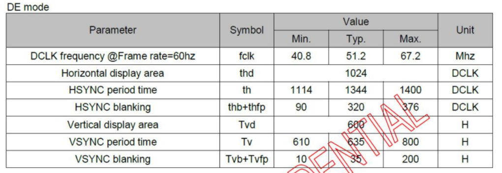
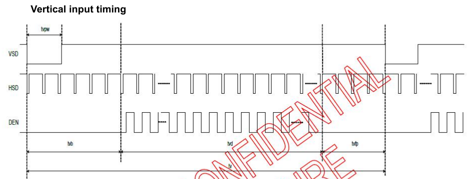

# 引言

最近发现一堆朋友竟然卡在点屏，以下是我在学习MIPI接口的LCD驱动开发与调试时的笔记，这里我主要用的是MIPI-DSI接口，说简单谈不上，但学起来其实也稍微有点复杂的，特别是对于连驱动都没写过的人来说更是头疼。

首先了解下什么是`MIPI-DSI`：

`MIPI-DSI`是一种应用于显示技术的串行接口，兼容DPI(显示像素接口，`Display Pixel Interface`)、DBI(显示总线接口，`Display Bus Interface`)和DCS(显示命令集，`Display Command Set`)，以串行的方式发送像素信息或指令给外设，而且从外设中读取状态信息或像素信息，而且在传输的过程中享有自己独立的通信协议，包括数据包格式和纠错检错机制。下图所示的是MIPI-DSI接口的简单示意图。`MIPI-DSI`具备高速模式和低速模式两种工作模式，全部数据通道都可以用于单向的高速传输，但只有第一个数据通道才可用于低速双向传输，从属端的状态信息、像素等格式通过该数据通道返回。时钟通道专用于在高速传输数据的过程中传输同步时钟信号。此外，一个主机端可允许同时与多个从属端进行通信。


那么，在Linux中调试`MIPI LCD`需要注意哪些细节呢？

- 供电
- 复位
- 时序
- 像素时钟
- MIPI时钟
- MIPI命令
- MIPI数据格式

# 参数解读（走马观花）

在Linux驱动开发过程中，一般通用的MIPI的驱动都是现成的，比如以下的`simple-panel-dsi`，就是通用的MIPI接口LCD驱动，它在Linux内核中位于`driver/gpu/drm/panel`目录下，对应的文件是：`panel-simple.c`。

一般使用通用的MIPI LCD驱动，我们只需要根据自己选购的屏的参数进行配置即可，也就是只需要配置设备树即可顺利完成点屏的操作，那么如何来配置相关参数呢？这里我用的是瑞芯微的RV1109方案，在此借用荣品LCD的设备树我们来学习下它的设备树参数：

```
&dsi {
 status = "okay";

 rockchip,lane-rate = <480>;
 panel@0 {
  compatible ="simple-panel-dsi";
  reg = <0>;
  backlight = <&backlight>;
  /delete-property/ power-supply;
  prepare-delay-ms = <100>;
  reset-delay-ms = <10>;
  init-delay-ms = <100>;
  disable-delay-ms = <50>;
  unprepare-delay-ms = <20>;

  width-mm = <68>;
  height-mm = <121>;
  
  pinctrl-names = "default";
  pinctrl-0 = <&vdd_5v_3v3_h>;
  
  enable-gpios = <&gpio2 27 GPIO_ACTIVE_HIGH>;
  reset-gpios  = <&gpio3 4 GPIO_ACTIVE_LOW>;
  
  dsi,flags = <(MIPI_DSI_MODE_VIDEO | MIPI_DSI_MODE_VIDEO_BURST |
         MIPI_DSI_MODE_LPM | MIPI_DSI_MODE_EOT_PACKET)>;
  dsi,format = <MIPI_DSI_FMT_RGB888>;
  dsi,lanes = <4>;

  panel-init-sequence = [
   05 78 01 11
   05 78 01 29
  ];

  display-timings {
   native-mode = <&timing0>;

   timing0: timing0 {
    clock-frequency = <51000000>;
    hactive = <1024>;
    vactive = <600>;
    hback-porch = <160>;
    hfront-porch = <136>;
    vback-porch = <16>;
    vfront-porch = <16>;
    hsync-len = <4>;
    vsync-len = <2>;
    hsync-active = <0>;
    vsync-active = <0>;
    de-active = <0>;
    pixelclk-active = <0>;
   };
  };

  ports {
   #address-cells = <1>;
   #size-cells = <0>;

   port@0 {
    reg = <0>;
    panel_in_dsi: endpoint {
     remote-endpoint = <&dsi_out_panel>;
    };
   };
  };
 };

 ports {
  #address-cells = <1>;
  #size-cells = <0>;

  port@1 {
   reg = <1>;
   dsi_out_panel: endpoint {
    remote-endpoint = <&panel_in_dsi>;
   };
  };
 };
};
```

上面提供了非常多的节点，但是怎么去理解这些节点呢？？Linux内核为我们提供了丰富的文档：


有了这些文档，我们再来看上面设备树节点的内容就简单多了，当然我们也可以结合代码来理解这些参数的含义：


# 举例说明

先列举一些重要的参数：

1. enable-gpios和reset-gpios


enable-gpios配置的是LCD的使能脚，reset-gpios配置的是LCD的复位脚：

```
enable-gpios = <&gpio2 27 GPIO_ACTIVE_HIGH>;
reset-gpios  = <&gpio3 4 GPIO_ACTIVE_LOW>;
```

如上所示，为什么是27和4，我们要查询下IO口绑定的编号，如下：


2. hactive, vactive

表示显示分辨率，在设备树里一般如下表示：

```
hactive = <1024>;  //水平分辨率
vactive = <600>;   //垂直分辨率
```

跟分辨率相关的内容我们一般都可以从LCD厂家提供的数据手册里找到它们：


3. dsi,lanes

确定接口类型为MIPI，MIPI能够实现多通道差分传输，所以通过数据手册我们可以了解它具体有多少路：


根据数据手册，我们很容易了解到数据通道有4组，所以对应设备树中的配置如下：

```
dsi,lanes = <4>; //表示使用 4lane 传输数据
```

4. 时序


一般厂家FAE会给到我们一组参数，分别是：

```
lane个数（与原理图匹配）
HSA、HBP、HACT、HFP
VSA、VBP、VACT、VFP
FR
pixel_clk (KHZ)
phy_data_rate (Mbps)

其中参考了网上的一些计算公式：
(1)HBB = HSA + HBP
(2)VBB = VSA + VBP
(3)pixel_clk = round((HBB+HACT+HFP)*(VBB+VACT+VFP)*FR/1000) KHZ
(4)phy_data_rate = round((HBB+HACT+HFP)*(VBB+VACT+VFP)*FR*output_format/lane个数/1000000) Mbps
output_format是输出数据字节数，例：RBG24即为24
```

根据以上提供的这些参数就可以完成`MIPI DSI`的时序初始化。比如我随便找一个LCD的数据手册就会看到：




4.1 以像素为单位的水平显示时序参数

在LCD屏厂手册里一般都会提供以下三个参数，分别是：

- hfront-porch：(HFP)
- hback-porch：(HBP)
- hsync-len：(HSA)

```
hback-porch = <160>;
hfront-porch = <136>; 
hsync-len = <4>;
```

相对应的在以像素为单位的水平时序里还有一个水平脉冲的配置选项：`hsync-active`，官方文档描述是：`hsync pulse is active low/high/ignored`，也就是说，如果要配置的话要么就是0/1，要么就不配置，默认配置：

```
hsync-active = <0>;
```

4.2 以行为单位的垂直显示时序参数

在LCD屏厂手册里一般都会提供以下三个参数，分别是：

- vfront-porch：(VFP)
- vback-porch：(VBP)
- vsync-len：(VSA)

```
vback-porch = <16>;
vfront-porch = <16>;
vsync-len = <2>;
```

相对应的在以行为单位的垂直显示时序里还有一个水平脉冲的配置选项：`vsync-active`，官方文档描述是：`vsync pulse is active low/high/ignored`，也就是说，如果要配置的话要么就是0/1，要么就不配置，默认配置：

```
vsync-active = <0>;
```

4.3 数据使能 & 像素时钟脉冲参数

(1) de-active：`data-enable pulse is active low/high/ignored`

```
de-active = <0>;
```

(2) pixelclk-active：数据采样的方式

配置为1：上升沿驱动像素数据/下降沿采样数据
配置为0：下降沿驱动像素数据/上升沿采样数据

```
pixelclk-active = <0>;
```

5. 像素时钟的配置

一般像素时钟有一个计算公式，如下：

```
(h+hbp+hfp+hsa)*(v+vbp+vfp+vsa)*60
```

也就是说把厂家手册提供给我们的时序参数往这个公式里面套，最终就可以算出我们的像素时钟是多少了。

6. panel-init-sequence

这部分一般指的是厂家给我们提供的屏幕的初始化代码，官方文档的介绍是这样的：

```
A byte stream formed by simple multiple dcs packets.
byte 0: dcs data type
byte 1: wait number of specified ms after dcs command transmitted
byte 2: packet payload length
byte 3 and beyond: number byte of payload
```

荣品的设备树这部分配置如下：

```
panel-init-sequence = [
   05 78 01 11
   05 78 01 29
  ];
```

# 深入探究

## 1、DSI驱动设备树DCS序列配置MIPI LCD初始化代码

在之前的内容中，我们看到荣品的屏设备树中有这么一段代码，但是里面的数据是什么含义？

```
panel-init-sequence = [
   05 78 01 11
   05 78 01 29
  ];
```

这里详细记录了如何在设备树中适配`MIPI-DSI LCD`初始化代码的详细过程。Linux提供了配置初始化代码的接口，相应的设备树也就支持了,这部分在内核的文档里有写：

```
kernel/Documentation/devicetree/bindings/display/panel/simple-panel.txt
```

这个文档里简单描述了一下：

```
- panel-init-sequence: //初始化序列
- panel-exit-sequence: //退出序列
 A byte stream formed by simple multiple dcs packets. //由简单的多个dcs数据包形成的字节流
  byte 0: dcs data type //第0个字节：dcs数据类型
  byte 1: wait number of specified ms after dcs command transmitted //第1个字节：发送dcs命令后等待指定的毫秒数
  byte 2: packet payload length //第2个字节：数据包有效载荷长度
  byte 3 and beyond: number byte of payload //第3个字节及以后：有效载荷的字节数
```

一般情况下LCD屏会有初始化和反初始化的过程，但是在实际应用中，一般还很少会用到反初始化，所以LCD面板厂家一般都是只提供初始化代码，在MIPI DSI驱动中，我们需要将这些厂家提供的初始化代码转换为相应的DCS序列，关于初始化序列和退出序列的描述，由于我用的平台是瑞芯微，瑞芯微提供的技术文档也有相应的描述：


**<font color="red"> 具体参数配置方法，查看原厂瑞芯微给的文档的案例描述：**


**<font color="red"> 关于 DCS 类型是怎么来理解的，瑞芯微文档中也可以看到对它的描述：**


**<font color="red"> 理解：** <font color="black"> 如果只有一个数据，对应的命令类型是`0x05`;如果有两个数据，对应的命令类型是`0x15`；如果多于两个数据，对应的命令类型是`0x39`。

## 2、具体的配置方法(举例)

最近由于需要调试公鸡派MIPI接口的LCD显示屏，然而我已经很久没调过驱动了；厂家给了我下面这一段初始化代码，我一看一脸懵逼，厂商的初始化代码如下：

```
SET_GENERIC(0x02);
W_D(0x80);W_D(0xAB);
SET_GENERIC(0x02);
W_D(0x81);W_D(0x4B);
SET_GENERIC(0x02);
W_D(0x82);W_D(0x84);
SET_GENERIC(0x02);
W_D(0x83);W_D(0x88);
SET_GENERIC(0x02);
W_D(0x84);W_D(0xA8);
SET_GENERIC(0x02);
W_D(0x85);W_D(0xE3);
SET_GENERIC(0x02);
W_D(0x86);W_D(0xB8);
SET_GENERIC(0x02);
W_D(0x87);W_D(0x5A);
SET_GENERIC(0x02);
W_D(0xB1);W_D(0x38);
SET_GENERIC(0x01);
W_D(0x11);
delay_ms(120);
SET_GENERIC(0x01);
W_D(0x29);
```

那么这个初始化代码是什么含义呢？厂家一般不会告诉我，也不会给我提供寄存器手册，因为那是他们的知识产权，所以我也没必要知道他们到底设置了什么东西，我只需要知道它们就是协助我点屏的重要步骤之一就可以了。

我们就简单的认为这个初始化代码包含三类指令，分别是：

- SET_GENERIC
- W_D
- delay_ms

不同厂家提供的初始化代码是不同的，但格式基本上都是大同小异，有的初始化代码很少，也有的超级长，比如荣品的设备树里就有一个更长的，如下所示，这个是已经将初始化代码转换为`DCS`格式的了：


可见有些LCD面板厂家提供的初始化代码也是很多的，<font color="red"> 所以搞这个真的还是要有点耐心的，否则很容易出错，一旦出错，可能屏幕都点不亮。<font color="black"> 以上只是举一个简单的例子，我们需要将上面厂家给我的初始化命令转化成对应的`DCS`格式，然后添加到设备树的初始化序列里，这样驱动在加载的时候才能够被正确识别到。

首先感谢CSDN网友提供以下思路：

```
https://blog.csdn.net/sunqinglin4826/article/details/104848529
https://blog.csdn.net/weixin_42399752/article/details/101108550
https://blog.csdn.net/dearsq/article/details/52354593
```

既然要将初始化代码转换成`DCS`格式，那么就衍生出下面的步骤：

- **数个数** 以`SET_GENERIC`为开始，下一个`SET_GENERIC`(不包含这次的`SET_GENERIC`和`Delay`)为结束作为一次数据发送，数一数一共有几个数据。

- **看延时** 看看厂家提供的初始化代码里面有没有延时。

确定了以上步骤以后，我们就需要将初始化代码改写成下面的格式：

```
命令类型+延时数量+数据长度+数据
```

### 2.1、普通序列

```
SET_GENERIC(0x02);
W_D(0x80);W_D(0xAB);
```

如上，有三个数据，所以命令类型为`39`，所以第一个序列要这么写：

```
以下每一个字节一一进行对应：
命令类型 延时数量 数据长度 数据1 数据2 数据3
  39   00   03   02   80  AB
```

### 2.2、带延时的序列

```
SET_GENERIC(0x01);
W_D(0x11);
delay_ms(120);
```

如上，有两个数据，1个延时，所以命令类型为`15`，所以带延时的序列要这么写：

```
以下每一个字节一一进行对应：
命令类型 延时数量(转16进制)  数据长度  数据1  数据2
 15      78        02   01   11
```

### 2.3、将厂家给的序列转换为DCS格式序列

以此类推，从厂家给我们的初始化代码转换为序列就是：

```
39 00 03 02 80 AB
39 00 03 02 81 4B
39 00 03 02 82 84
39 00 03 02 83 88
39 00 03 02 84 A8
39 00 03 02 85 E3
39 00 03 02 86 B8
39 00 03 02 87 5A
39 00 03 02 B1 38
15 78 02 01 11
15 00 02 01 29
```

所以在设备树里的初始化序列就应该这么写，把上面转换的结果复制到下面来：

```
panel-init-sequence = [
  39 00 03 02 80 AB
  39 00 03 02 81 4B
  39 00 03 02 82 84
  39 00 03 02 83 88
  39 00 03 02 84 A8
  39 00 03 02 85 E3
  39 00 03 02 86 B8
  39 00 03 02 87 5A
  39 00 03 02 B1 38
  15 78 02 01 11
  15 00 02 01 29
];
```

所以我们就不难理解以上荣品的DTS里初始化序列的含义：

```
panel-init-sequence = [
   05 78 01 11
   05 78 01 29
  ];
```

第一行：

- 05表示DCS命令类型，表示只有一个数据。
- 78表示延时时间为(0x78)=> 120ms
- 01表示指令的数据长度只有一个字节
- 11表示的就是数据

同理，第二行也是一样的理解，到这里我们就彻底的掌握了设备树关于初始化序列的配置方法了，如果想详细了解驱动代码里是怎么实现的，那么也可以去追一追代码，我觉得这种实现模式太优秀了，不得不说Linux内核实现的DSI驱动设计思想真的很棒！

### 4、DSI驱动调试LCD时序参数配置

要点亮MIPI DSI接口的LCD，我们还有一个非常重要的配置，那就是屏幕的时序，时序就是点屏的基础，大部分LCD提供的数据手册都大同小异；

#### 1、LCD屏幕显示原理

与纯 RGB 显示屏同理， MIPI DSI 显示参考下图：


##### 1.1、垂直方向

直接干Datasheet，关于垂直方向，我们只需要关心以下几个参数就可以了：




垂直方向：

- tvd ：垂直方向的分辨率
- tv ：整个垂直方向的周期
- tvpw ：vysnc 脉冲宽度
- tvb ：上边黑框 ===> vbp ===> Vertical Back porch ===> 垂直后肩
- tvfp ：下边黑框 ===> vfp ===> Vertical Front porch ===> 垂直前肩

##### 1.2、水平方向

直接干Datasheet，关于水平方向，我们只需要关心以下几个参数就可以了：


水平方向:

- thd ：水平方向的分辨率
- th : 整个水平方向的周期
- thpw ：hsync 脉冲宽度
- thb ：左边黑框 ===> hbp ===> Horizontal Back porch ===> 水平后肩
- thfp ：右边黑框 ===> hfp ===> Horizontal Front porch ===> 水平前肩

### 2、MIPI DSI设备树时序配置

接下来我们照着以上的几个参数，结合数据手册里提供的典型参数往设备树里的时序列表里填，最终时序部分如下：

```
display-timings {
  native-mode = <&timing0>;
 
  timing0: timing0 {
    clock-frequency = <51200000>; //DCLK
    hactive = <1024>;             //hactive
    vactive = <600>;              //vactive
    hfront-porch = <160>;         //hfp
    hsync-len = <70>;             //hsa
    hback-porch = <160>;          //hbp
    vfront-porch = <12>;          //vfp
    vsync-len = <10>;             //vsa
    vback-porch = <23>;           //vbp
    hsync-active = <0>;           //hync 极性控制 置 1 反转极性
    vsync-active = <0>;           //vsync 极性控制 置 1 反转极性
    de-active = <0>;              //DEN 极性控制
    pixelclk-active = <0>;        //dclk 极性控制
  };
};
```

其中`clock-frequency`即`DCLK`频率，查看以下规格书：


可知，`DCLK`频率为`51.2Mhz`，所以这个参数就是`51200000`。

其中`clock-frequency`的计算公式是这样的：

```
clock-frequency = (h_active + hfp + hbp + h_sync) * (v_active + vfp + vbp + v_sync) * fps
```

根据以上公式我们还可以计算出`fps`：

```
fps = 51200000 / (1024+160+160+70) * (600+23+12+10) = 51200000 / 912030 = 56Hz
```

这里的`56Hz`也就是屏幕的刷新率`(fps)`。

时序搞定了，那离点屏就差10%了
