# MIPI接口LCD调试-DRM显示与应用调试

## 1、有关DRM的一些基础概念

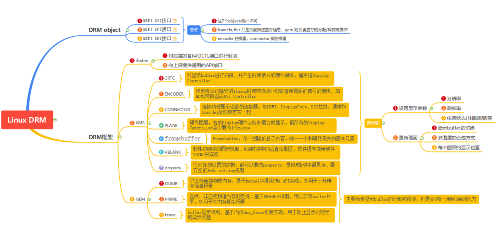

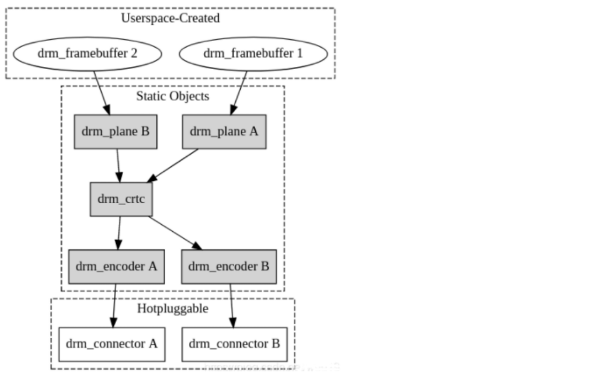

### 1.1、Connectors
就是屏幕，比如主控芯片通过HDMI、MIPI DSI，分别接2个屏幕显示，就会有2个对应的Connectors ID；

### 1.2、CRTCs
表示VOP，一个屏幕一般对应一个crtc；

### 1.3、Planes
就是图层，比如视频层在plane2，UI在plane1，视频在UI上面；

## 2、通过modetest查看系统DRM的情况

例如在RV1109的开发板端执行modetest，我们可以看到以下输出信息：

```
[root@RV1126_RV1109:/oem]# modetest
Encoders:
id   crtc  type  possible crtcs possible clones
55    53   DSI   0x00000001   0x00000000
Connectors:
id   encoder status     name      size (mm)    modes  encoders
56    55   connected    DSI-1      154x86      1    55
modes:
   name refresh (Hz) hdisp hss hse htot vdisp vss vse vtot)
1024x600 54 1024 1240 1310 1470 600 612 622 645 51200 flags: nhsync, nvsync;
type: preferred, driver
props:
    1 EDID:
       flags: immutable blob
       blobs:
       value:
    2 DPMS:
       flags: enum
       enums: On=0 Standby=1 Suspend=2 Off=3
       value: 0
    5 link-status:
       flags: enum
       enums: Good=0 Bad=1
       value: 0
    6 non-desktop:
       flags: immutable range
       values: 0 1
       value: 0
    43 brightness:
       flags: range
       values: 0 100
       value: 50
    44 contrast:
       flags: range
       values: 0 100
       value: 50
    47 saturation:
       flags: range
       values: 0 100
       value: 50
    48 hue:
       flags: range
       values: 0 100
       value: 50
CRTCs:
id   fb   pos   size
53    57   (0,0)  (1024x600)
1024x600 54 1024 1240 1310 1470 600 612 622 645 51200 flags: nhsync, nvsync;
type: preferred, driver
props:
    38 left margin:
       flags: range
       values: 0 100
       value: 100
    39 right margin:
       flags: range
       values: 0 100
       value: 100
    40 top margin:
       flags: range
       values: 0 100
       value: 100
    41 bottom margin:
       flags: range
       values: 0 100
       value: 100
    51 FEATURE:
       flags: immutable bitmask
       values: afbdc=0x1
       value: 0
       Planes:
id   crtc  fb   CRTC x,y    x,y   gamma size   possible crtcs
52    53    57    0,0       0,0   0        0x00000001
formats: XR24 AR24 XB24 AB24 RG24 BG24 RG16 BG16
props:
    8 type:
       flags: immutable enum
       enums: Overlay=0 Primary=1 Cursor=2
       value: 1
    50 FEATURE:
       flags: immutable bitmask
       values: scale=0x1 alpha=0x2 hdr2sdr=0x4 sdr2hdr=0x8 afbdc=0x10
       value: 2
54    0    0    0,0       0,0   0        0x00000001
formats: XR24 AR24 XB24 AB24 RG24 BG24 RG16 BG16 NV12 NV16 NV24
props:
    8 type:
       flags: immutable enum
       enums: Overlay=0 Primary=1 Cursor=2
       value: 0
    50 FEATURE:
       flags: immutable bitmask
       values: scale=0x1 alpha=0x2 hdr2sdr=0x4 sdr2hdr=0x8 afbdc=0x10
       value: 3
Frame buffers:
id   size  pitch
```

从以上信息，我们能够了解到：

### 2.1、Connectors

观察以上信息，我们可以看到Connectors有1个，代表可以接1个屏幕输出，ID是56。该显示输出的最大分辨率是1024x600，刷新频率54hz；

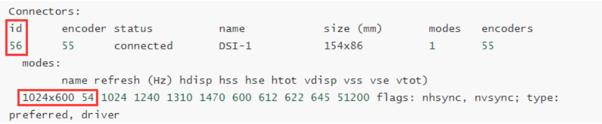

### 2.2、CRTCs

观察以上信息，我们可以看到CRTCs有1个，ID是53；

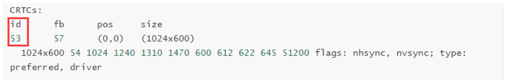

### 2.3、Planes

观察以上信息，我们可以看到Planes有2个，即代表有2个图层，ID分别是52、54。plane 53当前type值是1，代表是Primary层；plane 55当前type值是0，代表是Overlay层；

#### 2.3.1、Primary层

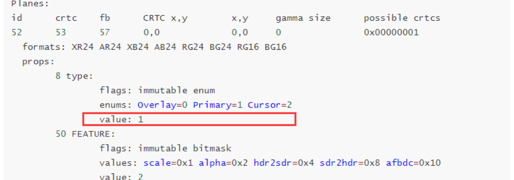

#### 2.3.2、Overlay层

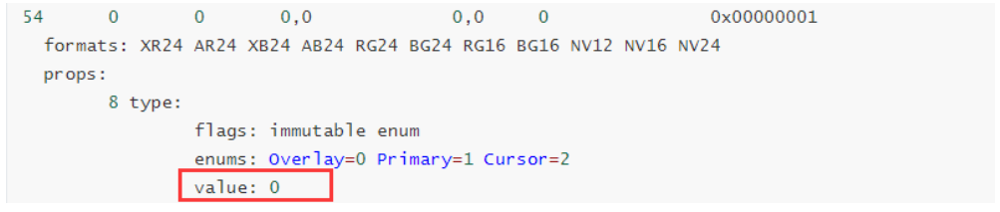

## 3、通过modetest指令测试屏幕输出

我们可以根据以上modetest探测出来的信息，然后发送以下指令让色块显示到LCD显示屏上，在ARM端输入以下命令：

```
modetest -s 56@53:1024x600@RG24
```

其中：

- 56，对应Connectors ID；
- 53，对应CRTCs ID；
- 1024x600，输出最大分辨率；
- RG24，代表RGB888，每个像素点24bit，R/G/B各8bit；

执行以后，我们可以看到屏幕上的显示效果：

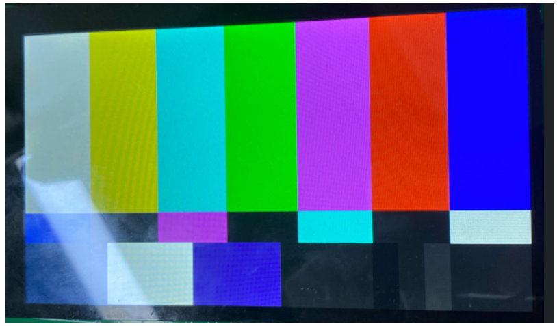

## 4、如何用/sys/kernel/debug/dri进行监控

### 4.1、查看/sys/kernel/debug/dri下的节点

```
ls /sys/kernel/debug/dri/0/
```

可以看到：

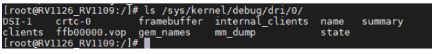

### 4.2、获取dri的状态

```
cat /sys/kernel/debug/dri/0/state
```

可以看到：

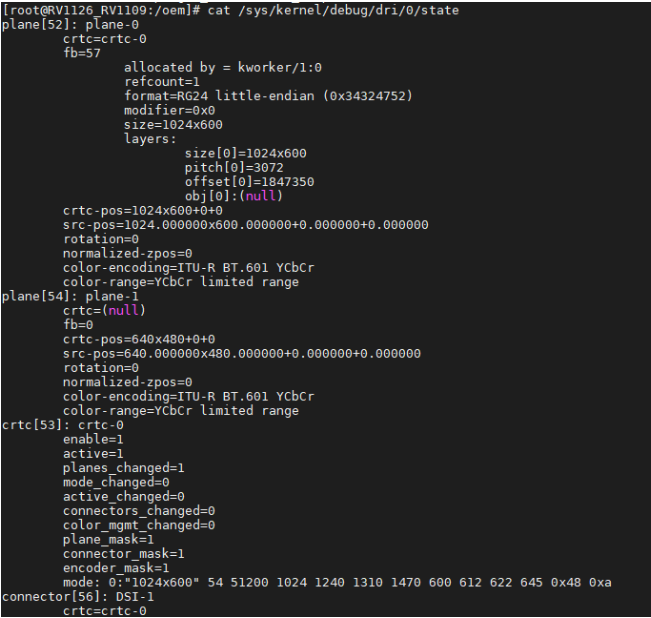

### 4.3、查看dri当前的显示状态

```
cat /sys/kernel/debug/dri/0/summary
```

可以看到：

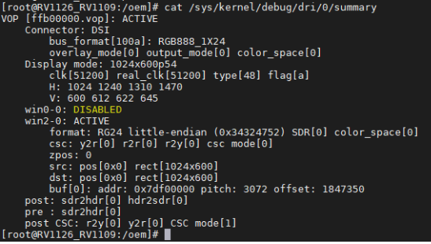

从以上信息可以看出：

VOP的状态是ACTIVE，表示正在运行中，如果是DISABLED，表示VOP没在运行。

Connector：DSI 表示对应屏幕接口的名称。

Display mode表示的是当前显示的分辨率和频率为，即分辨率为1024*600，频率为54fps。

### 4.4、查看当前的显示时钟

```
cat /sys/kernel/debug/clk/clk_summary | grep vop
```

可以看到：

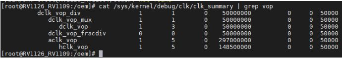

- 关于dclk即pixel clock, 像素时钟, 该时钟由具体的显示timing决定, 如果dclk不正确, 可能导致fps不对或直接不显示.edp, mipi, lvds等显示接口对应dclk的容忍性较好, 有些偏差也不影响正常显示.但hdmi, dp等高清显示接口,是有严格要求的, 这类显示接口的频率要给的很精准.
- DCLK频率
指的是像素时钟，跟数据传输有关，液晶面板分辨率越高，像素时钟信号的频率也越高。在一行内，像素时钟的个数与液晶面板一行内所具有的像素数量相等。例如，对于1024×768的液晶面板，一行有1024个像素，则在一行中（对应于有效视频区间）像素时钟的个数也是1024个。
- aclk_vop:如果该时钟频率太低, 可能会导致显示出现抖动, 另外如果aclk 没有使能的话, 访问vop的寄存器也可能引发总线挂死
- hclk_vop:如果该时钟未使能, 不能访问vop的寄存器, 一但访问vop寄存器, 会造成总线挂死.

## 5、如何用/sys/类/drm进行监控

### 5.1、查看/sys/drm/目录下的节点

```
ls /sys/class/drm
```

可以看到：

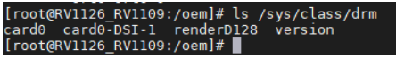

## 5.2、获取DRM连接器的名称和当前的状态

ARM终端输入：

```
for p in /sys/class/drm/*/status; do con=${p%/status}; echo -n "${con#*/card?-}:"; cat $p; done
```

可以看到：

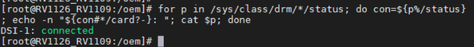

当前还有其它的节点可以访问。

## 6、基于RK平台MIPI DSI设备调试实战

### 6.1、查看显示驱动是否已经正常加载

以RK平台为例，之前一直调试的是RV1126_RV1109，RK在底层实现了自己的一套DRM显示框架：

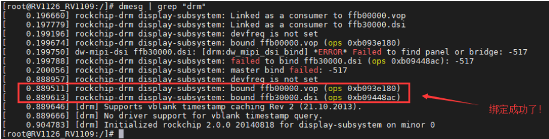

MIPI DRM 驱动的加载存在依赖关系，所以可能会多次因为驱动资源暂时获取不到而返回 -517 ，但是只要配置正确，待相关组件驱动能够完整获取到资源后，最终就会 bound 成功，如果没有看到如下：

```
[   0.889511] rockchip-drm display-subsystem: bound ffb00000.vop (ops0xb093e180)
[   0.889613] rockchip-drm display-subsystem: bound ffb30000.dsi (ops0xb09448ac)
```

则绑定失败，通讯异常。

注意：如果你确定软件上已经没问题了，那么多半是硬件连接的问题，因为 MIPI 排线比较脆弱，很容易导致接触不良。

### 6.2、查看显示信息

查看命令如下：

```
cat /sys/kernel/debug/dri/0/summary
```

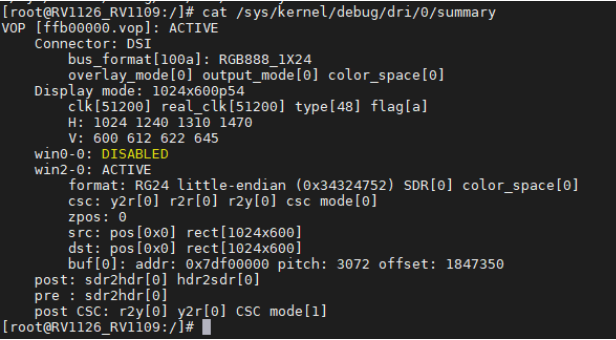

### 6.3、查看当前连接状态

查看命令:

```
cat /sys/class/drm/card0-DSI-1/status
```

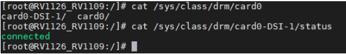

### 6.4、查看当前使能状态

```
cat /sys/class/drm/card0-DSI-1/enabled
```

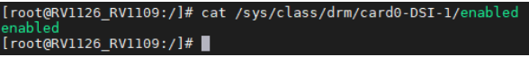

### 6.5、查看当前支持的显示模式

查看命令：

```
cat /sys/class/drm/card0-DSI-1/modes
```

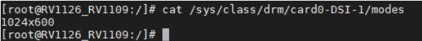
