# 图解LCD原理-调色板与Framebuffer原理

## 1、LCD硬件原理

### LCD操作原理


- LCD屏幕上的点称为像素
- 屏幕后面有电子枪【红绿蓝】：一边移动，一边发出颜色
- 每来一个clk，移动一个像素
- R、G、B三组线确定颜色
- 接收到HSYNC（水平同步信号）脉冲，电子枪从最右边跳到最左边。（跳到下一行）
- 接收到VSYNC[垂直同步信号]从最下边跳到最上边。（跳到原点）

### LCD时序图

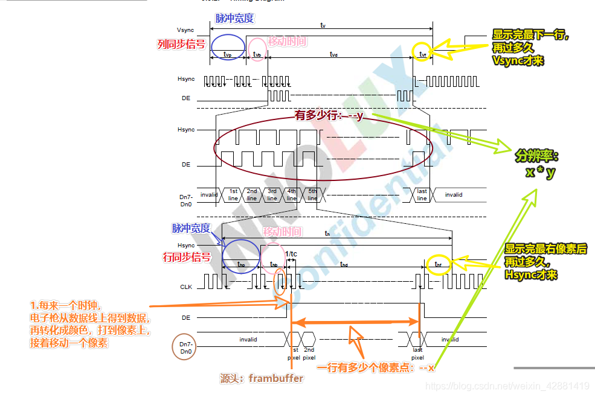

### LCD硬件原理图

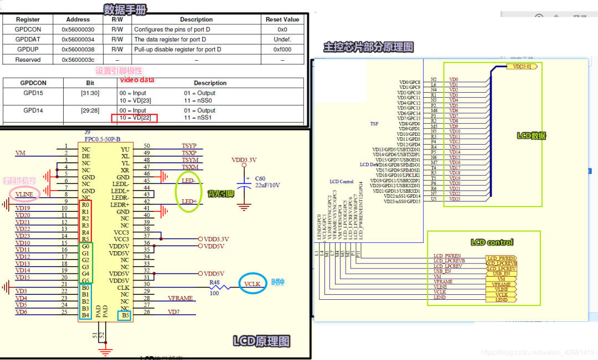

### 2440_LCD时序图

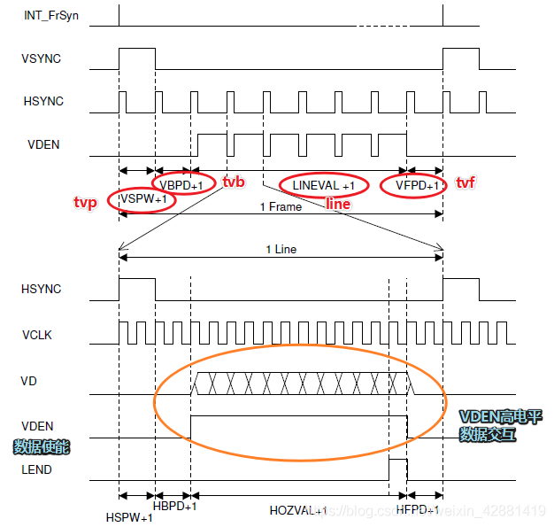

### LCD display config

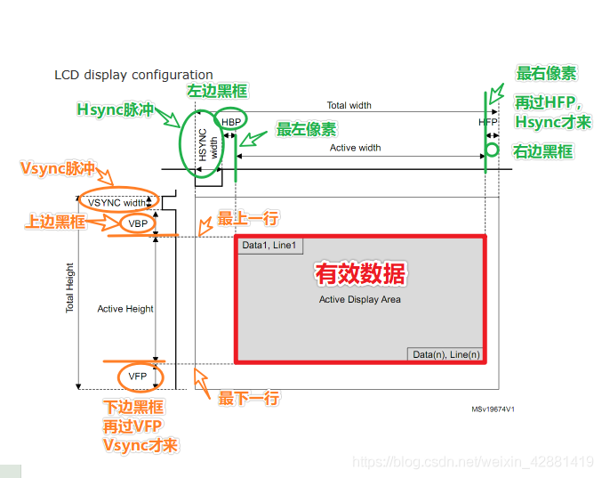

可以通过调整四边黑框调整屏幕边框

### BPP（bit per pixel）

BPP：在FrameBuffer中每个像素占据多少位，

- 硬件上LCD的BPP是确定的
  但是可以对LCD进行封装
- 16条线，每个像素占16位数据，16BPP

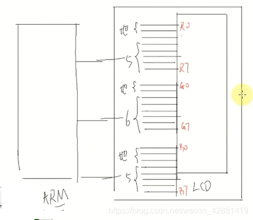

## 2、S3C2440_LCD控制器

功能：

1. 从内存中（FrameBuffer）取出某个像素的数据：把FrameBuffer的地址告诉LCD控制器，BPP，分辨率
2. 合其他信号把数据发送给LCD：把时序告诉LCD控制器，设置引脚的极性

### BLOCK DIAGRAM

**16BPP**

调色板[ palette]

本质：内存

- 16BPP中，本来用16bit表示1像素，也可用利用调色板，用8位表示；8BPP：伪彩色；16/24BPP：真彩色。
那么当使用像素深度为8pp时候，像素深度和我们的带宽不一致，我们的颜色要用16位表示，如果直接用上肯定不可能，那我们就可以选择用调色板，调色板中存放了256种16bpp的颜色，这时候我们color存放的就不是真实的颜色值了，而是存放的是调色板中256种颜色的索引，成线性关系一一对应，这样我们大大减轻了系统的负担。用16bpp还是8bpp这得取决实际情况，16bpp肯定比8pp清晰，但同时带来的负荷也更加重。

- 过程：FrameBuffer中8bit —> LCD控制器 —> 调色板中取16bit【用8bit作为索引，取出真正的颜色】 —> LCD

## 3、LCD编程_框架与准备

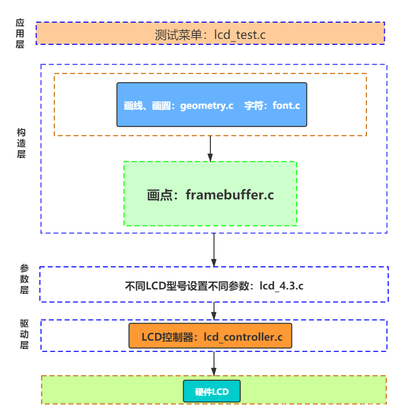

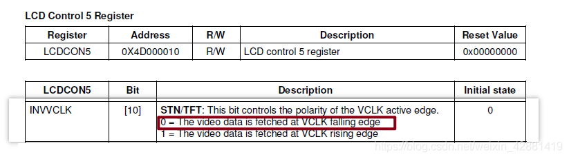

定义结构体

- 定义引脚极性结构体

```
typedef struct pins_polarity{
 int vclk; /* normal:在下降沿获取 */
 int rgb; /* normal：高电平表示1 */
 int hsync;  /* normal：高脉冲 */
 int vsync;  /* normal：高脉冲 */

}pins_polarity,*p_pins_polarity;
```

- 定义时序结构体

```
typedef struct time_sequence{
 /* 垂直方向 */
 int tvp;/* vysnc脉冲宽度 */
 int tvb;/* 上边黑框，Vertical Back porch */
 int tvf;/* 下边黑框，Vertical Front porch */

 /* 水平方向 */
 int thp;/* hysnc脉冲宽度 */
 int thb;/* 左边黑框，Horizontal Back porch */
 int thf;/* 右边黑框，Horizontal Front porch */
}time_sequence,*p_time_sequence;
```

- 定义lcd参数结构体

```
typedef struct lcd_params{
 /* 引脚极性 */
 pins_polarity pins_pol;
 
 /* 时序 */
 pins_sequence time_seq;
 
 /* 分辨率，bpp */
 int xres;
 int yres;
 int bpp;
 
 /* framebuffer的地址 */
 unsigned int fb_base;

}lcd_params,*p_lcd_params;
```

## 4、LCD_编程_抽象出重要结构体

结构体传参

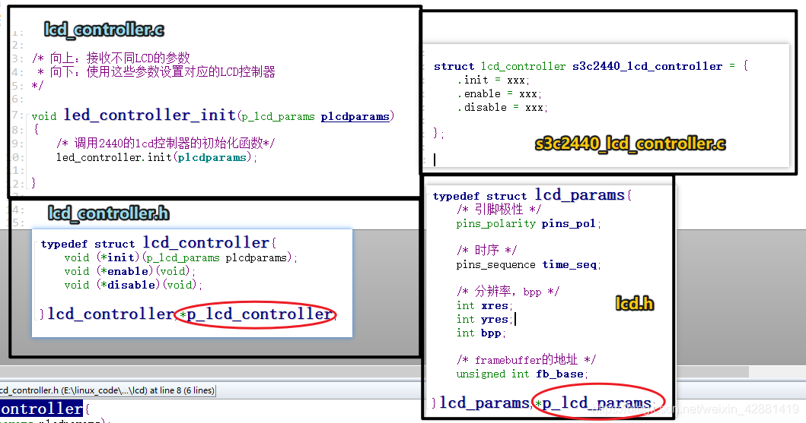

## 5、LCD_LCD控制器

`S3C2440_controller.c`：根据S3C2440数据手册，设置LCD控制器相关寄存器

### 引脚初始化

```
void jz2440_lcd_pin_init(void)
{
 /* 初始化引脚 : 背光引脚*/
 GPBCON &= ~0x3;
 GPBCON |= 0x01;
 
 /* 初始化引脚 : LCD专用引脚*/
 GPCCON = 0xaaaaaaaa;
 GPDCON = 0xaaaaaaaa;

 /* PWREN */
 GPGCON |= (3<<8);
}
```

#### LCDCON1

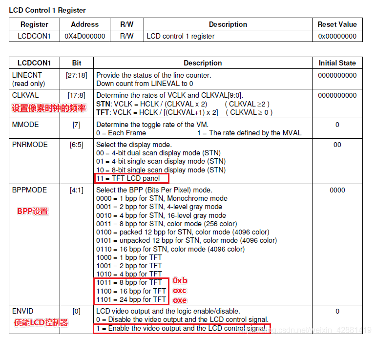

```
    /* [17 : 8] :clkval,VCLK = HCLK / [(CLKVAL+1) x 2]
  *     9    = 100M/ [(CLKVAL+1) x 2] ,clkval = 4.5 = 5
  *      clkval = 100/vclk/2-1
  * [6 : 5]：0b11,TFT lcd
  * [4:1]: bpp mode
  * [0]  : LCD video output and the logic enable/disable.
  */
 int clkval = (double)HCLK/plcdparams ->time_seq.vclk/2-1+0.5;
 int bppmode = plcdparams->bpp == 8 ? 0xb :\
       plcdparams->bpp == 16 ? 0xc:\
       0xd;  /* 0xd:24bpp */
 LCDCON1 = (clkval << 8) | (3<<5) | (bppmode<<1);
```

#### LCDCON2

```
    /* [ 31:24 ] :VBPD    = tvb - 1
  * [ 23:14 ] :lineval = line - 1
  * [ 13:6  ] :vfpd    = tvf - 1
  * [  5:0  ] :vspw    = tvp - 1 
  */
 LCDCON2 = ((plcdparams->time_seq.tvb - 1)<<24) | \
     ((plcdparams->yres - 1 )<<14)           | \
     ((plcdparams->time_seq.tvf - 1)<<6)    |\
     ((plcdparams->time_seq.tvp - 1)<<0);
```

#### LCDCON3

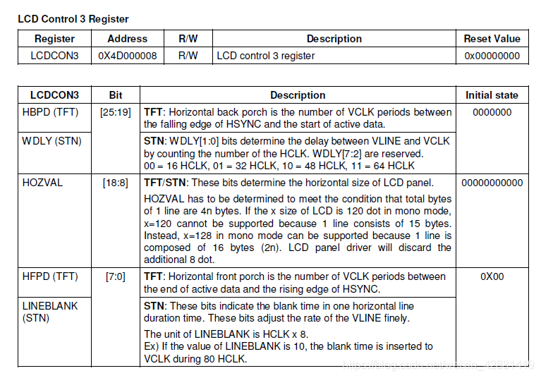

```
      /* [ 25:19 ] :HBPD = thb - 1
    * [ 13:6  ] :HOZVAL = 列 - 1
    * [ 5:0  ] :HFPD = thf - 1 
    */
   LCDCON3 = ((plcdparams->time_seq.thb - 1)<<19) | \
    ((plcdparams->xres - 1 )<<8)     | \
    ((plcdparams->time_seq.thf - 1)<<0)    |\;
```

#### LCDCON4

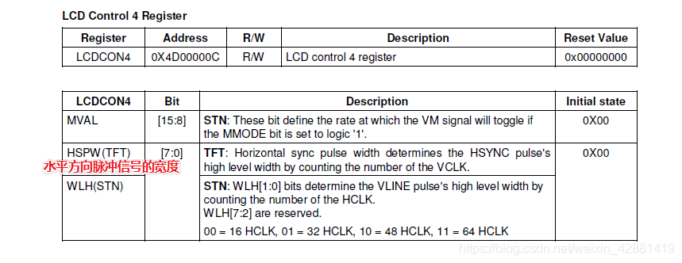

```
  /* [ 7:0 ] :HSPD = thp - 1
    */
   LCDCON4 = ((plcdparams->time_seq.thp - 1)<<0);
```

#### LCDCON5

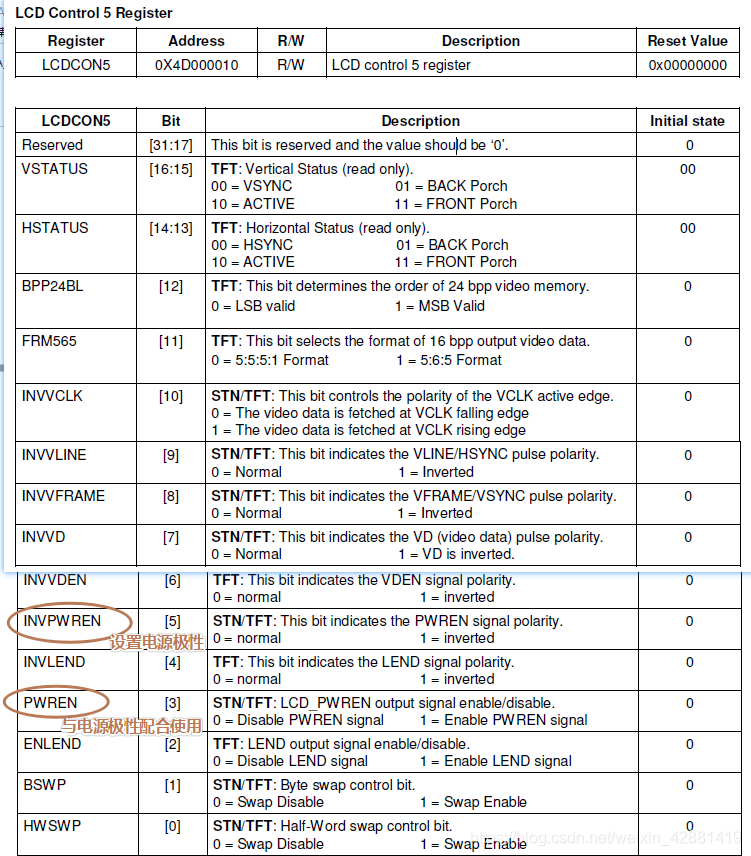

```
        /* 用来设置引脚极性，设置16BPP，设置内存中像素存放的格式
    * [12] : BPP24BL
    * [11] : PRM565 , 1- 565
    * [10] : INVVCLK,0 = The video data is fetched at VCLK falling edge
    * [9]  : HSYNC 是否反转
    * [8]  : VSYNC 是否反转
    * [7]  : INVVD,rgb是否反转
    * [6]  : INVVDEN
    * [5]  : INVPWREN
    * [4]  : INVLEND
    * [3]  : PWREN, LCD_PWREN output signal enable/disable
    * [2]  : ENLEND
    * [1]  : BSWP
    * [0]  : HWSWP
    */

   pixelplace = plcdparams -> == 24 ? (0) |\
       plcdparams-> == 16 ? (1) |\
       (1<<1);  /* 8BPP */
   LCDCON5 = (plcdparams->pins_pol.vclk <<10)   |\
      (plcdparams->pins_pol.rgb<<7)      |\
      (plcdparams->pins_pol.hsync<<9)    |\
      (plcdparams->pins_pol.vsync<<8)    |\
      (plcdparams->pins_pol.de<<6)       |\
      (plcdparams->pins_pol.pwren<<5)    |\
      (1<<11) | pixelplace ;
```

### FrameBuffer地址设置

#### LCDADDR1

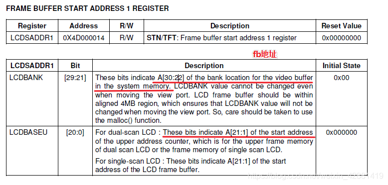

```
 /* 
  * [29:21] : LCDBANK,A[30:22] of fb
  * [20:0 ] : LCDBASEU,A[21:1] of fb
 */
 addr = plcdparams->fb_base & (1<<31)
 LCDSADDR1 = (addr>>1) ;
```

#### LCDSADDR2

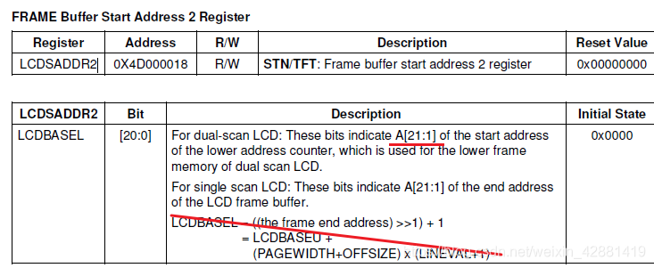

```
    /* 
  * [20:0 ] : LCDBASEL,A[21:1] of end addr
 */
 addr = plcdparams->fb_base + plcdparams->xres*plcdparams->yres*plcdparams->bpp/8;
 addr >>= 1;
 addr &= 0x1fffff;
 LCDSADDR2 = addr;
```

### LCD硬件原理图


## 6、LCD设置

### 打开LCD4.3芯片手册，根据芯片手册设置

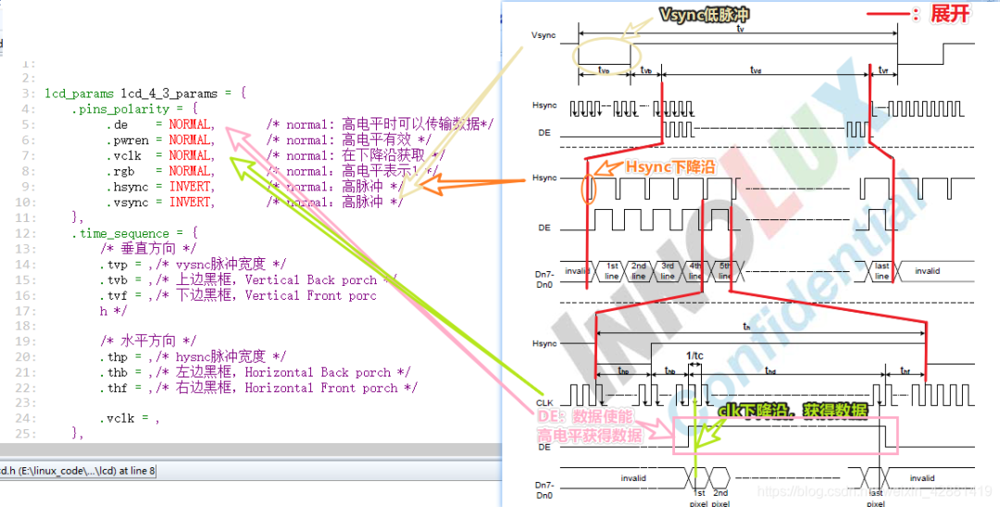

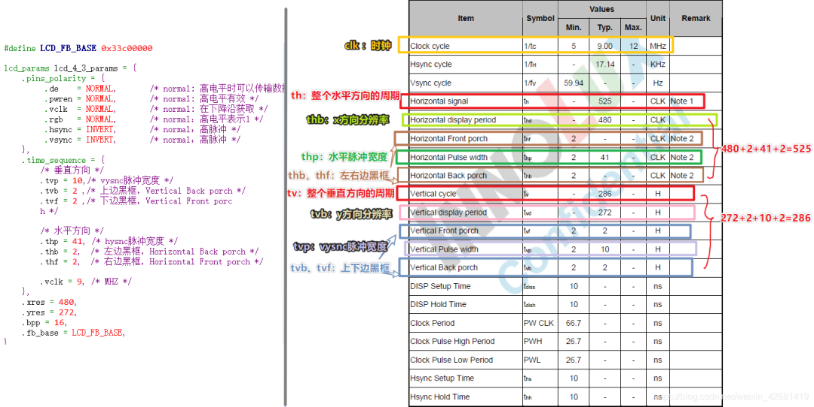

```
#define LCD_FB_BASE 0x33c00000

lcd_params lcd_4_3_params = {
 .name = "lcd_4.3",
 .pins_polarity = {
   .de    = NORMAL,       /* normal: 高电平时可以传输数据*/
   .pwren = NORMAL,   /* normal: 高电平有效 */
   .vclk  = NORMAL,  /* normal: 在下降沿获取 */
   .rgb   = NORMAL,  /* normal：高电平表示1 */
   .hsync = INVERT,   /* normal：高脉冲 */
   .vsync = INVERT,  /* normal：高脉冲 */
 },
 .time_sequence = {
  /* 垂直方向 */
  .tvp = 10,/* vysnc脉冲宽度 */
  .tvb = 2 ,/* 上边黑框，Vertical Back porch */
  .tvf = 2 ,/* 下边黑框，Vertical Front porc
  h */

  /* 水平方向 */
  .thp = 41, /* hysnc脉冲宽度 */
  .thb = 2,  /* 左边黑框，Horizontal Back porch */
  .thf = 2,  /* 右边黑框，Horizontal Front porch */

  .vclk = 9, /* MHZ */
 },
 .xres = 480,
 .yres = 272,
 .bpp = 16,
 .fb_base = LCD_FB_BASE,
}
```

硬件16BPP软件上为何可以使用24bpp

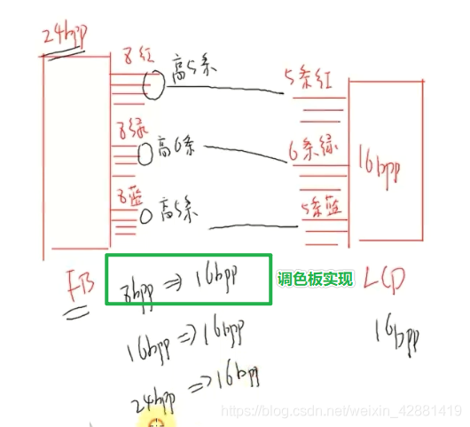

## 7、画点线圆

### FB基地址计算

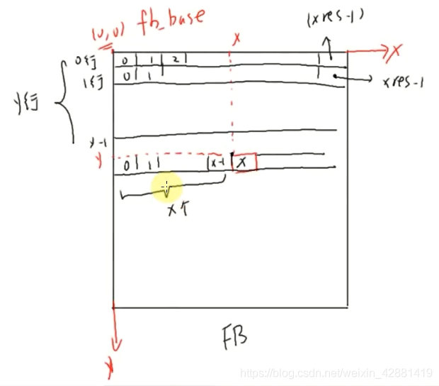

```
unsigned int pixel_base = (unsigned int)(fb_base + (xres * bpp /8) * y + x * bpp / 8);
```

### 画点画线的基础都是描点

```
#include "lcd.h"
/* 实现画点 */

/* 获得LCD参数 */

static unsigned int fb_base;
static int xres, yres, bpp;

void fb_get_lcd_params(void)
{
 get_lcd_params(&fb_base,&xres,&yres,&bpp);
}

/* rgb : 32 bit, 0x00RRGGBB */
unsigned short convert32bppto16bpp(unsigned int rgb)
{
 int r = (rgb>>16) & 0xff;
 int g = (rgb>>8)  & 0xff;
 int b =  rgb      & 0xff;

 /* rgb 565 */
 r = r >> 3;
 g = g >> 2;
 b = b >> 3;

 return((r<<11) | (g<<5) | (b));
}

/* color : 32bit , 0x00RRGGBB
 *
 */
void fb_put_pixel(int x,int y,unsigned int color)
{
 unsigned char *pc;   /* 8bpp */
 unsigned short *pw;  /* 16bpp */
 unsigned int *pdw;   /* 32bpp */

 unsigned int pixel_base = (unsigned int)(fb_base + (xres * bpp /8) * y + x * bpp / 8);
 
 switch(bpp)
 {
  case 8:
   pc = (unsigned char *)pixel_base;
   *pc = color;
   break;
  case 16:
   pw = (unsigned short *)pixel_base;
   *pw = convert32bppto16bpp(color);
   break;
  case 32:
   pdw = (unsigned int *)pixel_base;
   *pdw = color;
   break;
 }
}
```

### 画点画线坐标

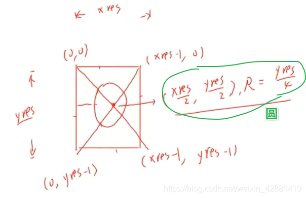

```
//-------------画圆函数。参数：圆心，半径，颜色----------
//        画1/8圆 然后其他7/8对称画
//          ---------------->X
//          |(0,0)   0
//          |     7     1
//          |    6       2
//          |     5     3
//       (Y)V        4
//
//      L = x^2 + y^2 - r^2
void draw_circle(int x, int y, int r, int color)
{
    int a, b, num;
    a = 0;
    b = r;
    while(2 * b * b >= r * r)          // 1/8圆即可
    {
        fb_put_pixel(x + a, y - b,color); // 0~1
        fb_put_pixel(x - a, y - b,color); // 0~7
        fb_put_pixel(x - a, y + b,color); // 4~5
        fb_put_pixel(x + a, y + b,color); // 4~3
 
        fb_put_pixel(x + b, y + a,color); // 2~3
        fb_put_pixel(x + b, y - a,color); // 2~1
        fb_put_pixel(x - b, y - a,color); // 6~7
        fb_put_pixel(x - b, y + a,color); // 6~5
        
        a++;
        num = (a * a + b * b) - r*r;
        if(num > 0)
        {
            b--;
            a--;
        }
    }
}
 
//-----------画线。参数：起始坐标，终点坐标，颜色--------
void draw_line(int x1,int y1,int x2,int y2,int color)
{
    int dx,dy,e;
    dx=x2-x1; 
    dy=y2-y1;
    if(dx>=0)
    {
        if(dy >= 0) // dy>=0
        {
            if(dx>=dy) // 1/8 octant
            {
                e=dy-dx/2;
                while(x1<=x2)
                {
                    fb_put_pixel(x1,y1,color);
                    if(e>0){y1+=1;e-=dx;}   
                    x1+=1;
                    e+=dy;
                }
            }
            else        // 2/8 octant
            {
                e=dx-dy/2;
                while(y1<=y2)
                {
                    fb_put_pixel(x1,y1,color);
                    if(e>0){x1+=1;e-=dy;}   
                    y1+=1;
                    e+=dx;
                }
            }
        }
        else           // dy<0
        {
            dy=-dy;   // dy=abs(dy)
            if(dx>=dy) // 8/8 octant
            {
                e=dy-dx/2;
                while(x1<=x2)
                {
                    fb_put_pixel(x1,y1,color);
                    if(e>0){y1-=1;e-=dx;}   
                    x1+=1;
                    e+=dy;
                }
            }
            else        // 7/8 octant
            {
                e=dx-dy/2;
                while(y1>=y2)
                {
                    fb_put_pixel(x1,y1,color);
                    if(e>0){x1+=1;e-=dy;}   
                    y1-=1;
                    e+=dx;
                }
            }
        }   
    }
    else //dx<0
    {
        dx=-dx;     //dx=abs(dx)
        if(dy >= 0) // dy>=0
        {
            if(dx>=dy) // 4/8 octant
            {
                e=dy-dx/2;
                while(x1>=x2)
                {
                    fb_put_pixel(x1,y1,color);
                    if(e>0){y1+=1;e-=dx;}   
                    x1-=1;
                    e+=dy;
                }
            }
            else        // 3/8 octant
            {
                e=dx-dy/2;
                while(y1<=y2)
                {
                    fb_put_pixel(x1,y1,color);
                    if(e>0){x1-=1;e-=dy;}   
                    y1+=1;
                    e+=dx;
                }
            }
        }
        else           // dy<0
        {
            dy=-dy;   // dy=abs(dy)
            if(dx>=dy) // 5/8 octant
            {
                e=dy-dx/2;
                while(x1>=x2)
                {
                    fb_put_pixel(x1,y1,color);
                    if(e>0){y1-=1;e-=dx;}   
                    x1-=1;
                    e+=dy;
                }
            }
            else        // 6/8 octant
            {
                e=dx-dy/2;
                while(y1>=y2)
                {
                    fb_put_pixel(x1,y1,color);
                    if(e>0){x1-=1;e-=dy;}   
                    y1-=1;
                    e+=dx;
                }
            }
        }   
    }
}
```

## 8、显示文字

### 字符显示原理

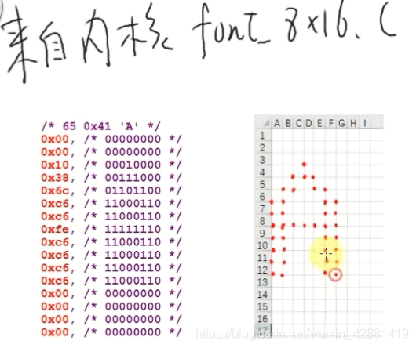

显示字符时，坐标表示

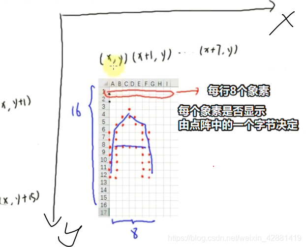

```
void fb_print_char(int x, int y, char c,unsigned int color)
{
 int i,j;

 /* 根据c的asscii码在fontdata_8x16中得到点阵数据 */
 unsigned char *dots = &fontdata_8x16[c *16];
 unsigned char data;
 int bit;


 /* 根据点阵来设置对应像素的颜色 */
 for(j = y; j < y+16; j++)
 {
  data = *data++;
  bit = 7;
  for(i = x; i < x+8; i++)
  {
   /* 根据点阵的某位决定是否描颜色 */
   if(data & (1<<bit))
    fb_put_pixel(i,j,color);
  }
 }
}
```

显示字符串时，坐标表示

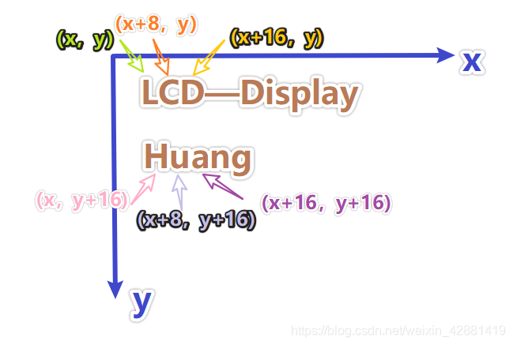

## 9、添加除法

对于未实现的函数：

- a.去uboot中查找
- b.去内核源码中查找
- c.去库函数中查找 （一般来说编译器自带有很多库）

进入工具链的目录：`grep "__floatsisf" * -nr`找到`.a`文件

```
. a文件是静态库文件
. so文件时动态库文件
注意：如果更换编译器，需要自己去编译器目录里找出对应的libgcc.a。可能有多个，逐个尝试。
```

## 10、使用调色板

在FB中每个象素占8bit怎么转换成LCD所需要的16位数据

在调色板（0—255）中填入真正的16位的颜色

```
把LCD控制器设置成8bpp时，它回去FrameBuffer中取出一个象素的数据（8位），然后使用8位作为索引，然后去调色板中取出真正的颜色，得到16位的数据；把这16位的数据发给LCD。
```
