## **1、数据报文的封装与分用**

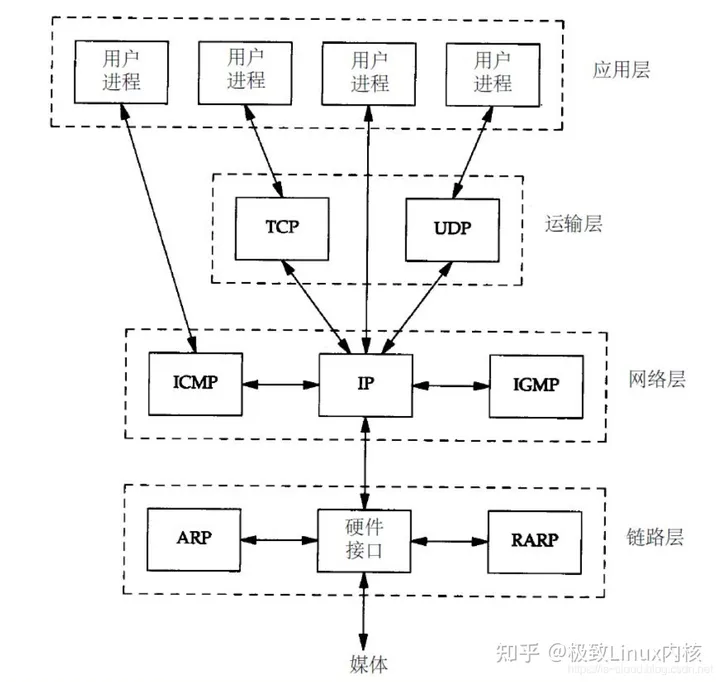

**封装**：当应用程序用 TCP 协议传送数据时，数据首先进入内核网络协议栈中，然后逐一通过 TCP/IP 协议族的每层直到被当作一串比特流送入网络。对于每一层而言，对收到的数据都会封装相应的协议首部信息（有时还会增加尾部信息）。TCP 协议传给 IP 协议的数据单元称作 TCP 报文段，或简称 TCP 段（TCP segment）。IP 传给数据链路层的数据单元称作 IP 数据报（IP datagram），最后通过以太网传输的比特流称作帧（Frame）。

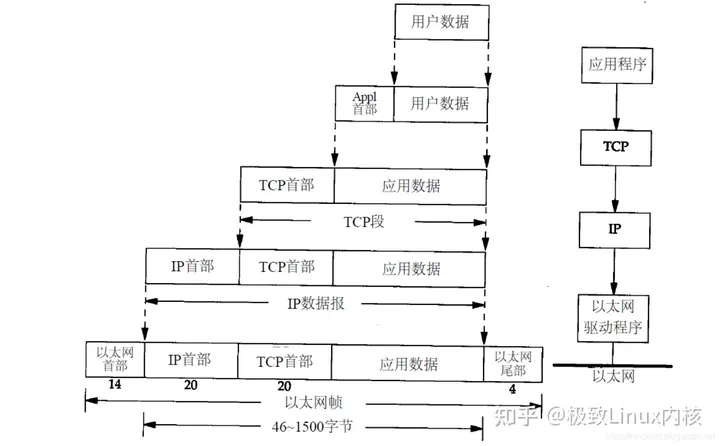

**分用**：当目的主机收到一个以太网数据帧时，数据就开始从内核网络协议栈中由底向上升，同时去掉各层协议加上的报文首部。每层协议都会检查报文首部中的协议标识，以确定接收数据的上层协议。这个过程称作分用。

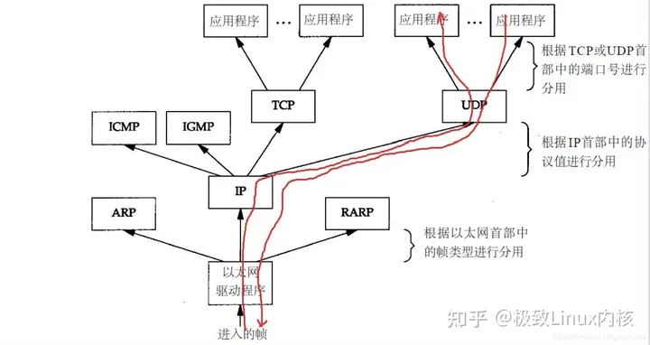

## 2、**Linux 内核网络协议栈**

### 2.1**协议栈的分层结构**


**逻辑抽象层级**：

- **物理层**：主要提供各种连接的物理设备，如各种网卡，串口卡等。
- **链路层**：主要提供对物理层进行访问的各种接口卡的驱动程序，如网卡驱动等。
- **网路层**：是负责将网络数据包传输到正确的位置，最重要的网络层协议是 IP 协议，此外还有如 ICMP，ARP，RARP 等协议。
- **传输层**：为应用程序之间提供端到端连接，主要为 TCP 和 UDP 协议。
- **应用层**：顾名思义，主要由应用程序提供，用来对传输数据进行语义解释的 “人机交互界面层”，比如 HTTP，SMTP，FTP 等协议。

**协议栈实现层级**：

- **硬件层（Physical device hardware）**：又称驱动程序层，提供连接硬件设备的接口。

- **设备无关层（Device agnostic interface）**：又称设备接口层，提供与具体设备无关的驱动程序抽象接口。这一层的目的主要是为了统一不同的接口卡的驱动程序与网络协议层的接口，它将各种不同的驱动程序的功能统一抽象为几个特殊的动作，如 open，close，init 等，这一层可以屏蔽底层不同的驱动程序。

- **网络协议层（Network protocols）**：对应 IP layer 和 Transport layer。毫无疑问，这是整个内核网络协议栈的核心。这一层主要实现了各种网络协议，最主要的当然是 IP，ICMP，ARP，RARP，TCP，UDP 等。

- **协议无关层（Protocol agnostic interface）**，又称协议接口层，本质就是 SOCKET 层。这一层的目的是屏蔽网络协议层中诸多类型的网络协议（主要是 TCP 与 UDP 协议，当然也包括 RAW IP， SCTP 等等），以便提供简单而同一的接口给上面的系统调用层调用。简单的说，不管我们应用层使用什么协议，都要通过系统调用接口来建立一个 SOCKET，这个 SOCKET 其实是一个巨大的 sock 结构体，它和下面的网络协议层联系起来，屏蔽了不同的网络协议，通过系统调用接口只把数据部分呈献给应用层。

- - **BSD（Berkeley Software Distribution）socket**：BSD Socket 层，提供统一的 SOCKET 操作接口，与 socket 结构体关系紧密。
  - **INET（指一切支持 IP 协议的网络） socket**：INET socket 层，调用 IP 层协议的统一接口，与 sock 结构体关系紧密。

- **系统调用接口层（System call interface）**，实质是一个面向用户空间（User Space）应用程序的接口调用库，向用户空间应用程序提供使用网络服务的接口。

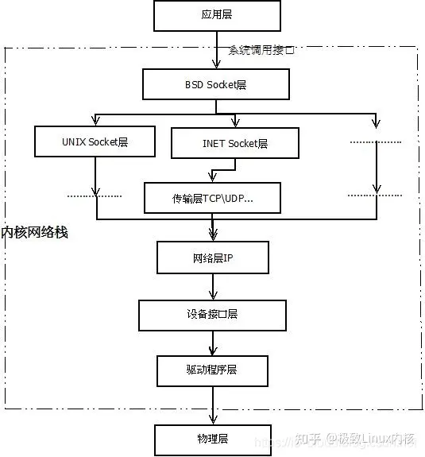

### 2.2**协议栈的数据结构**


- **msghdr**：描述了从应用层传递下来的消息格式，包含有用户空间地址，消息标记等重要信息。
- **iovec**：描述了用户空间地址的起始位置。
- **file**：描述文件属性的结构体，与文件描述符一一对应。
- **file_operations**：文件操作相关结构体，包括 `read()`、`write()`、`open()`、`ioctl()` 等。
- **socket**：向应用层提供的 BSD socket 操作结构体，协议无关，主要作用为应用层提供统一的 Socket 操作。
- **sock**：网络层 sock，定义与协议无关操作，是网络层的统一的结构，传输层在此基础上实现了 inet_sock。
- **sock_common**：最小网络层表示结构体。
- **inet_sock**：表示层结构体，在 sock 上做的扩展，用于在网络层之上表示 inet 协议族的的传输层公共结构体。
- **udp_sock**：传输层 UDP 协议专用 sock 结构，在传输层 inet_sock 上扩展。
- **proto_ops**：BSD socket 层到 inet_sock 层接口，主要用于操作 socket 结构。
- **proto**：inet_sock 层到传输层操作的统一接口，主要用于操作 sock 结构。
- **net_proto_family**：用于标识和注册协议族，常见的协议族有 IPv4、IPv6。
- **softnet_data**：内核为每个 CPU 都分配一个这样的 softnet_data 数据空间。每个 CPU 都有一个这样的队列，用于接收数据包。
- **sk_buff**：描述一个帧结构的属性，包含 socket、到达时间、到达设备、各层首部大小、下一站路由入口、帧长度、校验和等等。
- **sk_buff_head**：数据包队列结构。
- **net_device**：这个巨大的结构体描述一个网络设备的所有属性，数据等信息。
- **inet_protosw**：向 IP 层注册 socket 层的调用操作接口。
- **inetsw_array**：socket 层调用 IP 层操作接口都在这个数组中注册。
- **sock_type**：socket 类型。
- **IPPROTO**：传输层协议类型 ID。
- **net_protocol**：用于传输层协议向 IP 层注册收包的接口。
- **packet_type**：以太网数据帧的结构，包括了以太网帧类型、处理方法等。
- **rtable**：路由表结构，描述一个路由表的完整形态。
- **rt_hash_bucket**：路由表缓存。
- **dst_entry**：包的去向接口，描述了包的去留，下一跳等路由关键信息。
- **napi_struct**：NAPI 调度的结构。NAPI 是 Linux 上采用的一种提高网络处理效率的技术，它的核心概念就是不采用中断的方式读取数据，而代之以首先采用中断唤醒数据接收服务，然后采用 poll 的方法来轮询数据。NAPI 技术适用于高速率的短长度数据包的处理。

### 2.3**网络协议栈初始化流程**

这需要从内核启动流程说起。当内核完成自解压过程后进入内核启动流程，这一过程先在 arch/mips/kernel/head.S 程序中，这个程序负责数据区（BBS）、中断描述表（IDT）、段描述表（GDT）、页表和寄存器的初始化，程序中定义了内核的入口函数 `kernel_entry()`、`kernel_entry()` 函数是体系结构相关的汇编代码，它首先初始化内核堆栈段为创建系统中的第一过程进行准备，接着用一段循环将内核映像的未初始化的数据段清零，最后跳到 `start_kernel()` 函数中初始化硬件相关的代码，完成 Linux Kernel 环境的建立。

`start_kenrel()` 定义在 init/main.c 中，真正的内核初始化过程就是从这里才开始。函数 `start_kerenl()` 将会调用一系列的初始化函数，如：平台初始化，内存初始化，陷阱初始化，中断初始化，进程调度初始化，缓冲区初始化，完成内核本身的各方面设置，目的是最终建立起基本完整的 Linux 内核环境。

`start_kernel()` 中主要函数及调用关系如下：

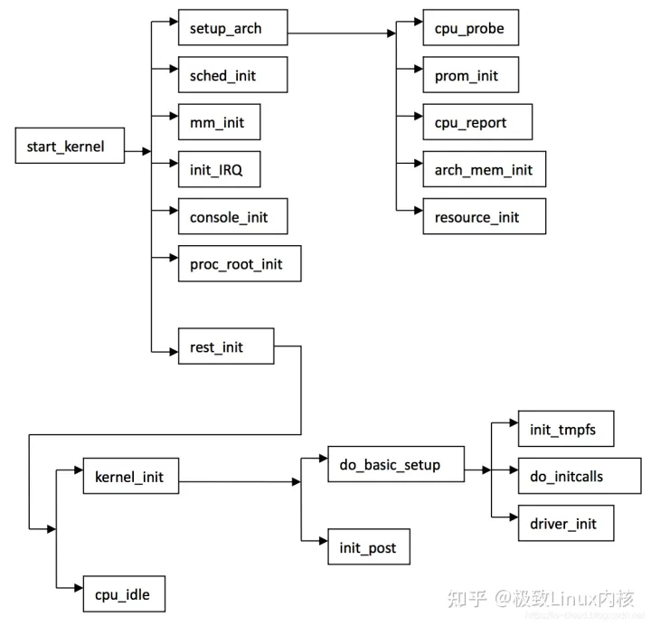

`start_kernel()` 的过程中会执行 `socket_init()` 来完成协议栈的初始化，实现如下：

```text
void sock_init(void)//网络栈初始化
{
	int i;
 
	printk("Swansea University Computer Society NET3.019\n");
 
	/*
	 *	Initialize all address (protocol) families. 
	 */
	 
	for (i = 0; i < NPROTO; ++i) pops[i] = NULL;
 
	/*
	 *	Initialize the protocols module. 
	 */
 
	proto_init();
 
#ifdef CONFIG_NET
	/* 
	 *	Initialize the DEV module. 
	 */
 
	dev_init();
  
	/*
	 *	And the bottom half handler 
	 */
 
	bh_base[NET_BH].routine= net_bh;
	enable_bh(NET_BH);
#endif  
}
```

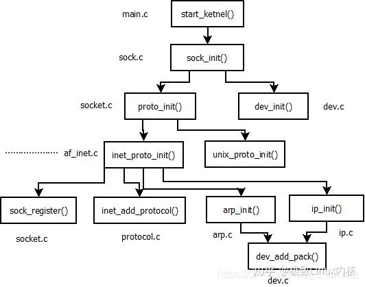

`sock_init()` 包含了内核协议栈的初始化工作：

- **sock_init**：Initialize sk_buff SLAB cache，注册 SOCKET 文件系统。

- **net_inuse_init**：为每个 CPU 分配缓存。

- **proto_init**：在 /proc/net 域下建立 protocols 文件，注册相关文件操作函数。

- **net_dev_init**：建立 netdevice 在 /proc/sys 相关的数据结构，并且开启网卡收发中断；为每个 CPU 初始化一个数据包接收队列（softnet_data），包接收的回调；注册本地回环操作，注册默认网络设备操作。

- **inet_init**：注册 INET 协议族的 SOCKET 创建方法，注册 TCP、UDP、ICMP、IGMP 接口基本的收包方法。为 IPv4 协议族创建 proc 文件。此函数为协议栈主要的注册函数：

- - `rc = proto_register(&udp_prot, 1);`：注册 INET 层 UDP 协议，为其分配快速缓存。

  - `(void)sock_register(&inet_family_ops);`：向 `static const struct net_proto_family *net_families[NPROTO]` 结构体注册 INET 协议族的操作集合（主要是 INET socket 的创建操作）。

  - `inet_add_protocol(&udp_protocol, IPPROTO_UDP) < 0;`：向 `externconst struct net_protocol *inet_protos[MAX_INET_PROTOS]` 结构体注册传输层 UDP 的操作集合。

  - `static struct list_head inetsw[SOCK_MAX]; for (r = &inetsw[0]; r < &inetsw[SOCK_MAX];++r) INIT_LIST_HEAD(r);`：初始化 SOCKET 类型数组，其中保存了这是个链表数组，每个元素是一个链表，连接使用同种 SOCKET 类型的协议和操作集合。

  - `for (q = inetsw_array; q < &inetsw_array[INETSW_ARRAY_LEN]; ++q)`：

  - - `inet_register_protosw(q);`：向 sock 注册协议的的调用操作集合。


- - `arp_init();`：启动 ARP 协议支持。
  - `ip_init();`：启动 IP 协议支持。
  - `udp_init();`：启动 UDP 协议支持。
  - `dev_add_pack(&ip_packet_type);`：向 `ptype_base[PTYPE_HASH_SIZE];` 注册 IP 协议的操作集合。
  - `socket.c` 提供的系统调用接口。

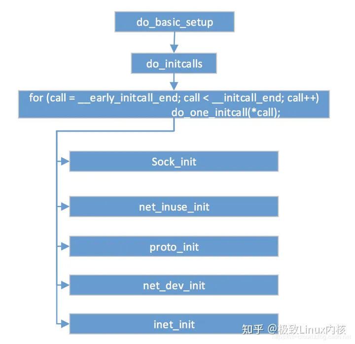

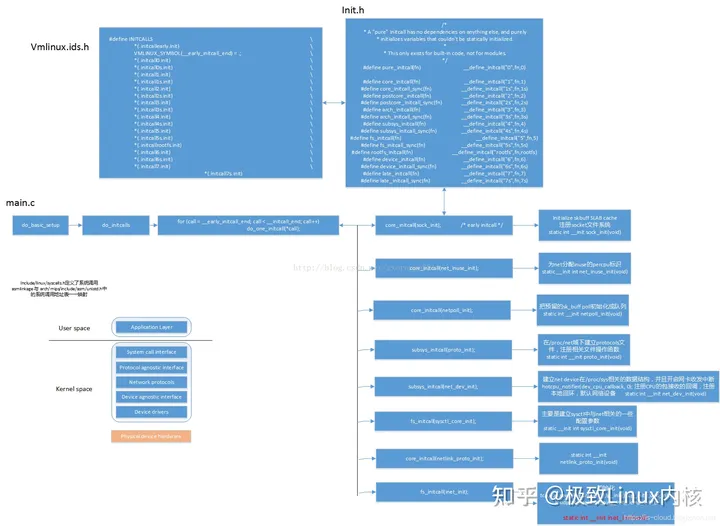

协议栈初始化完成后再执行 `dev_init()`，继续设备的初始化。

### 2.4**Socket 创建流程**

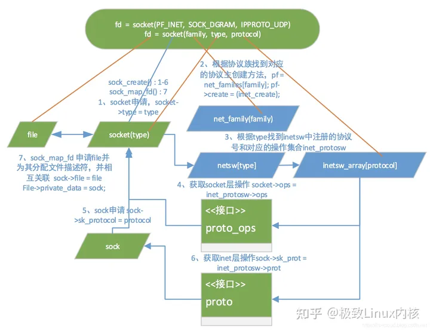

### 2.5**协议栈收包流程概述**

**硬件层与设备无关层**：硬件监听物理介质，进行数据的接收，当接收的数据填满了缓冲区，硬件就会产生中断，中断产生后，系统会转向中断服务子程序。在中断服务子程序中，数据会从硬件的缓冲区复制到内核的空间缓冲区，并包装成一个数据结构（sk_buff），然后调用对驱动层的接口函数 `netif_rx()` 将数据包发送给设备无关层。该函数的实现在 net/inet/dev.c 中，采用了 bootom half 技术，该技术的原理是将中断处理程序人为的分为两部分，上半部分是实时性要求较高的任务，后半部分可以稍后完成，这样就可以节省中断程序的处理时间，整体提高了系统的性能。

**NOTE**：在整个协议栈实现中 dev.c 文件的作用重大，它衔接了其下的硬件层和其上的网络协议层，可以称它为链路层模块，或者设备无关层的实现。

**网络协议层**：就以 IP 数据报为例，从设备无关层向网络协议层传递时会调用 `ip_rcv()`。该函数会根据 IP 首部中使用的传输层协议来调用相应协议的处理函数。UDP 对应 `udp_rcv()`、TCP 对应 `tcp_rcv()`、ICMP 对应 `icmp_rcv()`、IGMP 对应 `igmp_rcv()`。以 `tcp_rcv()` 为例，所有使用 TCP 协议的套接字对应的 sock 结构体都被挂入 tcp_prot 全局变量表示的 proto 结构之 sock_array 数组中，采用以本地端口号为索引的插入方式。所以，当 `tcp_rcv()` 接收到一个数据包，在完成必要的检查和处理后，其将以 TCP 协议首部中目的端口号为索引，在 tcp_prot 对应的 sock 结构体之 sock_array 数组中得到正确的 sock 结构体队列，再辅之以其他条件遍历该队列进行对应 sock 结构体的查询，在得到匹配的 sock 结构体后，将数据包挂入该 sock 结构体中的缓存队列中（由 sock 结构体中的 receive_queue 字段指向），从而完成数据包的最终接收。

**NOTE**：虽然这里的 ICMP、IGMP 通常被划分为网络层协议，但是实际上他们都封装在 IP 协议里面，作为传输层对待。

**协议无关层和系统调用接口层**：当用户需要接收数据时，首先根据文件描述符 inode 得到 socket 结构体和 sock 结构体，然后从 sock 结构体中指向的队列 recieve_queue 中读取数据包，将数据包 copy 到用户空间缓冲区。数据就完整的从硬件中传输到用户空间。这样也完成了一次完整的从下到上的传输。

### 2.6**协议栈发包流程概述**

1. **应用层**可以通过系统调用接口层或文件操作来调用内核函数，BSD socket 层的 `sock_write()` 会调用 INET socket 层的 `inet_wirte()`。INET socket 层会调用具体传输层协议的 write 函数，该函数是通过调用本层的 `inet_send()` 来实现的，`inet_send()` 的 UDP 协议对应的函数为 `udp_write()`。
2. 在**传输层**`udp_write()` 调用本层的 `udp_sendto()` 完成功能。`udp_sendto()` 完成 sk_buff 结构体相应的设置和报头的填写后会调用 `udp_send()` 来发送数据。而在 `udp_send()` 中，最后会调用 `ip_queue_xmit()` 将数据包下放的网络层。
3. 在**网络层**，函数 `ip_queue_xmit()` 的功能是将数据包进行一系列复杂的操作，比如是检查数据包是否需要分片，是否是多播等一系列检查，最后调用 `dev_queue_xmit()` 发送数据。
4. 在**链路层**中，函数调用会调用具体设备提供的发送函数来发送数据包，e.g. `dev->hard_start_xmit(skb, dev);`。具体设备的发送函数在协议栈初始化的时候已经设置了。这里以 8390 网卡为例来说明驱动层的工作原理，在 net/drivers/8390.c 中函数 `ethdev_init()` 的设置如下：

```text
/* Initialize the rest of the 8390 device structure. */  
int ethdev_init(struct device *dev)  
{  
    if (ei_debug > 1)  
        printk(version);  
      
    if (dev->priv == NULL) { //申请私有空间  
        struct ei_device *ei_local; //8390 网卡设备的结构体  
          
        dev->priv = kmalloc(sizeof(struct ei_device), GFP_KERNEL); //申请内核内存空间  
        memset(dev->priv, 0, sizeof(struct ei_device));  
        ei_local = (struct ei_device *)dev->priv;  
#ifndef NO_PINGPONG  
        ei_local->pingpong = 1;  
#endif  
    }  
      
    /* The open call may be overridden by the card-specific code. */  
    if (dev->open == NULL)  
        dev->open = &ei_open; // 设备的打开函数  
    /* We should have a dev->stop entry also. */  
    dev->hard_start_xmit = &ei_start_xmit; // 设备的发送函数，定义在 8390.c 中  
    dev->get_stats   = get_stats;  
#ifdef HAVE_MULTICAST  
    dev->set_multicast_list = &set_multicast_list;  
#endif  
  
    ether_setup(dev);  
          
    return 0;  
}  
```

## 3、**UDP 的收发包流程总览**


### 3.1**内核中断收包流程**


### 3.2**UDP 收包流程**

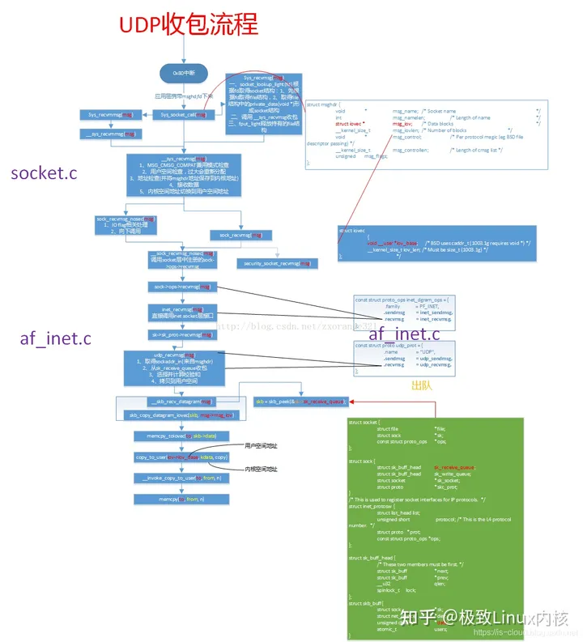

### 3.3**UDP 发包流程**

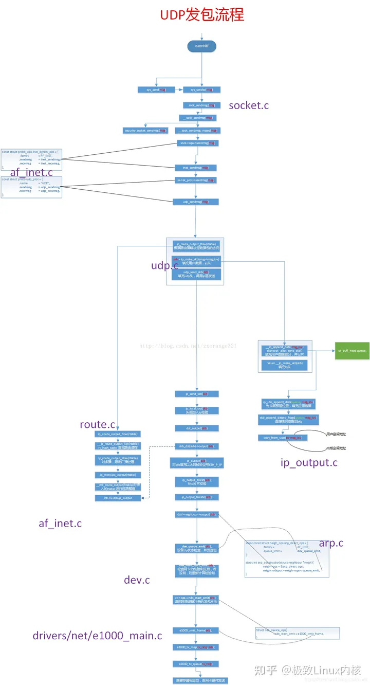
