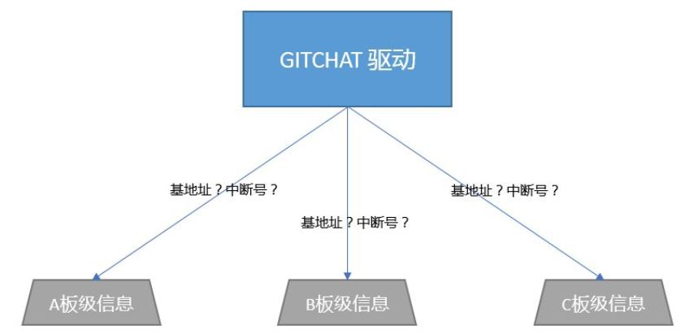
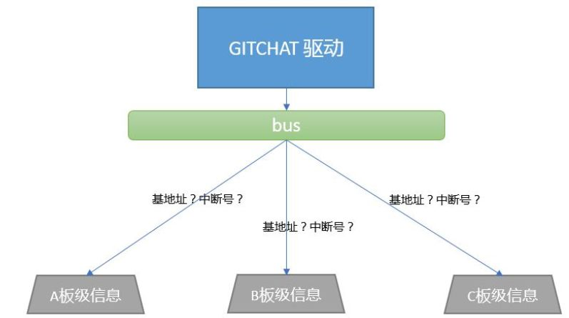
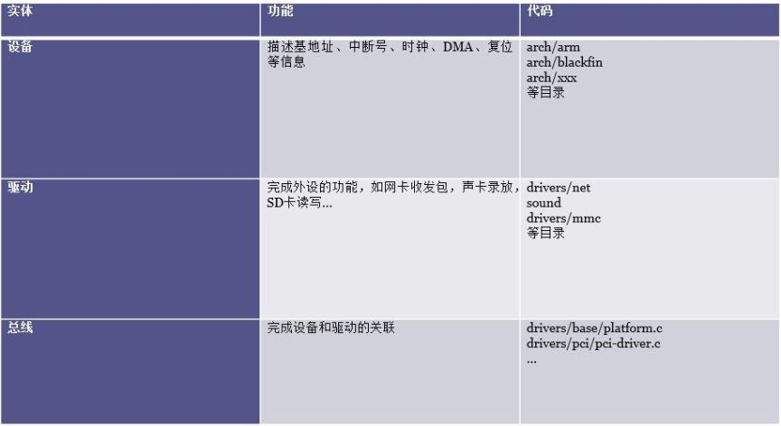

## 设备驱动模型的需求

总线、设备和驱动模型，如果把它们之间的关系比喻成生活中的例子是比较容易理解的。举个例子，充电墙壁插座安静的嵌入在墙面上，无论设备是电脑还是手机，插座都能依然不动的完成它的使命——充电，没有说为了满足各种设备充电而去更换插座的。其实这就是软件工程强调的高内聚、低耦合概念。

所谓高内聚低耦合是模块内各元素联系越紧密就代表内聚性就越高，模块间联系越不紧密就代表耦合性低。所以高内聚、低耦合强调的就是内部要紧紧抱团。设备和驱动就是基于这种模型去实现彼此隔离不相干的。这里，有的读者就要问了，高内聚、低耦合的软件模型理解，可设备和驱动为什么要采用这种模型呢？没错，好问题。下面进入今天的话题——总线、设备和驱动模型的探究。

设想一个叫 GITCHAT 的网卡，它需要接在 CPU 的内部总线上，需要地址总线、数据总线和控制总线，以及中断 pin 脚等。


那么在 GITCHAT 的驱动里需要定义 GITCHAT 的基地址、中断号等信息。假设 GITCHAT 的地址为0x0001，中断号是 2，那么：

```c
#define GITCHAT_BASE 0x0001
#define GITCHAT_INTERRUPT 2

int gitchat_send()
{
    writel(GITCHAT_BASE + REG, 1);
    ...
}

int gitchat_init()
{
    request_init(GITCHAT_INTERRUPT, ...);
    ...
}
```

但是世界上的板子千千万，有三星、华为、飞思卡尔……每个板子的信息也都不一样，站在驱动的角度看，当每次重新换板子的时候，`GITCHAT_BASE` 和 `GITCHAT_INTERRUPT` 就不再一样，那驱动代码也要随之改变。这样的话一万个开发板要写一万个驱动了，这就是文章刚开始提到的高内聚、低耦合的应用场景。

驱动想以不变应万变的姿态适配各种设备连接的话就要实现设备驱动模型。基本上我们可以认为驱动不会因为 CPU 的改变而改变，所以它应该是跨平台的。自然像 `“#define GITCHAT_BASE 0x0001，#define GITCHAT_INTERRUPT 2”` 这样描述和 CPU 相关信息的代码不应该出现在驱动里。

## 设备驱动模型的实现

现在 CPU 板级信息和驱动分开的需求已经刻不容缓。但是基地址、中断号等板级信息始终和驱动是有一定联系的，因为驱动毕竟要取出基地址、中断号等。怎么取？有一种方法是 GITCHAT 驱动满世界去询问各个板子：请问你的基地址是多少？中断号是几？细心的读者会发现这仍然是一个耦合的情况。



对软件工程熟悉的读者肯定立刻想到能不能设计一个类似接口适配器的类（adapter）去适配不同的板级信息，这样板子上的基地址、中断号等信息都在一个 adapter 里去维护，然后驱动通过这个 adapter 不同的 API 去获取对应的硬件信息。没错，Linux 内核里就是运用了这种设计思想去对设备和驱动进行适配隔离的，只不过在内核里我们不叫做适配层，而取名为总线，意为通过这个总线去把驱动和对应的设备绑定一起，如图：



基于这种设计思想，Linux 把设备驱动分为了总线、设备和驱动三个实体，这三个实体在内核里的职责分别如下：



模型设计好后，下面来看一下具体驱动的实践，首先把板子的硬件信息填入设备端，然后让设备向总线注册，这样总线就间接的知道了设备的硬件信息。比如一个板子上有一个 GITCHAT，首先向总线注册：

```c
static struct resource gitchat_resource[] = {
    {
            .start = ...,
            .end = ...,
            .flags = IORESOURCE_MEM
    }...
};

static struct platform_device gitchat_device = {
    .name = "gitchat";
    .id = 0;
    .num_resources = ARRAY_SIZE(gitchat_resource);
    .resource = gitchat_resource,
};

static struct platform_device *ip0x_device __initdata = {
    &gitchat_device,
    ...
};

static ini __init ip0x_init(void)
{
    platform_add_devices(ip0x_device, ARRAY_SIZE(ip0x_device));
}
```

现在 platform 总线上自然知道了板子上关于 GITCHAT 设备的硬件信息，一旦 GITCHAT 的驱动也被注册的话，总线就会把驱动和设备绑定起来，从而驱动就获得了基地址、中断号等板级信息。总线存在的目的就是把设备和对应的驱动绑定起来，让内核成为该是谁的就是谁的和谐世界，有点像我们生活中红娘的角色，把有缘人通过红线牵在一起。设备注册总线的代码例子看完了，下面看下驱动注册总线的代码示例：

```c
static struct resource gitchat_resource[] = {
    {
            .start = ...,
            .end = ...,
            .flags = IORESOURCE_MEM
    }...
};

static struct platform_device gitchat_device = {
    .name = "gitchat";
    .id = 0;
    .num_resources = ARRAY_SIZE(gitchat_resource);
    .resource = gitchat_resource,
};

static struct platform_device *ip0x_device __initdata = {
    &gitchat_device,
    ...
};

static ini __init ip0x_init(void)
{
    platform_add_devices(ip0x_device, ARRAY_SIZE(ip0x_device));
}
```

现在 platform 总线上自然知道了板子上关于 GITCHAT 设备的硬件信息，一旦 GITCHAT 的驱动也被注册的话，总线就会把驱动和设备绑定起来，从而驱动就获得了基地址、中断号等板级信息。总线存在的目的就是把设备和对应的驱动绑定起来，让内核成为该是谁的就是谁的和谐世界，有点像我们生活中红娘的角色，把有缘人通过红线牵在一起。设备注册总线的代码例子看完了，下面看下驱动注册总线的代码示例：

```c
static int gitchat_probe(struct platform_device *pdev)
{
    ...
    db->addr_res = platform_get_resource(pdev, IORESOURCE_MEM, 0);
    db->data_res = platform_get_resource(pdev, IORESOURCE_MEM, 1);
    db->irq_res  = platform_get_resource(pdev, IORESOURCE_IRQ, 2);
    ...
}
```

从代码中看到驱动是通过总线 API 接口 platform_get_resource 取得板级信息，这样驱动和设备之间就实现了高内聚、低耦合的设计，无论你设备怎么换，我驱动就可以岿然不动。

看到这里，可能有些喜欢探究本质的读者又要问了，设备向总线注册了板级信息，驱动也向总线注册了驱动模块，但总线是怎么做到驱动和设备匹配的呢？接下来就讲下设备和驱动是怎么通过总线进行“联姻”的。

总线里有很多匹配方式，比如：

```c
static int platform_match(struct device *dev, struct device_driver *drv)
{
        struct platform_device *pdev = to_platform_device(dev);
        struct platform_driver *pdrv = to_platform_driver(drv);

        /* When driver_override is set, only bind to the matching driver */
        if (pdev->driver_override) 
                return !strcmp(pdev->driver_override, drv->name);

        /* Attempt an OF style match first */
        if (of_driver_match_device(dev, drv))
                return 1;

        /* Then try ACPI style match */
        if (acpi_driver_match_device(dev, drv))
                return 1;

        /* Then try to match against the id table */
        if (pdrv->id_table)
                return platform_match_id(pdrv->id_table, pdev) != NULL;

        /* fall-back to driver name match */
        return (strcmp(pdev->name, drv->name) == 0);
}
```

从上面可知 platform 总线下的设备和驱动是通过名字进行匹配的，先去匹配 platform_driver 中的 id_table 表中的各个名字与 platform_device->name 名字是否相同，如果相同则匹配。

## 设备驱动模型的改善


最底层是不同板子的板级文件代码，中间层是内核的总线，最上层是对应的驱动，现在描述板级的代码已经和驱动解耦了，这也是 Linux 设备驱动模型最早的实现机制，但随着时代的发展，就像是人类的贪婪促进了社会的进步一样，开发人员对这种模型有了更高的要求，虽然驱动和设备解耦了，但是天下设备千千万，每次设备的需求改动都要去修改 board-xxx.c 设备文件的话，这样下去，有太多的板级文件需要维护。完美的 Linux 怎么会允许这样的事情存在，于是乎，设备树（DTS）就登向了历史舞台
