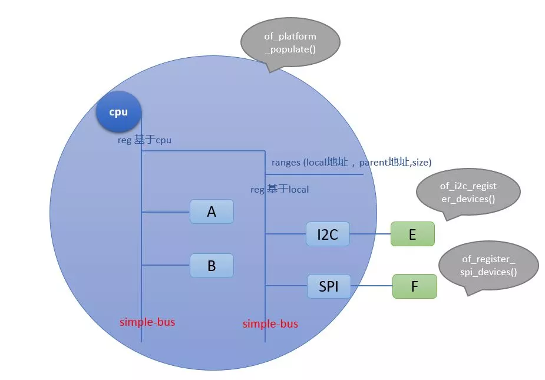
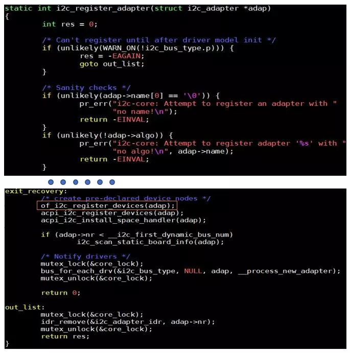
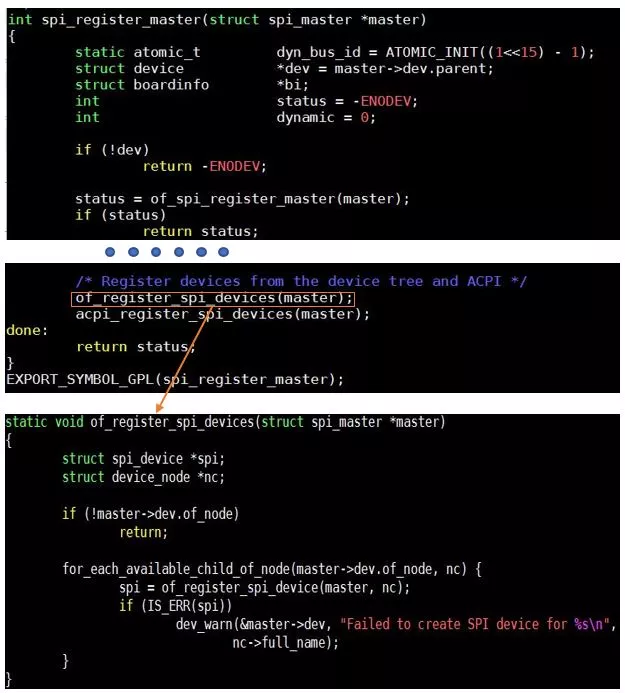
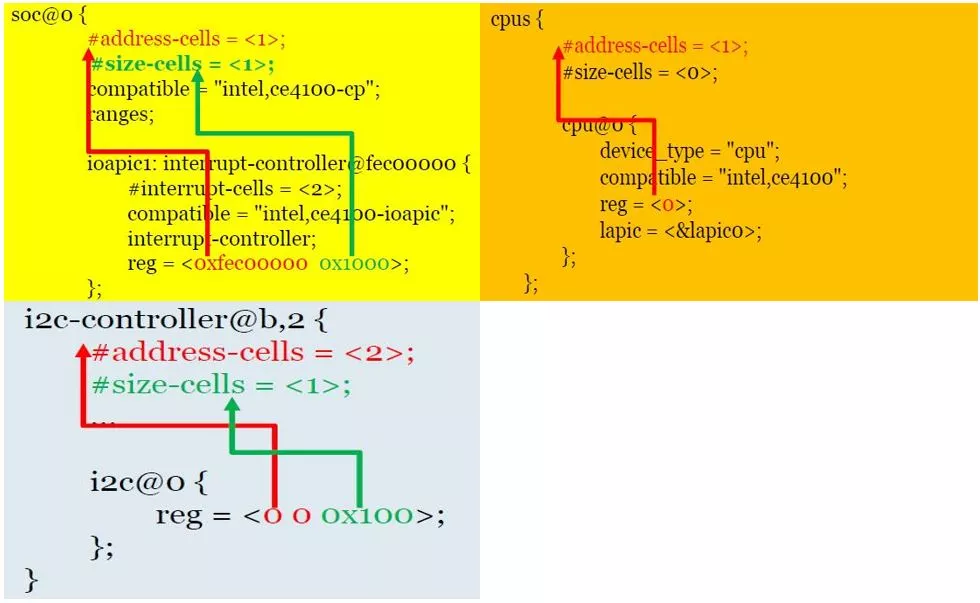

本文结合设备信息集合的详细讲解来认识一下设备和驱动是如何绑定的。所谓设备信息集合，就是根据不同的外设寻找各自的外设信息，我们知道一个完整的开发板有 CPU 和各种控制器（如 I2C 控制器、SPI 控制器、DMA 控制器等），CPU 和控制器可以统称为 SOC，除此之外还有各种外设 IP，如 LCD、HDMI、SD、CAMERA 等，如下图：

我们看到一个开发板有很多的设备，这些设备是如何一层一层展开的呢？设备和驱动又是如何绑定的呢？我们带着这些疑问进入本节的主题。

## 各级设备的展开

内核启动的时候是一层一层展开地去寻找设备，设备树之所以叫设备树也是因为设备在内核中的结构就像树一样，从根部一层一层的向外展开，为了更形象的理解来看一张图：

大的圆圈中就是我们常说的 soc，里面包括 CPU 和各种控制器 A、B、I2C、SPI，soc 外面接了外设 E 和 F。IP 外设有具体的总线，如 I2C 总线、SPI 总线，对应的 I2C 设备和 SPI 设备就挂在各自的总线上，但是在 soc 内部只有系统总线，是没有具体总线的。

第一节中讲了总线、设备和驱动模型的原理，即任何驱动都是通过对应的总线和设备发生联系的，故虽然 soc 内部没有具体的总线，但是内核通过 platform 这条虚拟总线，把控制器一个一个找到，一样遵循了内核高内聚、低耦合的设计理念。下面我们按照 platform 设备、i2c 设备、spi 设备的顺序探究设备是如何一层一层展开的。

### 1.展开 platform 设备

上图中可以看到红色字体标注的 simple-bus，这些就是连接各类控制器的总线，在内核里即为 platform 总线，挂载的设备为 platform 设备。下面看下 platform 设备是如何展开的。

还记得上一节讲到在内核初始化的时候有一个叫做 `init_machine()` 的回调函数吗？如果你在板级文件里注册了这个函数，那么在系统启动的时候这个函数会被调用，如果没有定义，则会通过调用 of_platform_populate() 来展开挂在“simple-bus”下的设备，如图（分别位于 kernel/arch/arm/kernel/setup.c，kernel/drivers/of/platform.c）：

这样就把 simple-bus 下面的节点一个一个的展开为 platform 设备。

### 2.展开 i2c 设备

有经验的小伙伴知道在写 i2c 控制器的时候肯定会调用 `i2c_register_adapter()` 函数，该函数的实现如下（kernel/drivers/i2c/i2c-core.c）：

注册函数的最后有一个函数 `of_i2c_register_devices(adap)`，实现如下：

`of_i2c_register_devices()`函数中会遍历控制器下的节点，然后通过`of_i2c_register_device()`函数把 i2c 控制器下的设备注册进去。

### 3.展开 spi 设备

spi 设备的注册和 i2c 设备一样，在 spi 控制器下遍历 spi 节点下的设备，然后通过相应的注册函数进行注册，只是和 i2c 注册的 api 接口不一样，下面看一下具体的代码（kernel/drivers/spi/spi.c)：

当通过 spi_register_master 注册 spi 控制器的时候会通过 of_register_spi_devices 来遍历 spi 总线下的设备，从而注册。这样就完成了 spi 设备的注册。

## 各级设备的展开

学到这里相信应该了解设备的硬件信息是从设备树里获取的，如寄存器地址、中断号、时钟等等。接下来我们一起看下这些信息在设备树里是怎么记录的，为下一节动手定制开发板做好准备。

### 1.reg 寄存器

我们先看设备树里的 soc 描述信息，红色标注的代表着寄存器地址用几个数据量来表述，绿色标注的代表着寄存器空间大小用几个数据量来表述。图中的含义是中断控制器的基地址是 0xfec00000，空间大小是 0x1000。如果 address-cells 的值是 2 的话表示需要两个数量级来表示基地址，比如寄存器是 64 位的话就需要两个数量级来表示，每个代表着 32 位的数。

## 2.ranges 取值范围

ranges 代表了 local 地址向 parent 地址的转换，如果 ranges 为空的话代表着与 cpu 是 1:1 的映射关系，如果没有 range 的话表示不是内存区域。
