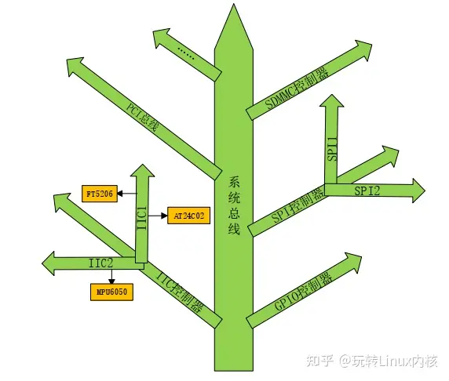
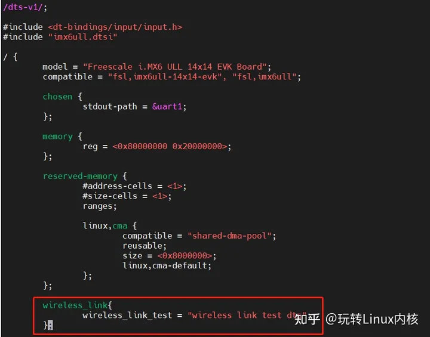
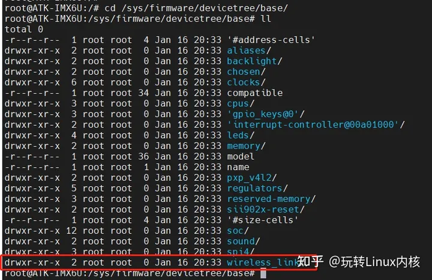

## 一、设备树概念以及作用

### 1.1设备树概念

设备树(Device Tree)，将这个词分开就是“设备”和“树”，描述设备树的文件叫做 DTS(DeviceTree Source)，这个 DTS 文件采用树形结构描述板级设备，也就是开发板上的设备信息，比如CPU 数量、 内存基地址、 IIC 接口上接了哪些设备、 SPI 接口上接了哪些设备等等，如图 所示：



在图中，树的主干就是系统总线， IIC 控制器、 GPIO 控制器、 SPI 控制器等都是接到系统主线上的分支。IIC 控制器有分为 IIC1 和 IIC2 两种，其中 IIC1 上接了 FT5206 和 AT24C02这两个 IIC 设备， IIC2 上只接了 MPU6050 这个设备。 DTS 文件的主要功能就是按照图所示的结构来描述板子上的设备信息， DTS 文件描述设备信息是有相应的语法规则要求的，稍后我们会详细的讲解 DTS 语法规则。

### 1.2设备树引用以及概念

以LED驱动为例，如果你要更换LED所用的GPIO引脚，需要修改驱动程序源码、重新编译驱动、重新加载驱动。

在内核中，使用同一个芯片的板子，它们所用的外设资源不一样，比如A板用GPIO A，B板用GPIO B。而GPIO的驱动程序既支持GPIO A也支持GPIO B，你需要指定使用哪一个引脚，怎么指定？在c代码中指定。

随着ARM芯片的流行，内核中针对这些ARM板保存有大量的、没有技术含量的文件。

Linus大发雷霆："this whole ARM thing is a f*cking pain in the ass"。

于是，Linux内核开始引入设备树。设备树并不是重新发明出来的，在Linux内核中其他平台如PowerPC，早就使用设备树来描述硬件了。

Linus发火之后，内核开始全面使用设备树来改造，神人就神人。

/sys/firmware/devicetree目录下是以目录结构程现的dtb文件, 根节点对应base目录, 每一个节点对应一个目录, 每一个属性对应一个文件。

这些属性的值如果是字符串，可以用cat命令把它打印出来；对于数值，可以用hexdump把它打印出来。

一个单板启动时，u-boot先运行，它的作用是启动内核。U-boot会把内核和设备树文件都读入内存，然后启动内核。在启动内核时会把设备树在内存中的地址告诉内核。


### 1.3设备树名词关系

设备树源文件扩展名为.dts，但是我们在前面移植 Linux 的时候却一直在使用.dtb 文件，那么 DTS 和 DTB 这两个文件是什么关系呢？ DTS 是设备树源码文件， DTB 是将DTS 编译以后得到的二进制文件。将.c 文件编译为.o 需要用到 gcc 编译器，那么将.dts 编译为.dtb需要什么工具呢？需要用到 DTC 工具！ DTC 工具源码在 Linux 内核的 scripts/dtc 目录下.另外dtsi就相当于C语言的.h文件的概念

## 二、设备树语法

### 2.1Device格式

**DTS文件格式**

```
/dts-v1/;                // 表示版本
[memory reservations]    // 格式为: /memreserve/ <address> <length>;
/ {
    [property definitions]
    [child nodes]
};
```

**node格式**

```
设备树中的基本单元，被称为“node”，其格式为：

[label:] node-name[@unit-address] {
    [properties definitions]
    [child nodes]
};
```

label是标号，可以省略。label的作用是为了方便地引用node，比如：

```
/dts-v1/;
/ {
    uart0: uart@fe001000 {
        compatible="ns16550";
        reg=<0xfe001000 0x100>;
    };
};
```

可以使用下面2种方法来修改uart@fe001000这个node：

```
1. *
   // 在根节点之外使用label引用node：*
2. &uart0 {
3. ​    status = “disabled”;
4. };
5. *//在根节点之外使用全路径：*
6. &{/uart@fe001000}  {
7. ​    status = “disabled”;
```

可以使用下面2种方法来修改uart@fe001000这个node：

```
// 在根节点之外使用label引用node：
&uart0 {
    status = “disabled”;
};
//在根节点之外使用全路径：
&{/uart@fe001000}  {
    status = “disabled”;
};
```

### 2.2常用属性(properties)

简单地说，properties就是“name=value”，value有多种取值方式。

**Property格式1:**

```
[label:] property-name = value;
```

**Property格式2(没有值):**

```
[label:] property-name;
```

**Property取值只有3种:**

```
arrays of cells(1个或多个32位数据, 64位数据使用2个32位数据表示), 
string(字符串), 
bytestring(1个或多个字节)
```

### 2.3#address-cells、#size-cells

cell指一个32位的数值，

address-cells：address要用多少个32位数来表示；

size-cells：size要用多少个32位数来表示。

比如一段内存，怎么描述它的起始地址和大小？

下例中，address-cells为1，所以reg中用1个数来表示地址，即用0x80000000来表示地址；size-cells为1，所以reg中用1个数来表示大小，即用0x20000000表示大小：

```
/ {
#address-cells = <1>;
#size-cells = <1>;
memory {
reg = <0x80000000 0x20000000>;
    };
};
```

### 2.2 compatible

“compatible”表示“兼容”，对于某个LED，内核中可能有A、B、C三个驱动都支持它，可以这样写：

```
led {
compatible = “A”, “B”, “C”;
};
```

内核启动时，就会为这个LED按这样的优先顺序为它找到驱动程序：A、B、C。

根节点下也有compatible属性，用来选择哪一个“machine desc”：一个内核可以支持machine A，也支持machine B，内核启动后会根据根节点的compatible属性找到对应的machine desc结构体，执行其中的初始化函数。

compatible的值，建议取这样的形式："manufacturer,model"，即“厂家名,模块名”。

比如：compatible = "fsl,imx6ull-gpmi-nand", "fsl, imx6ul-gpmi-nand";

注意：machine desc的意思就是“机器描述”，学到内核启动流程时才涉及。

### 2.4model

model属性与compatible属性有些类似，但是有差别。

compatible属性是一个字符串列表，表示可以你的硬件兼容A、B、C等驱动；

model用来准确地定义这个硬件是什么。

比如根节点中可以这样写：

```
/ {
    compatible = "samsung,smdk2440", "samsung,mini2440";
    model = "jz2440_v3";
};
```

它表示这个单板，可以兼容内核中的“smdk2440”，也兼容“mini2440”。

从compatible属性中可以知道它兼容哪些板，但是它到底是什么板？用model属性来明确。

### 2.5status

dtsi文件中定义了很多设备，但是在你的板子上某些设备是没有的。这时你可以给这个设备节点添加一个status属性，设置为“disabled”：


### 2.6reg

reg的本意是register，用来表示寄存器地址。

但是在设备树里，它可以用来描述一段空间。反正对于ARM系统，寄存器和内存是统一编址的，即访问寄存器时用某块地址，访问内存时用某块地址，在访问方法上没有区别。

reg属性的值，是一系列的“address size”，用多少个32位的数来表示address和size，由其父节点的#address-cells、#size-cells决定。

示例：

```
/dts-v1/;
/ {
#address-cells = <1>;
#size-cells = <1>; 
memory {
reg = <0x80000000 0x20000000>;
};
};
```

### 2.7name(过时了，建议不用)

它的值是字符串，用来表示节点的名字。在跟platform_driver匹配时，优先级最低。

compatible属性在匹配过程中，优先级最高。

### 2.8device_type(过时了，建议不用)

它的值是字符串，用来表示节点的类型。在跟platform_driver匹配时，优先级为中。

compatible属性在匹配过程中，优先级最高。

## 3、常用节点

### 3.1跟节点

dts文件中必须有一个根节点：

```
/dts-v1/;
/ {
model = "SMDK24440";
compatible = "samsung,smdk2440";
 
#address-cells = <1>;
#size-cells = <1>; 
};
```

根节点中必须有这些属性：

```
#address-cells // 在它的子节点的reg属性中, 使用多少个u32整数来描述地址(address)
#size-cells   // 在它的子节点的reg属性中, 使用多少个u32整数来描述大小(size)
compatible   // 定义一系列的字符串, 用来指定内核中哪个machine_desc可以支持本设备
            // 即这个板子兼容哪些平台 
            // uImage : smdk2410 smdk2440 mini2440     ==> machine_desc         
                 
model       // 咱这个板子是什么
            // 比如有2款板子配置基本一致, 它们的compatible是一样的
            // 那么就通过model来分辨这2款板子
```

### 3.2CPU节点

一般不需要我们设置，在dtsi文件中都定义好了：

```cpp
cpus {
        #address-cells = <1>;
        #size-cells = <0>;
 
        cpu0: cpu@0 {
            .......
        }
};
```

### 3.3 memory节点

芯片厂家不可能事先确定你的板子使用多大的内存，所以memory节点需要板厂设置，比如：

```cpp
memory {
reg = <0x80000000 0x20000000>;
};
```

### 3.4 chosen节点

我们可以通过设备树文件给内核传入一些参数，这要在chosen节点中设置bootargs属性：

```cpp
chosen {
bootargs = "noinitrd root=/dev/mtdblock4 rw init=/linuxrc console=ttySAC0,115200";
};
```

3.5 aliases 子节点
单词 aliases 的意思是“别名”，因此 aliases 节点的主要功能就是定义别名，定义别名的目的就是为了方便访问节点。不过我们一般会在节点命名的时候会加上 label，然后通过&label来访问节点，这样也很方便，而且设备树里面大量的使用&label 的形式来访问节点。

打开 imx6ull.dtsi 文件， aliases 节点内容如下所示：

```
aliases {
 can0 = &flexcan1;
 can1 = &flexcan2;
 ethernet0 = &fec1;
 ethernet1 = &fec2;
 gpio0 = &gpio1;
 gpio1 = &gpio2;
....
 spi0 = &ecspi1;
 spi1 = &ecspi2;
 spi2 = &ecspi3;
 spi3 = &ecspi4;
 usbphy0 = &usbphy1;
 usbphy1 = &usbphy2;
};
```

## 4、设备树使用

### 4.1编译设备树

make dtbs

### 4.2开发板使用设备树

我们来修改下一个设备树，在跟节点中增加一个测试节点

#### 4.1.1测试节点编写



#### 4.1.2编译dtbs


### 4.3通过配置tftp boot

bootcmd以及bootargs配置为

```
setenv bootargs 'console=ttymxc0,115200 root=/dev/mmcblk1p2 rootwait rw'
setenv bootcmd 'mmc dev 1; fatload mmc 1:1 80800000 zImage; fatload mmc 1:1 83000000
imx6ull-alientek-emmc.dtb; bootz 80800000 - 83000000;
saveenv
```

### 4.4板子启动后查看设备树信息




## 5、内核操作设备树的函数

设备树描述了设备的详细信息，这些信息包括数字类型的、字符串类型的、数组类型的，我们在编写驱动的时候需要获取到这些信息。比如设备树使用 reg 属性描述了某个外设的寄存器地址为 0X02005482，长度为 0X400，我们在编写驱动的时候需要获取到 reg 属性的 0X02005482 和 0X400 这两个值，然后初始化外设。 Linux 内核给我们提供了一系列的函数来获取设备树中的节点或者属性信息，这一系列的函数都有一个统一的前缀“of_”，所以在很多资料里面也被叫做 OF 函数。这些 OF 函数原型都定义在 include/linux/of.h 文件中。

### 5.1查找节点的 OF 函数

设备都是以节点的形式“挂”到设备树上的，因此要想获取这个设备的其他属性信息，必须先获取到这个设备的节点。 Linux 内核使用 device_node 结构体来描述一个节点，此结构体定义在文件 include/linux/of.h 中，定义如下：

```
 struct device_node {
    const char *name;                    /* 节点名字 */
    const char *type;                    /* 设备类型 */
    phandle phandle;
    const char *full_name;                /* 节点全名 */
    struct fwnode_handle fwnode;
 
    struct    property *properties;        /* 属性 */
    struct    property *deadprops;        /* removed 属性 */
    struct    device_node *parent;        /* 父节点 */
    struct    device_node *child;            /* 子节点 */
    struct    device_node *sibling;
    struct    kobject kobj;
    unsigned long _flags;
    void    *data;
#if defined(CONFIG_SPARC)
    const char *path_component_name;
    unsigned int unique_id;
    struct of_irq_controller *irq_trans;
#endif
};
```

与查找节点有关的 OF 函数有 5 个，我们依次来看一下。

#### 5.1of_find_node_by_name 函数

of_find_node_by_name 函数通过节点名字查找指定的节点，函数原型如下：

```
struct device_node *of_find_node_by_name(struct device_node *from,const char *name);
```

from：开始查找的节点，如果为 NULL 表示从根节点开始查找整个设备树。

name：要查找的节点名字。

返回值： 找到的节点，如果为 NULL 表示查找失败。

#### 5.2of_find_node_by_type 函数

of_find_node_by_type 函数通过 device_type 属性查找指定的节点，函数原型如下：

```
struct device_node *of_find_node_by_type(struct device_node *from, const char *type)
```

from：开始查找的节点，如果为 NULL 表示从根节点开始查找整个设备树。

type：要查找的节点对应的 type 字符串，也就是 device_type 属性值。

返回值： 找到的节点，如果为 NULL 表示查找失败。

#### 5.3of_find_compatible_node 函数

of_find_compatible_node 函数根据 device_type 和 compatible 这两个属性查找指定的节点，

函数原型如下：

```
struct device_node *of_find_compatible_node(struct device_node *from,
                                            const char *type,
                                            const char *compatible)
```

from：开始查找的节点，如果为 NULL 表示从根节点开始查找整个设备树。

type：要查找的节点对应的 type 字符串，也就是 device_type 属性值，可以为 NULL，表示

忽略掉 device_type 属性。

compatible： 要查找的节点所对应的 compatible 属性列表。

返回值： 找到的节点，如果为 NULL 表示查找失败

#### 5.4of_find_matching_node_and_match 函数

of_find_matching_node_and_match 函数通过 of_device_id 匹配表来查找指定的节点，函数原

型如下：

```
struct device_node *of_find_matching_node_and_match(struct device_node *from,
                                                    const struct of_device_id *matches,
                                                    const struct of_device_id **match)
```

from：开始查找的节点，如果为 NULL 表示从根节点开始查找整个设备树。

matches： of_device_id 匹配表，也就是在此匹配表里面查找节点。

match： 找到的匹配的 of_device_id。

返回值： 找到的节点，如果为 NULL 表示查找失败

#### 5.5of_find_node_by_path 函数

of_find_node_by_path 函数通过路径来查找指定的节点，函数原型如下：

```
inline struct device_node *of_find_node_by_path(const char *path)
```

path：带有全路径的节点名，可以使用节点的别名，比如“/backlight”就是 backlight 这个

节点的全路径。

返回值： 找到的节点，如果为 NULL 表示查找失败

### 5.2查找父/子节点的 OF 函数

Linux 内核提供了几个查找节点对应的父节点或子节点的 OF 函数，我们依次来看一下。

#### 5.2.1of_get_parent 函数

of_get_parent 函数用于获取指定节点的父节点(如果有父节点的话)，函数原型如下：

```
struct device_node *of_get_parent(const struct device_node *node)
```

node：要查找的父节点的节点。

返回值： 找到的父节点。

#### 5.2.2of_get_next_child 函数

of_get_next_child 函数用迭代的查找子节点，函数原型如下：

```
struct device_node *of_get_next_child(const struct device_node *node,
                                    struct device_node *prev)
```

node：父节点。

prev：前一个子节点，也就是从哪一个子节点开始迭代的查找下一个子节点。可以设置为

NULL，表示从第一个子节点开始。

返回值： 找到的下一个子节点。

### 5.3提取属性值的 OF 函数

节点的属性信息里面保存了驱动所需要的内容，因此对于属性值的提取非常重要， Linux 内核中使用结构体 property 表示属性，此结构体同样定义在文件 include/linux/of.h 中，内容如下：

```
struct property {
    char    *name;                /* 属性名字 */
    int    length;                    /* 属性长度 */
    void    *value;                /* 属性值 */
    struct property *next;        /* 下一个属性 */
    unsigned long _flags;
    unsigned int unique_id;
    struct bin_attribute attr;
};
```

Linux 内核也提供了提取属性值的 OF 函数，我们依次来看一下

#### 5.3.1of_find_property 函数

of_find_property 函数用于查找指定的属性，函数原型如下

```
property *of_find_property(const struct device_node *np,
                            const char *name,
                            int *lenp)
```

np：设备节点。

name： 属性名字。

lenp：属性值的字节数

返回值： 找到的属性

#### 5.3.2of_property_count_elems_of_size 函数

of_property_count_elems_of_size 函数用于获取属性中元素的数量，比如 reg 属性值是一个

数组，那么使用此函数可以获取到这个数组的大小，此函数原型如下：

```
int of_property_count_elems_of_size(const struct device_node *np,
                                    const char *propname,
                                    int elem_size)
```

np：设备节点。

proname： 需要统计元素数量的属性名字。

elem_size：元素长度。

返回值： 得到的属性元素数量。

#### 5.3.3of_property_read_u32_index 函数

of_property_read_u32_index 函数用于从属性中获取指定标号的 u32 类型数据值(无符号 32位)，比如某个属性有多个 u32 类型的值，那么就可以使用此函数来获取指定标号的数据值，此函数原型如下：

```
int of_property_read_u32_index(const struct device_node *np,
                                const char *propname,
                                u32 index,
                                u32 *out_value)
```

np：设备节点。

proname： 要读取的属性名字。

index：要读取的值标号。

out_value：读取到的值

返回值： 0 读取成功，负值，读取失败， -EINVAL 表示属性不存在， -ENODATA 表示没有

要读取的数据， -EOVERFLOW 表示属性值列表太小。
