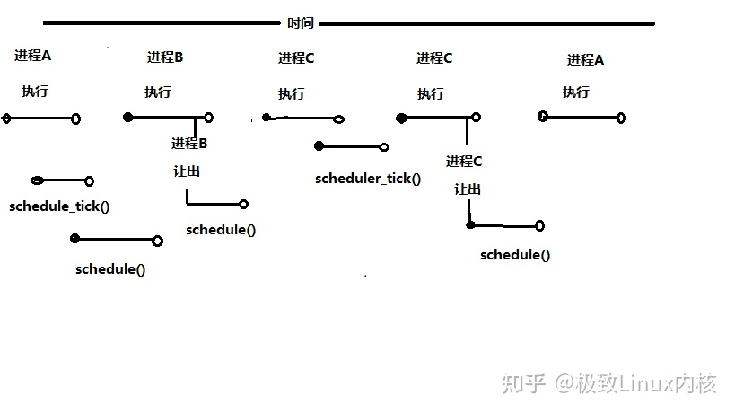

Linux2.6版本中的内核引入了一个全新的调度程序，称为O(1)调度程序，进程在被初始化并放到运行队列后，在某个时刻应该获得对CPU的访问，它负责把CPU的控制权传递到不同进程的两个函数schedule()和schedule_tick()中。下图是随着时间推移，CPU是如何在不同进程之间传递的，至于细节这里不多阐释，大家看待就可以理解的啦~



下面开始介绍一下上下文切换，在操作系统中，CPU切换到另一个进程需要保存当前进程的状态并恢复另一个进程的状态：当前运行任务转为就绪（或者挂起、删除）状态，另一个被选定的就绪任务成为当前任务。上下文切换包括保存当前任务的运行环境，恢复将要运行任务的运行环境。

## 1、**如何获得上下文切换的次数？**

vmstat直接运行即可，在最后几列，有CPU的context switch次数。 这个是系统层面的，加入想看特定进程的情况，可以使用pidstat。

```text
$ vmstat 1 100
procs -----------memory---------- ---swap-- -----io---- --system-- -----cpu------
 r  b   swpd   free   buff  cache   si   so    bi    bo   in   cs us sy id wa st
 0  0     88 233484 288756 1784744    0    0     0    23    0    0  4  1 94  0  0
 4  0     88 233236 288756 1784752    0    0     0     0 6202 7880  4  1 96  0  0
 2  0     88 233360 288756 1784800    0    0     0   112 6277 7612  4  1 95  0  0
 0  0     88 232864 288756 1784804    0    0     0   644 5747 6593  6  0 92  2  0
```

****执行pidstat，将输出系统启动后所有活动进程的cpu统计信息：

```text
linux:~ # pidstat
Linux 2.6.32.12-0.7-default (linux)             06/18/12        _x86_64_

11:37:19          PID    %usr %system  %guest    %CPU   CPU  Command
……
11:37:19        11452    0.00    0.00    0.00    0.00     2  bash
11:37:19        11509    0.00    0.00    0.00    0.00     3  dd
11:37:19: pidstat获取信息时间点
PID: 进程pid
%usr: 进程在用户态运行所占cpu时间比率
%system: 进程在内核态运行所占cpu时间比率
%CPU: 进程运行所占cpu时间比率
CPU: 指示进程在哪个核运行
Command: 拉起进程对应的命令
备注:执行pidstat默认输出信息为系统启动后到执行时间点的统计信息，因而即使当前某进程的cpu占用率很高
```

## 2、**上下文切换的性能消耗在哪里呢？**

context switch过高，会导致CPU像个搬运工，频繁在寄存器和运行队列直接奔波 ，更多的时间花在了线程切换，而不是真正工作的线程上。直接的消耗包括CPU寄存器需要保存和加载，系统调度器的代码需要执行。间接消耗在于多核cache之间的共享数据。 ****

## 3、**引起上下文切换的原因有哪些？**

对于抢占式操作系统而言， 大体有几种：

- 当前任务的时间片用完之后，系统CPU正常调度下一个任务；
- 当前任务碰到IO阻塞，调度线程将挂起此任务，继续下一个任务；
- 多个任务抢占锁资源，当前任务没有抢到，被调度器挂起，继续下一个任务；
- 用户代码挂起当前任务，让出CPU时间；
- 硬件中断；  

## 4、**如何测试上下文切换的时间消耗？**

这里我再网上查找到了一个程序，代码不长，切换一个 差不多就是 20个微秒吧，这个程序望大神指教

```text
#include <stdio.h>
#include <unistd.h>
#include <sys/time.h>
#include<pthread.h>

int pipes[20][3];
char buffer[10];
int running = 1;

void inti()
{
    int i =20;
    while(i--)
    {
        if(pipe(pipes[i])<0)
            exit(1);
        pipes[i][2] = i;
    }
}

void distroy()
{
    int i =20;
    while(i--)
    {
        close(pipes[i][0]);
        close(pipes[i][1]);
    }
}

double self_test()
{
    int i =20000;
    struct timeval start, end;
    gettimeofday(&start, NULL);
    while(i--)
    {
        if(write(pipes[0][1],buffer,10)==-1)
            exit(1);
        read(pipes[0][0],buffer,10);
    }
    gettimeofday(&end, NULL);
    return (double)(1000000*(end.tv_sec-start.tv_sec)+ end.tv_usec-start.tv_usec)/20000;
}

void *_test(void *arg)
{
    int pos = ((int *)arg)[2];
    int in = pipes[pos][0];
    int to = pipes[(pos + 1)%20][1];
    while(running)
    {
        read(in,buffer,10);
        if(write(to,buffer,10)==-1)
            exit(1);
    }
}

double threading_test()
{
    int i = 20;
    struct timeval start, end;
    pthread_t tid;
    while(--i)
    {
        pthread_create(&tid,NULL,_test,(void *)pipes[i]);
    }
    i = 10000;
    gettimeofday(&start, NULL);
    while(i--)
    {
        if(write(pipes[1][1],buffer,10)==-1)
            exit(1);
        read(pipes[0][0],buffer,10);
    }
    gettimeofday(&end, NULL);
    running = 0;
    if(write(pipes[1][1],buffer,10)==-1)
        exit(1);
    return (double)(1000000*(end.tv_sec-start.tv_sec)+ end.tv_usec-start.tv_usec)/10000/20;
}


int main()
{
    inti();
    printf("%6.6f\n",self_test());
    printf("%6.6f\n",threading_test());
    distroy();
    exit(0);
}
```

总而言之，我们可以认为，这最多只能是依赖于底层操作系统的近似计算。 一个近似的解法是记录一个进程结束时的时间戳，另一个进程开始的时间戳及排除等待时间。如果所有进程总共用时为T，那么总的上下文切换时间为： T – (所有进程的等待时间和执行时间)

接下来来述说抢占，抢占是一个进程到另一个进程的切换，那么Linux是如何决定在何时进行切换的呢？下面我们一次来介绍这三种抢占方式。

**显式内核抢占：**

最容易的就是这个抢占啦，它发生在内核代码调用schedule(可以直接调用或者阻塞调用)时候的内核空间中。当这种方式抢占时，例如在wait_queue等待队列中设备驱动程序在等候时，控制权被简单地传递到调度程序，从而新的进程被选中执行。

**隐式用户抢占：**

当内核处理完内核空间的进程并准备把控制权传递到用户空间的进程时，它首先查看应该把控制权传递到哪一个用户空间的进程上，这个进程也行不是传递其控制权到内核的那个用户空间进程。系统中中的每一个进程有一个“必须重新调度”，在进程应该被重新调度的任何时候设置它。**代码可以在include/linux/sched.h中查看**~

```text
static inline void set_tsk_need_resched(struct task_struct *tsk)
{
    set_tsk_thread_flag(tsk,TIF_NEED_RESCHED);
}

static inline void clear_tsk_need_resched(struct task_struct *tsk)
{
    clear_tsk_thread_flag(tsk,TIF_NEED_RESCHED);
}
//set_tsk_need_resched和clear_tsk_need_resched是两个接口，用于设置体系结构特有的TIF_NEED_RESCHED标志
stactic inline int need_resched(void)
{
    return unlikely(test_thread_flag(TIF_NEED_RESCHED));
}//need_resched测试当前线程的标志，看看TIF_NEED_RESCHED是否被设置
```

**隐式内核抢占：**

隐式内核抢占有两种可能性：内核代码出自使抢占禁止的代码块，或者处理正在从中断返回到内核代码时，如果控制权正在从一个中断返回到内核空间，该中断调用schedule()，一个新的 进程以刚才描述的同一种方式被选中，如果内核代码出自禁止抢占的代码块，激活抢占 的操作可能引起当前进程被抢占(代码在include/linux/preempt.h中查看到):

```text
#define preempt_enable() \
do { \
    preempt_enable_no_resched(); \
    preempt_check_resched(); \
} while(0)
```

preempt_enable()调用preempt_enable_no_resched()，它把与当前进程相关的preempt_count减1，然后调用preempt_check_resched():

```text
#define preempt_check_resched() \
do { \
    if(unlikely(test_thread_flag(TIF_NEED_RESCHED))); \
    preempt_schedule(); \
} 
```

preempt_check_resched()判断当前进程是否被标记为重新调度，如果是，它调用preempt_schedule()。
当两个或者两个以上的进程请求对共享资源独自访问时候，它们需要具有这样一种条件，即它们是在给代码段中操作的唯一进程，在Linux内核锁的基本形式是自旋锁。自旋锁会因为连续循环等待或者试图两次获得锁这种方式的操作而导致死锁，所以在此之前必须初始化spin_lock_t，这个可以通过调用spin_lock_init()来完成(**代码在include/linux/spinlock.h中查看**)：

```text
#define spin_lock_init(x) \
    do { \
        (x) -> magic = SPINLOCK_MAGIC; \
        (x) -> lock = 0; \　　　　　　//设置自旋锁为"开锁"
        (x) -> babble = 5; \
        (x) -> module = __FILE__; \
        (x) -> owner = NULL; \
        (x) -> oline = 0; \
    } while(0)
```

自旋锁被初始化后，可以通过调用spin_lock()或者spin_lock_irqsave()来获取，如果你使用spin_lock()那么进程可能在上锁的代码中被中断，为了在代码的临界区执行后释放，必须调用spin_unlock()或者spin_unlock_irqrestroe(),spin_unlock_irqrestroe()把中断寄存器的状态恢复成调用spin_lock_irq()时寄存器所处的状态。

自旋锁的缺点是它们频繁地循环直到等待锁的释放，那么对于等待时间长的代码区，最好是使用Linux kernel的另一个上锁工具：信号量。它的主要优势之一是：持有信号量的进程可以安全的阻塞，它们在SMP和中断中是保险的(**代码在include/asm-i386/semaphore.h，include/asm-ppc/semaphore.h中可以查看**)：

```text
struct semaphore{
    atomic_t count;
    int sleepers;
    wait_queue_head_t wait;
#ifdef WAITQUEUE_DEBUG
    long __magic;
#endif
};
```


```text
struct semaphore{
    atomic_t count;
    wait_queue_head_t wait;
#ifdef WAITQUEUE_DEBUG
    long __magic;
#endif
};
```

两种体系结构的实现都提供了指向wait_queue的一个指针和一个计数，有了信号量我们能够让多于一个的进程同时进去代码的临界区，如果计数初始化为1，则表示只有一个进程能够进去代码的临界区，信号量用sema_init()来初始化，分别调用down()和up()来上锁和解锁，down()和up()函数的使用以及一些情况就不多说了看信号量的调用问题，很容易理解的。
