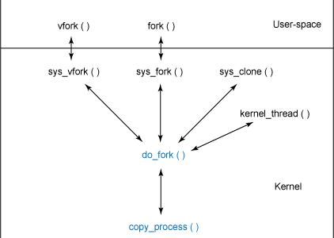
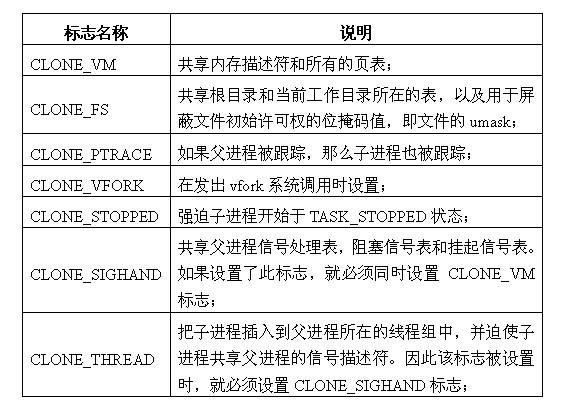

> **前言：**Linux内核里大部分都是C语言。建议先看《Linux内核设计与实现(Linux Kernel Development)》,Robert Love，也就是LKD。

Linux是一种动态系统，能够适应不断变化的计算需求。Linux计算需求的表现是以进程的通用抽象为中心的。进程可以是短期的（从命令行执行的一个命令），也可以是长期的（一种网络服务）。因此，对进程及其调度进行一般管理就显得极为重要。

在用户空间，进程是由进程标识符（PID）表示的。从用户的角度来看，一个 PID 是一个数字值，可惟一标识一个进程。一个 PID 在进程的整个生命期间不会更改，但 PID 可以在进程销毁后被重新使用，所以对它们进行缓存并不见得总是理想的。在用户空间，创建进程可以采用几种方式。可以 执行一个程序（这会导致新进程的创建），也可以 在程序内，调用一个 fork或 exec 系统调用。fork调用会导致创建一个子进程，而exec调用则会用新程序代替当前进程上下文。这里将对这几种方法进行讨论以便您能很好地理解它们的工作原理。

这里将按照下面的顺序展开对进程的介绍，首先展示进程的内核表示以及它们是如何在内核内被管理的，然后来看看进程创建和调度的各种方式（在一个或多个处理器上），最后介绍进程的销毁。内核的版本为2.6.32.45。

## 1，**进程描述符**

在Linux内核内，进程是由相当大的一个称为 task_struct 的结构表示的。此结构包含所有表示此进程所必需的数据，此外，还包含了大量的其他数据用来统计（accounting）和维护与其他进程的关系（如父和子）。task_struct 位于 ./[linux](https://link.zhihu.com/?target=http%3A//lib.csdn.net/base/linux)/include/[linux](https://link.zhihu.com/?target=https%3A//so.csdn.net/so/search%3Ffrom%3Dpc_blog_highlight%26q%3Dlinux)/sched.h（注意./linux/指向内核源代码树）。

**下面是task_struct结构：**

```cpp
  struct task_struct {  
       volatile long state;    /* -1 不可运行, 0 可运行, >0 已停止 */  
       void *stack;            /* 堆栈 */  
       atomic_t usage;  
       unsigned int flags; /* 一组标志 */  
       unsigned int ptrace;  
       /* ...  */  
     
       int prio, static_prio, normal_prio;  /* 优先级  */  
      /* ...  */  
    
      struct list_head tasks;  /* 执行的线程（可以有很多）  */  
      struct plist_node pushable_tasks;  
    
      struct mm_struct *mm, *active_mm;   /* 内存页（进程地址空间）  */  
    
      /* 进行状态 */  
      int exit_state;  
      int exit_code, exit_signal;  
      int pdeath_signal;  /*  当父进程死亡时要发送的信号  */  
```


<span style="font-family: Arial, Helvetica, sans-serif;">*/\* ... \*/* </span>

```cpp
      pid_t pid;  /* 进程号 */  
      pid_t tgid;  
   
      /* ... */  
      struct task_struct *real_parent; /* 实际父进程real parent process */  
      struct task_struct *parent; /* SIGCHLD的接受者，由wait4()报告 */  
      struct list_head children;  /* 子进程列表 */  
      struct list_head sibling;   /* 兄弟进程列表 */  
      struct task_struct *group_leader;   /* 线程组的leader */  
      /* ... */  
    
      char comm[TASK_COMM_LEN]; /* 可执行程序的名称（不包含路径） */  
      /* 文件系统信息 */  
      int link_count, total_link_count;  
      /* ... */  
    
      /* 特定CPU架构的状态 */  
      struct thread_struct thread;  
     /* 进程当前所在的目录描述 */  
       struct fs_struct *fs;  
      /* 打开的文件描述信息 */  
      struct files_struct *files;  
      /* ... */  
  };  
```

在task_struct结构中，可以看到几个预料之中的项，比如执行的状态、堆栈、一组标志、父进程、执行的线程（可以有很多）以及开放文件。state 变量是一些表明任务状态的比特位。最常见的状态有：TASK_RUNNING 表示进程正在运行，或是排在运行队列中正要运行；TASK_INTERRUPTIBLE 表示进程正在休眠、TASK_UNINTERRUPTIBLE表示进程正在休眠但不能叫醒；TASK_STOPPED 表示进程停止等等。这些标志的完整列表可以在 ./linux/include/linux/sched.h 内找到。

flags 定义了很多指示符，表明进程是否正在被创建（PF_STARTING）或退出（PF_EXITING），或是进程当前是否在分配内存（PF_MEMALLOC）。可执行程序的名称（不包含路径）占用 comm（命令）字段。每个进程都会被赋予优先级（称为 static_prio），但进程的实际优先级是基于加载以及其他几个因素动态决定的。优先级值越低，实际的优先级越高。tasks字段提供了链接列表的能力。它包含一个 prev 指针（指向前一个任务）和一个 next 指针（指向下一个任务）。

进程的地址空间由mm 和 active_mm 字段表示。mm代表的是进程的内存描述符，而 active_mm 则是前一个进程的内存描述符（为改进上下文切换时间的一种优化）。thread_struct thread结构则用来标识进程的存储状态，此元素依赖于Linux在其上运行的特定架构。例如对于x86架构，在./linux/arch/x86/include/asm/processor.h的thread_struct结构中可以找到该进程自执行上下文切换后的存储（硬件注册表、程序计数器等）。

**代码如下：**

```cpp
struct thread_struct {
	/* Cached TLS descriptors: */
	struct desc_struct	tls_array[GDT_ENTRY_TLS_ENTRIES];
	unsigned long		sp0;
	unsigned long		sp;
#ifdef CONFIG_X86_32
	unsigned long		sysenter_cs;
#else
	unsigned long		usersp;	/* Copy from PDA */
	unsigned short		es;
	unsigned short		ds;
	unsigned short		fsindex;
	unsigned short		gsindex;
#endif
#ifdef CONFIG_X86_32
	unsigned long		ip;
#endif
	/* ... */
#ifdef CONFIG_X86_32
	/* Virtual 86 mode info */
	struct vm86_struct __user *vm86_info;
	unsigned long		screen_bitmap;
	unsigned long		v86flags;
	unsigned long		v86mask;
	unsigned long		saved_sp0;
	unsigned int		saved_fs;
	unsigned int		saved_gs;
#endif
	/* IO permissions: */
	unsigned long		*io_bitmap_ptr;
	unsigned long		iopl;
	/* Max allowed port in the bitmap, in bytes: */
	unsigned		io_bitmap_max;
/* MSR_IA32_DEBUGCTLMSR value to switch in if TIF_DEBUGCTLMSR is set.  */
	unsigned long	debugctlmsr;
	/* Debug Store context; see asm/ds.h */
	struct ds_context	*ds_ctx;
};
```

## 2，进程管理

在很多情况下，进程都是动态创建并由一个动态分配的 task_struct 表示。一个例外是init 进程本身，它总是存在并由一个静态分配的task_struct表示，参看./linux/arch/x86/kernel/init_task.c。

**代码如下：**

```cpp
static struct signal_struct init_signals = INIT_SIGNALS(init_signals);
static struct sighand_struct init_sighand = INIT_SIGHAND(init_sighand);
 
/*
 * 初始化线程结构
 */
union thread_union init_thread_union __init_task_data =
	{ INIT_THREAD_INFO(init_task) };
 
/*
 * 初始化init进程的结构。所有其他进程的结构将由fork.c中的slabs来分配
 */
struct task_struct init_task = INIT_TASK(init_task);
EXPORT_SYMBOL(init_task);
 
/*
 * per-CPU TSS segments. 
 */
DEFINE_PER_CPU_SHARED_ALIGNED(struct tss_struct, init_tss) = INIT_TSS;
```

注意进程虽然都是动态分配的，但还是需要考虑最大进程数。在内核内最大进程数是由一个称为max_threads的符号表示的，它可以在 ./linux/kernel/fork.c 内找到。可以通过/proc/sys/kernel/threads-max 的 proc 文件系统从用户空间更改此值。

Linux 内所有进程的分配有两种方式。第一种方式是通过一个哈希表，由PID 值进行哈希计算得到；第二种方式是通过双链循环表。循环表非常适合于对任务列表进行迭代。由于列表是循环的，没有头或尾；但是由于 init_task 总是存在，所以可以将其用作继续向前迭代的一个锚点。让我们来看一个遍历当前任务集的例子。任务列表无法从用户空间访问，但该问题很容易解决，方法是以模块形式向内核内插入代码。下面给出一个很简单的程序，它会迭代任务列表并会提供有关每个任务的少量信息（name、pid和 parent 名）。注意，在这里，此模块使用 printk 来发出结果。要查看具体的结果，可以通过 cat 实用工具（或实时的 tail -f/var/log/messages）查看 /var/log/messages 文件。next_task函数是 sched.h 内的一个宏，它简化了任务列表的迭代（返回下一个任务的 task_struct 引用）。

**如下：**

```cpp
#define next_task(p) \
	list_entry_rcu((p)->tasks.next, struct task_struct, tasks)
```

**查询任务列表信息的简单内核模块：**

```cpp
<pre name="code" class="cpp">#include <linux/kernel.h>
#include <linux/module.h>
#include <linux/sched.h>
 
int init_module(void)
{
	/* Set up the anchor point */
	struct task_struct *task=&init_task;
	/* Walk through the task list, until we hit the init_task again */
	do {
		printk(KERN_INFO "=== %s [%d] parent %s\n",
			task->comm,task->pid,task->parent->comm);
	} while((task=next_task(task))!=&init_task);
	
	printk(KERN_INFO "Current task is %s [%d]\n", current->comm,current->pid);
	return 0;
}
 
void cleanup_module(void)
{
	return;
}
```

**编译此模块的Makefile文件如下：**

```cpp
obj-m += procsview.o
 
KDIR := /lib/modules/$(shell uname -r)/build
PWD := $(shell pwd)
 
default:
	$(MAKE) -C $(KDIR) SUBDIRS=$(PWD) modules
```

在编译后，可以用insmod procsview.ko 插入模块对象，也可以用 rmmod procsview 删除它。插入后，/var/log/messages可显示输出，如下所示。从中可以看到，这里有一个空闲任务（称为 swapper）和init 任务（pid 1）。

> Dec 28 23:18:16 ubuntu kernel: [12128.910863]=== swapper [0] parent swapper
> Dec 28 23:18:16 ubuntu kernel: [12128.910934]=== init [1] parent swapper
> Dec 28 23:18:16 ubuntu kernel: [12128.910945]=== kthreadd [2] parent swapper
> Dec 28 23:18:16 ubuntu kernel: [12128.910953]=== migration/0 [3] parent kthreadd
> ......
> Dec 28 23:24:12 ubuntu kernel: [12485.295015]Current task is insmod [6051]

Linux 维护一个称为current的宏，标识当前正在运行的进程（类型是 task_struct）。模块尾部的那行prink用于输出当前进程的运行命令及进程号。注意到当前的任务是 insmod，这是因为 init_module 函数是在insmod 命令执行的上下文运行的。current 符号实际指的是一个函数（get_current），可在一个与 arch 有关的头部中找到它。比如 ./linux/arch/x86/include/asm/current.h，**如下：**

```cpp
#include <linux/compiler.h>
#include <asm/percpu.h>
 
#ifndef __ASSEMBLY__
struct task_struct;
 
DECLARE_PER_CPU(struct task_struct *, current_task);
 
static __always_inline struct task_struct *get_current(void)
{
	return percpu_read_stable(current_task);
}
 
#define current get_current()
 
#endif /* __ASSEMBLY__ */
 
#endif /* _ASM_X86_CURRENT_H */
```

## 3，**进程创建**

用户空间内可以通过执行一个程序、或者在程序内调用fork（或exec）系统调用来创建进程，fork调用会导致创建一个子进程，而exec调用则会用新程序代替当前进程上下文。一个新进程的诞生还可以分别通过vfork()和clone()。fork、vfork和clone三个用户态函数均由libc库提供，它们分别会调用Linux内核提供的同名系统调用fork,vfork和clone。下面以fork系统调用为例来介绍。

传统的创建一个新进程的方式是子进程拷贝父进程所有资源，这无疑使得进程的创建效率低，因为子进程需要拷贝父进程的整个地址空间。更糟糕的是，如果子进程创建后又立马去执行exec族函数，那么刚刚才从父进程那里拷贝的地址空间又要被清除以便装入新的进程映像。为了解决这个问题，**内核中提供了上述三种不同的系统调用。**

1. 内核采用写时复制技术对传统的fork函数进行了下面的优化。即子进程创建后，父子以只读的方式共享父进程的资源（并不包括父进程的页表项）。当子进程需要修改进程地址空间的某一页时，才为子进程复制该页。采用这样的技术可以避免对父进程中某些数据不必要的复制。
2. 使用vfork函数创建的子进程会完全共享父进程的地址空间，甚至是父进程的页表项。父子进程任意一方对任何数据的修改使得另一方都可以感知到。为了使得双方不受这种影响，vfork函数创建了子进程后，父进程便被阻塞直至子进程调用了exec()或exit()。由于现在fork函数引入了写时复制技术，在不考虑复制父进程页表项的情况下，vfork函数几乎不会被使用。
3. clone函数创建子进程时灵活度比较大，因为它可以通过传递不同的clone标志参数来选择性的复制父进程的资源。

大部分系统调用对应的例程都被命名为 sys_* 并提供某些初始功能以实现调用（例如错误检查或用户空间的行为），实际的工作常常会委派给另外一个名为 do_* 的函数。

在./linux/include/asm-generic/unistd.h中记录了所有的系统调用号及名称。注意fork实现与体系结构相关，对32位的x86系统会使用./linux/arch/x86/include/asm/unistd_32.h中的定义，fork系统调用编号为2。

**fork系统调用在unistd.h中的宏关联如下：**

```cpp
#define __NR_fork 1079
#ifdef CONFIG_MMU
__SYSCALL(__NR_fork, sys_fork)
#else
__SYSCALL(__NR_fork, sys_ni_syscall)
#endif
```

**在unistd_32.h中的调用号关联为：** #define __NR_fork 2

在很多情况下，用户空间任务和内核任务的底层机制是一致的。系统调用fork、vfork和clone在内核中对应的服务例程分别为sys_fork()，sys_vfork()和sys_clone()。它们最终都会依赖于一个名为do_fork 的函数来创建新进程。例如在创建内核线程时，内核会调用一个名为 kernel_thread 的函数（对32位系统）参见./linux/arch/x86/kernel/process_32.c，注意process.c是包含32/64bit都适用的代码，process_32.c是特定于32位架构，process_64.c是特定于64位架构），此函数执行某些初始化后会调用 do_fork。创建用户空间进程的情况与此类似。在用户空间，一个程序会调用fork，通过int $0x80之类的软中断会导致对名为sys_fork的内核函数的系统调用（参见 ./linux/arch/x86/kernel/process_32.c），如下：

```text
int sys_fork(struct pt_regs *regs)
{
	return do_fork(SIGCHLD, regs->sp, regs, 0, NULL, NULL);
}
```

**最终都是直接调用do_fork。进程创建的函数层次结构如下图：**



进程创建的函数层次结构

从图中可以看到 do_fork 是进程创建的基础。可以在 ./linux/kernel/fork.c 内找到 do_fork 函数（以及合作函数 copy_process）。

当用户态的进程调用一个系统调用时，CPU切换到内核态并开始执行一个内核函数。在X86体系中，可以通过两种不同的方式进入系统调用：执行int $0×80汇编命令和执行sysenter汇编命令。后者是Intel在Pentium II中引入的指令，内核从2.6版本开始支持这条命令。这里将集中讨论以int $0×80方式进入系统调用的过程。

通过int $0×80方式调用系统调用实际上是用户进程产生一个中断向量号为0×80的软中断。当用户态fork()调用发生时，用户态进程会保存调用号以及参数，然后发出int $0×80指令，陷入0x80中断。CPU将从用户态切换到内核态并开始执行system_call()。这个函数是通过汇编命令来实现的，它是0×80号软中断对应的中断处理程序。对于所有系统调用来说，它们都必须先进入system_call()，也就是所谓的系统调用处理程序。再通过系统调用号跳转到具体的系统调用服务例程处。32位x86系统的系统调用处理程序在./linux/arch/x86/kernel/entry_32.S中，代码如下：

```cpp
.macro SAVE_ALL
	cld
	PUSH_GS
	pushl %fs
	CFI_ADJUST_CFA_OFFSET 4
	/*CFI_REL_OFFSET fs, 0;*/
	pushl %es
	CFI_ADJUST_CFA_OFFSET 4
	/*CFI_REL_OFFSET es, 0;*/
	pushl %ds
	CFI_ADJUST_CFA_OFFSET 4
	/*CFI_REL_OFFSET ds, 0;*/
	pushl %eax
	CFI_ADJUST_CFA_OFFSET 4
	CFI_REL_OFFSET eax, 0
	pushl %ebp
	CFI_ADJUST_CFA_OFFSET 4
	CFI_REL_OFFSET ebp, 0
	pushl %edi
	CFI_ADJUST_CFA_OFFSET 4
	CFI_REL_OFFSET edi, 0
	pushl %esi
	CFI_ADJUST_CFA_OFFSET 4
	CFI_REL_OFFSET esi, 0
	pushl %edx
	CFI_ADJUST_CFA_OFFSET 4
	CFI_REL_OFFSET edx, 0
	pushl %ecx
	CFI_ADJUST_CFA_OFFSET 4
	CFI_REL_OFFSET ecx, 0
	pushl %ebx
	CFI_ADJUST_CFA_OFFSET 4
	CFI_REL_OFFSET ebx, 0
	movl $(__USER_DS), %edx
	movl %edx, %ds
	movl %edx, %es
	movl $(__KERNEL_PERCPU), %edx
	movl %edx, %fs
	SET_KERNEL_GS %edx
.endm
/* ... */
ENTRY(system_call)
	RING0_INT_FRAME			# 无论如何不能进入用户空间
	pushl %eax			# 将保存的系统调用编号压入栈中
	CFI_ADJUST_CFA_OFFSET 4
	SAVE_ALL
	GET_THREAD_INFO(%ebp)
					# 检测进程是否被跟踪
	testl $_TIF_WORK_SYSCALL_ENTRY,TI_flags(%ebp)
	jnz syscall_trace_entry
	cmpl $(nr_syscalls), %eax
	jae syscall_badsys
syscall_call:
	call *sys_call_table(,%eax,4)	# 跳入对应服务例程
	movl %eax,PT_EAX(%esp)		# 保存进程的返回值
syscall_exit:
	LOCKDEP_SYS_EXIT
	DISABLE_INTERRUPTS(CLBR_ANY)	# 不要忘了在中断返回前关闭中断
	TRACE_IRQS_OFF
	movl TI_flags(%ebp), %ecx
	testl $_TIF_ALLWORK_MASK, %ecx	# current->work
	jne syscall_exit_work
restore_all:
	TRACE_IRQS_IRET
restore_all_notrace:
	movl PT_EFLAGS(%esp), %eax	# mix EFLAGS, SS and CS
	# Warning: PT_OLDSS(%esp) contains the wrong/random values if we
	# are returning to the kernel.
	# See comments in process.c:copy_thread() for details.
	movb PT_OLDSS(%esp), %ah
	movb PT_CS(%esp), %al
	andl $(X86_EFLAGS_VM | (SEGMENT_TI_MASK << 8) | SEGMENT_RPL_MASK), %eax
	cmpl $((SEGMENT_LDT << 8) | USER_RPL), %eax
	CFI_REMEMBER_STATE
	je ldt_ss			# returning to user-space with LDT SS
restore_nocheck:
	RESTORE_REGS 4			# skip orig_eax/error_code
	CFI_ADJUST_CFA_OFFSET -4
irq_return:
	INTERRUPT_RETURN
.section .fixup,"ax"
```

**分析：**

（1）在system_call函数执行之前，CPU控制单元已经将eflags、cs、eip、ss和esp寄存器的值自动保存到该进程对应的内核栈中。随之，在 system_call内部首先将存储在eax寄存器中的系统调用号压入栈中。接着执行SAVE_ALL宏。该宏在栈中保存接下来的系统调用可能要用到的所有CPU寄存器。

（2）通过GET_THREAD_INFO宏获得当前进程的thread_inof结构的地址；再检测当前进程是否被其他进程所跟踪(例如调试一个程序时，被调试的程序就处于被跟踪状态)，也就是thread_info结构中flag字段的_TIF_ALLWORK_MASK被置1。如果发生被跟踪的情况则转向syscall_trace_entry标记的处理命令处。

（3）对用户态进程传递过来的系统调用号的合法性进行检查。如果不合法则跳入到syscall_badsys标记的命令处。

（4）如果系统调用好合法，则根据系统调用号查找./linux/arch/x86/kernel/syscall_table_32.S中的系统调用表sys_call_table，找到相应的函数入口点，跳入sys_fork这个服务例程当中。由于 sys_call_table表的表项占4字节，因此获得服务例程指针的具体方法是将由eax保存的系统调用号乘以4再与sys_call_table表的基址相加。

**syscall_table_32.S中的代码如下：**

```cpp
ENTRY(sys_call_table)
	.long sys_restart_syscall	/* 0 - old "setup()" system call, used for restarting */
	.long sys_exit
	.long ptregs_fork
	.long sys_read
	.long sys_write
	.long sys_open		/* 5 */
	.long sys_close
	/* ... */
```

sys_call_table是系统调用多路分解表，使用 eax 中提供的索引来确定要调用该表中的哪个系统调用。

（5）当系统调用服务例程结束时，从eax寄存器中获得当前进程的的返回值，并把这个返回值存放在曾保存用户态eax寄存器值的那个栈单元的位置上。这样，用户态进程就可以在eax寄存器中找到系统调用的返回码。

经过的调用链为fork()--->int$0×80软中断--->ENTRY(system_call)--->ENTRY(sys_call_table)--->sys_fork()--->do_fork()。实际上fork、vfork和clone三个系统调最终都是调用do_fork()。只不过在调用时所传递的参数有所不同，而参数的不同正好导致了子进程与父进程之间对资源的共享程度不同。因此，分析do_fork()成为我们的首要任务。在进入do_fork函数进行分析之前，很有必要了解一下它的参数。

clone_flags：该标志位的4个字节分为两部分。最低的一个字节为子进程结束时发送给父进程的信号代码，通常为SIGCHLD；剩余的三个字节则是各种clone标志的组合（本文所涉及的标志含义详见下表），也就是若干个标志之间的或运算。通过 clone标志可以有选择的对父进程的资源进行复制。

**本文所涉及到的clone标志详见下表：**



- **stack_start：**子进程用户态堆栈的地址。
- **regs：**指向pt_regs结构体的指针。当系统发生系统调用，即用户进程从用户态切换到内核态时，该结构体保存通用寄存器中的值，并被存放于内核态的堆栈中。
- **stack_size：**未被使用，通常被赋值为0。
- **parent_tidptr：**父进程在用户态下pid的地址，该参数在CLONE_PARENT_SETTID标志被设定时有意义。
- **child_tidptr：**子进程在用户态下pid的地址，该参数在CLONE_CHILD_SETTID标志被设定时有意义。
- do_fork函数在./linux/kernel/fork.c中，主要工作就是复制原来的进程成为另一个新的进程，它完成了整个进程创建中的大部分工作。

**代码如下：**

```cpp
long do_fork(unsigned long clone_flags,
	      unsigned long stack_start,
	      struct pt_regs *regs,
	      unsigned long stack_size,
	      int __user *parent_tidptr,
	      int __user *child_tidptr)
{
	struct task_struct *p;
	int trace = 0;
	long nr;
 
	/*
	 * 做一些预先的参数和权限检查
	 */
	if (clone_flags & CLONE_NEWUSER) {
		if (clone_flags & CLONE_THREAD)
			return -EINVAL;
		/* 希望当用户名称被支持时，这里的检查可去掉
		 */
		if (!capable(CAP_SYS_ADMIN) || !capable(CAP_SETUID) ||
				!capable(CAP_SETGID))
			return -EPERM;
	}
 
	/*
	 * 希望在2.6.26之后这些标志能实现循环
	 */
	if (unlikely(clone_flags & CLONE_STOPPED)) {
		static int __read_mostly count = 100;
 
		if (count > 0 && printk_ratelimit()) {
			char comm[TASK_COMM_LEN];
 
			count--;
			printk(KERN_INFO "fork(): process `%s' used deprecated "
					"clone flags 0x%lx\n",
				get_task_comm(comm, current),
				clone_flags & CLONE_STOPPED);
		}
	}
 
	/*
	 * 当从kernel_thread调用本do_fork时，不使用跟踪
	 */
	if (likely(user_mode(regs)))	/* 如果从用户态进入本调用，则使用跟踪 */
		trace = tracehook_prepare_clone(clone_flags);
 
	p = copy_process(clone_flags, stack_start, regs, stack_size,
			 child_tidptr, NULL, trace);
	/*
	 * 在唤醒新线程之前做下面的工作，因为新线程唤醒后本线程指针会变成无效（如果退出很快的话）
	 */
	if (!IS_ERR(p)) {
		struct completion vfork;
 
		trace_sched_process_fork(current, p);
 
		nr = task_pid_vnr(p);
 
		if (clone_flags & CLONE_PARENT_SETTID)
			put_user(nr, parent_tidptr);
 
		if (clone_flags & CLONE_VFORK) {
			p->vfork_done = &vfork;
			init_completion(&vfork);
		}
 
		audit_finish_fork(p);
		tracehook_report_clone(regs, clone_flags, nr, p);
 
		/*
		 * 我们在创建时设置PF_STARTING，以防止跟踪进程想使用这个标志来区分一个完全活着的进程
		 * 和一个还没有获得trackhook_report_clone()的进程。现在我们清除它并且设置子进程运行
		 */
		p->flags &= ~PF_STARTING;
 
		if (unlikely(clone_flags & CLONE_STOPPED)) {
			/*
			 * 我们将立刻启动一个即时的SIGSTOP
			 */
			sigaddset(&p->pending.signal, SIGSTOP);
			set_tsk_thread_flag(p, TIF_SIGPENDING);
			__set_task_state(p, TASK_STOPPED);
		} else {
			wake_up_new_task(p, clone_flags);
		}
 
		tracehook_report_clone_complete(trace, regs,
						clone_flags, nr, p);
 
		if (clone_flags & CLONE_VFORK) {
			freezer_do_not_count();
			wait_for_completion(&vfork);
			freezer_count();
			tracehook_report_vfork_done(p, nr);
		}
	} else {
		nr = PTR_ERR(p);
	}
	return nr;
}
```

（1）在一开始，该函数定义了一个task_struct类型的指针p，用来接收即将为新进程（子进程）所分配的进程描述符。trace表示跟踪状态，nr表示新进程的pid。接着做一些预先的参数和权限检查。

（2）接下来检查clone_flags是否设置了CLONE_STOPPED标志。如果设置了，则做相应处理，打印消息说明进程已过时。通常这样的情况很少发生，因此在判断时使用了unlikely修饰符。使用该修饰符的判断语句执行结果与普通判断语句相同，只不过在执行效率上有所不同。正如该单词的含义所表示的那样，当前进程很少为停止状态。因此，编译器尽量不会把if内的语句与当前语句之前的代码编译在一起，以增加cache的命中率。与此相反，likely修饰符则表示所修饰的代码很可能发生。tracehook_prepare_clone用于设置子进程是否被跟踪。所谓跟踪，最常见的例子就是处于调试状态下的进程被debugger进程所跟踪。进程的ptrace字段非0说明debugger程序正在跟踪它。如果调用是从用户态进来的（而不从kernel_thread进来的），且当前进程（父进程）被另外一个进程所跟踪，那么子进程也要设置为被跟踪，并且将跟踪标志CLONE_PTRACE加入标志变量clone_flags中。如果父进程不被跟踪，则子进程也不会被跟踪，设置好后返回trace。

（3）接下来的这条语句要做的是整个创建过程中最核心的工作：通过copy_process()创建子进程的描述符，分配pid，并创建子进程执行时所需的其他数据结构，最终则会返回这个创建好的进程描述符p。该函数中的参数意义与do_fork函数相同。注意原来内核中为子进程分配pid的工作是在do_fork中完成，现在新的内核已经移到copy_process中了。

（4）如果copy_process函数执行成功，那么将继续执行if(!IS_ERR(p))部分。首先定义了一个完成量vfork，用task_pid_vnr(p)从p中获取新进程的pid。如果clone_flags包含CLONE_VFORK标志，那么将进程描述符中的vfork_done字段指向这个完成量，之后再对vfork完成量进行初始化。完成量的作用是，直到任务A发出信号通知任务B发生了某个特定事件时，任务B才会开始执行，否则任务B一直等待。我们知道，如果使用vfork系统调用来创建子进程，那么必然是子进程先执行。究其原因就是此处vfork完成量所起到的作用。当子进程调用exec函数或退出时就向父进程发出信号，此时父进程才会被唤醒，否则一直等待。此处的代码只是对完成量进行初始化，具体的阻塞语句则在后面的代码中有所体现。

（5）如果子进程被跟踪或者设置了CLONE_STOPPED标志，那么通过sigaddset函数为子进程增加挂起信号，并将子进程的状态设置为TASK_STOPPED。signal对应一个unsignedlong类型的变量，该变量的每个位分别对应一种信号。具体的操作是将SIGSTOP信号所对应的那一位置1。如果子进程并未设置CLONE_STOPPED标志，那么通过wake_up_new_task将进程放到运行队列上，从而让调度器进行调度运行。wake_up_new_task()在./linux/kernel/sched.c中，用于唤醒第一次新创建的进程，它将为新进程做一些初始的必须的调度器统计操作，然后把进程放到运行队列中。一旦当然正在运行的进程时间片用完（通过时钟tick中断来控制），就会调用schedule()，从而进行进程调度。

**代码如下：**

```cpp
void wake_up_new_task(struct task_struct *p, unsigned long clone_flags)
{
	unsigned long flags;
	struct rq *rq;
	int cpu = get_cpu();
 
#ifdef CONFIG_SMP
	rq = task_rq_lock(p, &flags);
	p->state = TASK_WAKING;
 
	/*
	 * Fork balancing, do it here and not earlier because:
	 *  - cpus_allowed can change in the fork path
	 *  - any previously selected cpu might disappear through hotplug
	 *
	 * We set TASK_WAKING so that select_task_rq() can drop rq->lock
	 * without people poking at ->cpus_allowed.
	 */
	cpu = select_task_rq(rq, p, SD_BALANCE_FORK, 0);
	set_task_cpu(p, cpu);
 
	p->state = TASK_RUNNING;
	task_rq_unlock(rq, &flags);
#endif
 
	rq = task_rq_lock(p, &flags);
	update_rq_clock(rq);
	activate_task(rq, p, 0);
	trace_sched_wakeup_new(rq, p, 1);
	check_preempt_curr(rq, p, WF_FORK);
#ifdef CONFIG_SMP
	if (p->sched_class->task_woken)
		p->sched_class->task_woken(rq, p);
#endif
	task_rq_unlock(rq, &flags);
	put_cpu();
}
```

这里先用get_cpu()获取CPU，如果是对称多处理系统（SMP），先设置我为TASK_WAKING状态，由于有多个CPU（每个CPU上都有一个运行队列），需要进行负载均衡，选择一个最佳CPU并设置我使用这个CPU，然后设置我为TASK_RUNNING状态。这段操作是互斥的，因此需要加锁。注意TASK_RUNNING并不表示进程一定正在运行，无论进程是否正在占用CPU，只要具备运行条件，都处于该状态。 Linux把处于该状态的所有PCB组织成一个可运行队列run_queue，调度程序从这个队列中选择进程运行。事实上，Linux是将就绪态和运行态合并为了一种状态。然后用./linux/kernel/sched.c:activate_task()把当前进程插入到对应CPU的runqueue上，最终完成入队的函数是active_task()--->enqueue_task()，其中核心代码行为：p->sched_class->enqueue_task(rq, p,wakeup, head);sched_class在./linux/include/linux/sched.h中，是调度器一系列操作的面向对象抽象，这个类包括进程入队、出队、进程运行、进程切换等接口，用于完成对进程的调度运行。

（6）tracehook_report_clone_complete函数用于在进程复制快要完成时报告跟踪情况。如果父进程被跟踪，则将子进程的pid赋值给父进程的进程描述符的pstrace_message字段，并向父进程的父进程发送SIGCHLD信号。

（7）如果CLONE_VFORK标志被设置，则通过wait操作将父进程阻塞，直至子进程调用exec函数或者退出。

（8）如果copy_process()在执行的时候发生错误，则先释放已分配的pid，再根据PTR_ERR()的返回值得到错误代码，保存于nr中。
