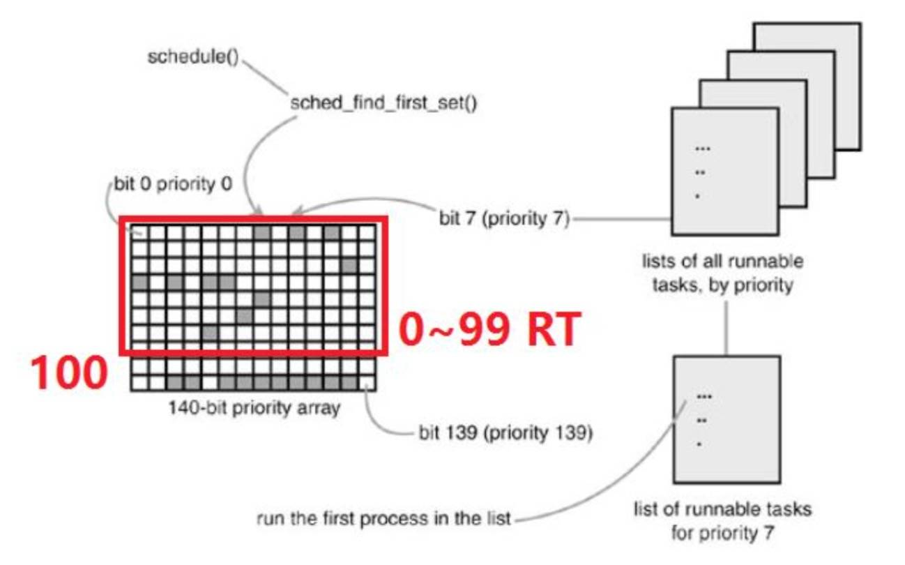
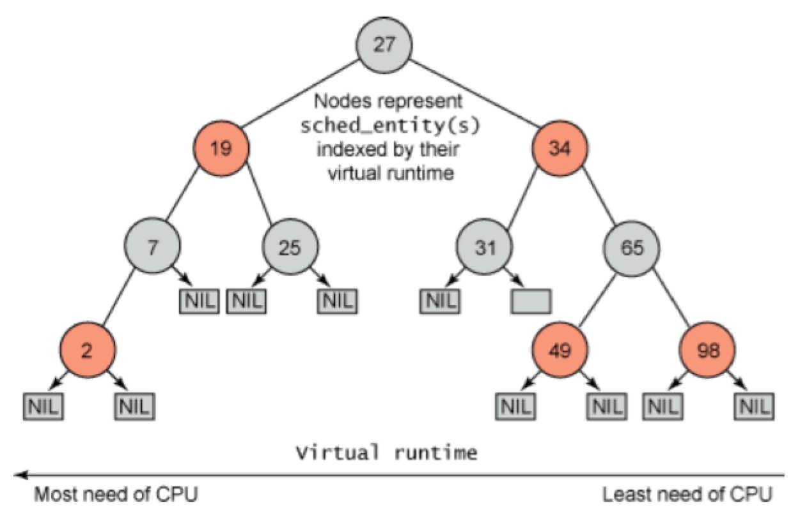
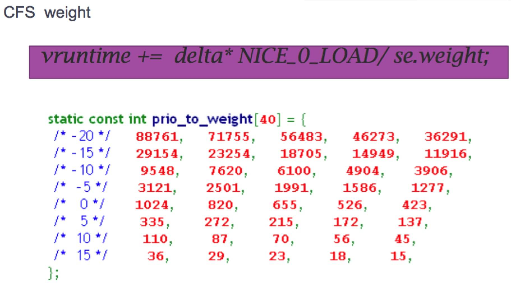

本节主要介绍进程的调度器，设计的目标：吞吐和响应，轮流让其他进程获取CPU资源。

### 进程调度机制的架构
操作系统通过中断机制，来周期性地触发调度算法进行进程的切换。

* rq: 可运行队列，每个CPU对应一个，包含自旋锁，进程数量，用于公平调度的CFS结构体，当前正在运行的进程描述符。
* cfs_rq: cfs调度的运行队列信息，包含红黑色的根节点，正在运行的进程指针，用于负载均衡的叶子队列等。
* sched_entity: 调度实体，包含负载权重值，对应红黑树节点，虚拟运行时vruntime等。
* sched_class: 调度算法抽象成的调度类，包含一组通用的调度操作接口，将接口和实现分离。


schedule函数的流程包括：

1、关闭内核抢占，标识cpu状态。通知RCU更新状态，关闭本地终端，获取所要保护的运行队列的自旋锁，为查找可运行进程做准备。<br>
2、检查prev状态，决定是否将进程插入到运行队列，或者从运行队列中删除。<br>
3、task_on_rq_queued(prev) : 将pre进程插入到运行队列的队尾。<br>
4、pick_next_task : 选取下一个将要执行的进程。<br>
5、context_switch(rq, prev, next) 进行进程上下文切换。<br>

### CPU/IO消耗型进程

吞吐 vs. 响应

* 响应：最小化某个任务的响应时间，哪怕牺牲其他的任务为代价。
* 吞吐：全局视野，整个系统的workload被最大化处理。
* 
任何操作系统的调度器设计只追求2个目标：吞吐率大和延迟低。这2个目标有点类似零和游戏，因为吞吐率要大，势必要把更多的时间放在做真实的有用功，而不是把时间浪费在频繁的进程上下文切换；而延迟要低，势必要求优先级高的进程可以随时抢占进来，打断别人，强行插队。但是，抢占会引起上下文切换，上下文切换的时间本身对吞吐率来讲，是一个消耗，这个消耗可以低到2us或者更低（这看起来没什么？），但是上下文切换更大的消耗不是切换本身，而是切换会引起大量的cache miss。你明明weibo跑的很爽，现在切过去微信，那么CPU的cache是不太容易命中微信的。

操作系统中估算"上下文切换"对吞吐能力影响时，不是计算上下文切换本身，而是在CPU 高速cache中的miss。一旦从一个进程切到另一个进程，会造成比较多的cache miss，从而影响吞吐能力。

在内核编译的时候，Kernel Features ---> Preemption Model选项实际上可以让我们编译内核的时候，是倾向于支持吞吐，还是支持响应

preemption model：选择内核的抢占模型，影响调度算法<br>
1、No Forced Preemption （Server）： 不强制抢占，更在意吞吐，支撑比较大的连接等。<br>
2、Voluntary kernel preemption (Desktop)： 内核不能抢占。<br>
3、Preemtible Kernel（low-latency desktop）： 内核都可以抢占，更在意响应，滑动触摸屏等操作需要立刻响应。

I/O消耗型 vs. CPU消耗型

* IO bound： CPU利用率低，进程的运行效率主要受限于I/O速度；
* tips: IO 消耗型对拿到CPU(延迟)比较敏感，应该被优先调度。一般需要CPU的响应速度快，即优先级要求比较高。
* CPU bound： 多数时间花在CPU上面（做运算）；

### 调度算法： 策略 + 优先级
早期2.6调度器：优先级数组 和 Bitmaps

* 0～ 139： 在内核空间， 把整个Linux优先级划分为0～139，数字越小，优先级越高。用户空间设置时，是反过来的。<br>
* 某个优先级有TASK_RUNNING进程，响应bit设置1。<br>
* 调度第一个bitmap设置为1的进程



#### SCHED_FIFO、SCHED_RR

实时（RT）进程调度策略： 0～99采用的RT，100～139是非RT的。

* SCHED_FIFO： 不同优先级按照优先级高的先跑到睡眠，优先级低的再跑；同等优先级先进先出。
* SCHED_RR：不同优先级按照优先级高的先跑到睡眠，优先级低的再跑；同等优先级轮转。


当所有的SCHED_FIFO和SCHED_RR都运行至睡眠态，就开始运行 100～139之间的 普通task_struct。这些进程讲究 nice，

#### SCHED_NORMAL

**非实时进程的调度和动态优先级：**

早期内核2.6的调度器，100对应nice值为 -20，139对应nice值为19。对于普通进程，优先级高不会形成对优先级低的绝对优势，并不会阻塞优先级低的进程拿到时间片。<br>
普通进程在不同优先级之间进行轮转，nice值越高，优先级越低。此时优先级的具体作用是：

1、时间片。优先级高的进程可以得到更多时间片。<br>
2、抢占。从睡眠状态到醒来，可以优先去抢占优先级低的进程。<br>
**Linux根据睡眠情况，动态奖励和惩罚。** 越睡，优先级越高。想让CPU消耗型进程和IO消耗型进程竞争时，IO消耗型的进程可以竞争过CPU消耗型。

#### rt的门限
Linux内核在period的时间里RT最多只能跑runtime的时间。<br>
在参数 /proc/sys/kernel/sched_rt_period_us 和 /proc/sys/kernel/sched_rt_runtime_us 中设置。单位：微秒。

#### CFS 完全公平调度
后期，Linux对普通进程调度，提供了 完全公平调度算法，每次都会调vruntime最小的进程调度。

红黑树，左边节点小于右边节点的值，运行到目前为止 （vruntime最小）的进程，同时考虑了CPU/IO和nice。





vruntime: virtual runtime，＝ pruntime/weight 权重* 系数。

随着时间运行，分子pruntime变大，vruntime也就变大，优先级变低。喜欢睡眠、IO消耗型的进程，分子小。nice值低的，分母大。但是RT的进程，优先级高于所有普通的进程。

红黑树实现的CFS，用分子pruntime来照顾 睡眠情况，用分母来照顾nice值。

当进程里fork了多个线程，每个线程的 调度策略都可以不同，优先级可以不同。原因显然。

#### 工具 chrt 和 renice

```c
#include <unistd.h>
#include <stdio.h>
#include <pthread.h>
#include <sys/types.h>

void *thread_fun(void *param)
{
    printf("thread pid:%d, tid:%lu\n", getpid(), pthread_self());
    while (1) ;
    return NULL;
}

int main(void)
{
    pthread_t tid1, tid2;
    int ret;
    printf("main pid:%d, tid:%lu\n", getpid(), pthread_self());
    ret = pthread_create(&tid1, NULL, thread_fun, NULL);
    if (ret == -1) {
        perror("cannot create new thread");
        return 1;
    }
    ret = pthread_create(&tid2, NULL, thread_fun, NULL);
    if (ret == -1) {
        perror("cannot create new thread");
        return 1;
    }
    if (pthread_join(tid1, NULL) != 0) {
        perror("call pthread_join function fail");
        return 1;
    }
    if (pthread_join(tid2, NULL) != 0) {
        perror("call pthread_join function fail");
        return 1;
    }
    return 0;
}

1.编译two-loops.c, gcc two-loops.c -pthread，运行两份
root@whale:~/develop$ gcc two-loops.c -pthread
root@whale:~/develop$ ./a.out &
[1] 13682
root@whale:~/develop$ main pid:13682, tid:3075434240
thread pid:13682, tid:3067038528
thread pid:13682, tid:3075431232

root@whale:~/develop$ ./a.out &
[2] 13685
root@whale:~/develop$
main pid:13685, tid:3075925760
thread pid:13685, tid:3067530048
thread pid:13685, tid:3075922752 

### top命令观察CPU利用率：
    13682 root   20   0   18684    616    552 S  98.4  0.0   1:12.09 a.out
    13685  root    20   0   18684    644    580 S  98.1  0.0   1:07.32 a.out  
    
### renice其中之一，再观察CPU利用率
    
    sudo renice -n -5 -g 13682

      PID USER      PR  NI    VIRT    RES    SHR S  %CPU %MEM     TIME+ COMMAND
    13682  root    15  -5   18684    616    552 S 147.4  0.0   4:52.73 a.out
    13685  root     20   0   18684    644    580 S  48.6  0.0   4:12.77 a.out
    
killall a.out

2.编译two-loops.c, gcc two-loops.c -pthread，运行一份
top发现其CPU利用率接近200%
-f：把它的所有线程设置为SCHED_FIFO
-a : 所有线程

  chrt -f -a -p 50 进程PID
  
再观察它的CPU利用率

答：CPU利用率会下降，rt的限制，1s中只能占0.95。
此时虽然CPU使用率下降，但是服务器的响应更慢了。因为鼠标等应用的优先级没有a.out 这个进程的优先级高。

```
