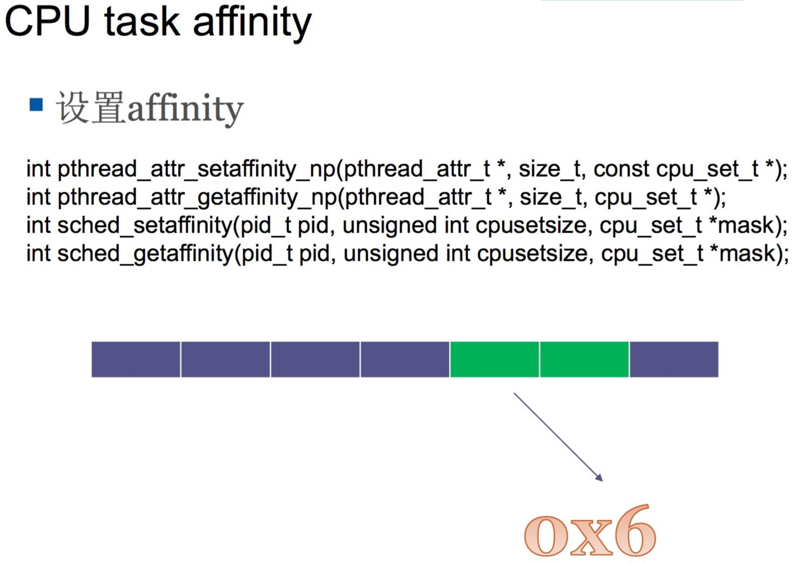
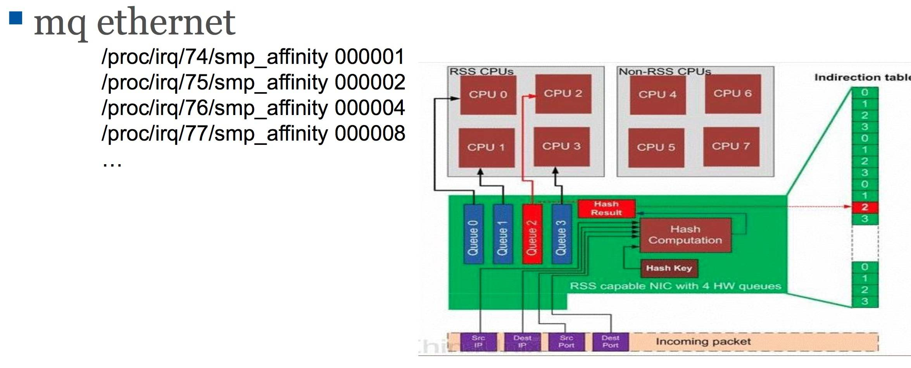
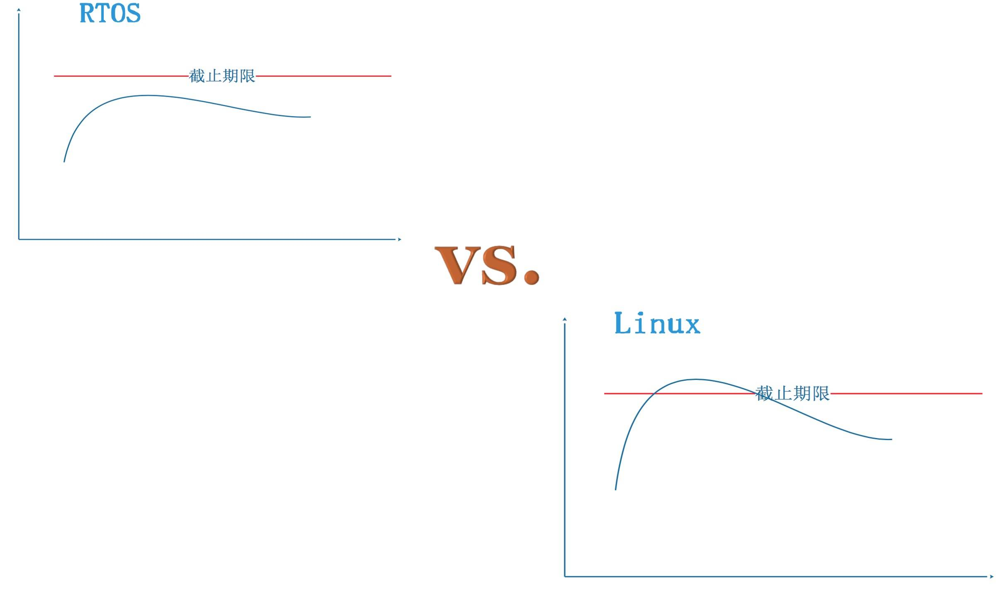
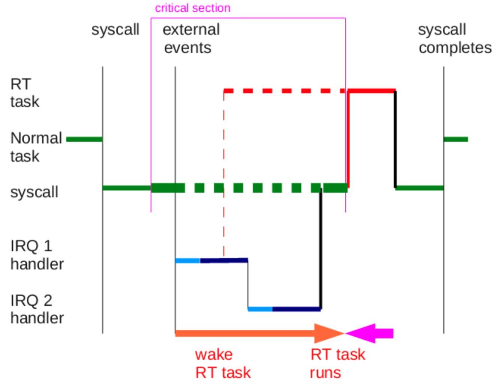
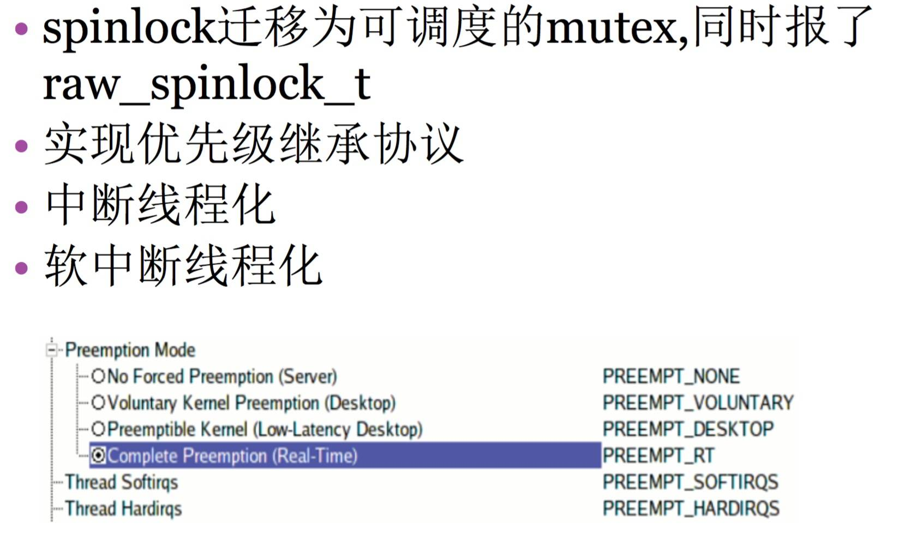

延续（三）中，调度器的其他内容：关于多核、分群、硬实时

### 多核下的负载均衡
Linux 每个CPU可能有多个操作线程，每个核均运行的调度算法是 SCHED_FIFO, SCHED_RR，SCHED_NORMAL(CFS)等，每个核都“以劳动为乐”。

tips: 旧的调度算法是通过+/- 5 nice值，来照顾IO型，惩罚CPU型。新的进程调度算法CFS，会根据ptime/nice值进行红黑树匹配。

```c
#include <stdio.h>
#include <pthread.h>
#include <sys/types.h>

void *thread_fun(void *param)
{
    printf("thread pid:%d, tid:%lu\n", getpid(), pthread_self());
    while (1) ;
    return NULL;
}

int main(void)
{
    pthread_t tid1, tid2;
    int ret;
    printf("main pid:%d, tid:%lu\n", getpid(), pthread_self());
    ret = pthread_create(&tid1, NULL, thread_fun, NULL);
    if (ret == -1) {
        perror("cannot create new thread");
        return 1;
    }
    ret = pthread_create(&tid2, NULL, thread_fun, NULL);
    if (ret == -1) {
        perror("cannot create new thread");
        return 1;
    }
    if (pthread_join(tid1, NULL) != 0) {
        perror("call pthread_join function fail");
        return 1;
    }
    if (pthread_join(tid2, NULL) != 0) {
        perror("call pthread_join function fail");
        return 1;
    }
    return 0;
}

1.编译two-loops.c, gcc two-loops.c -pthread，运行:
$ time ./a.out 
main pid:14958, tid:3075917568
thread pid:14958, tid:3067521856
thread pid:14958, tid:3075914560
^C

real	1m10.050s
user	2m20.016s
sys	0m0.004s 

* 我们得到时间分布比例，理解2个死循环被均分到2个core。
* (user+sys)/2=real ，原因：两个线程被Linux自动分配到两个核上，但是两个线程可能随机分配到任意CPU上运行。
```
* RT进程（task_struct）： 保证N个优先级最高的RT分布到N个核
pull_rt_task()<br>
push_rt_task()

RT的进程，更多强调的是实时性，因为优先级大于Normal 进程。例如，4核CPU，有8个RT的进程，会优先找其中4个优先级最高的让他们运行到4个核上。

* 普通进程：
周期性负载均衡： 当操作系统的时钟节拍来临，会查这个核是否空闲，旁边一个核是否忙，当旁边的核忙到一定程度，会自动从旁边较忙的CPU核上，pull task过来。<br>
IDLE时负载均衡： 当CPU IDLE为0，会从旁边的CPU核上pull task。<br>
fork和exec时负载均衡：fork时会创建一个新的task_struct，会把这个task_struct放在最空闲的核上运行。<br>
总结：每个核通过push/pull task来实现任务的负载均衡。所以，Linux上运行的多线程，可能会“动态”的出现在各个不同的CPU核上。

### 设置 CPU task affinity
程序员通过设置 affinity，即设置某个线程跟哪个CPU更亲和。<br>
内核API提供了两个系统调用，让用户可以修改位掩码或查看当前的位掩码。<br>
而该位掩码 , 正是对应 进程task_struct数据结构中的cpus_allowed属性，与cpu的每个逻辑核心一一对应。



上图 np代表 none posix，比如电脑有7个核，但线程只想在第1、2个核上运行。就把cpu_set_t设置为 0x6，代表 110。如果线程只想在第2个核上，就设置为 0x4。

还可以通过 taskset工具 设置进程的线程在哪个CPU上跑。

```
1. 编译two-loops.c, gcc two-loops.c -pthread，运行一份
top发现其CPU利用率接近200%

把它的所有线程affinity设置为01, 02, 03后分辨来看看CPU利用率

 taskset -a -p 02 进程PID
 taskset -a -p 01 进程PID
 taskset -a -p 03 进程PID
 
前两次设置后，a.out CPU利用率应该接近100%，最后一次接近200%

03代表，第1个或第2个CPU核上运行。
-a 代表 进程下的所有线程。

运行结果：前两次，a.out程序CPU的使用率均为100%，第3次，a.out程序CPU的使用率为200%。
```

### 中断负载均衡、RPS软中断负载均衡
IRQ affinity

中断也可以负载均衡，Linux每个中断号下面smp_affinity。

* 分配IRQ到某个CPU
[root@boss ~]# echo 01 > /proc/irq/145/smp_affinity<br>
[root@boss ~]# cat /proc/irq/145/smp_affinity<br>
00000001



比如上图，有个网卡有4个收发队列，分别是 74，75，76，77。把4个网卡收发队列的中断分别设置为01，02，04，08，那么这个网卡4个队列的中断就被均分到4个核上。

但是有些中断不能被负载均衡。比如，一张网卡只有1个队列，8个核。队列上的中断就发到1个核上。网卡中断里，CPU0收到一个中断irq之后，如果在这个irq中调用了soft irq，那么这个soft irq也会运行在CPU0。因为CPU0上中断中调度的软中断，也是会运行在CPU0上。那么这个核上 ，中断的负载和 软中断的负载 均很重，因为TCP/IP协议栈的处理，都丢到软中断中，此时网卡的吞吐率肯定上不来。

此时，出现了RPS补丁，实现 多核间的softIRQ 负载均衡

* RPS将包处理负载均衡到多个CPU

[root@whale~]# echo fffe > /sys/class/net/eth1/queues/rx-0/rps_cpus<br>
fffe<br>
[root@whale~]# watch -d "cat /proc/softirqs |grep NET_RX"

每个网卡的队列下面，均有一个文件 rps_cpus， 如果echo fffe到这个文件，就会让某个核上的软中断，负载均衡到0～15个核上。一般来说，CPU0上收到的中断，软中断都会在CPU0。但是CPU0会把收到中断的软中断派发到其他核上，这样其他核也可以处理TCP/IP收到的包处理的工作。

### cgroups和CPU资源分群分配
比如，有两个用户在OS上执行编译程序，用户A创建1000个线程，用户B创建32个线程。如果这1010个线程nice值均为0，那么按照CFS的调度算法，用户A可以拿到1000/1032的cpu时间片，用户B只能拿到 32/1032的cpu时间片。

此时，Linux通过分层调度，把某些task_struct 加到cgroup A，另外的task_struct加到cgroup B , cgroup A和B 先按照某个权重进行CPU的分配，再到不同cgroup里面，按照调度算法进行调度。

* 定义不同cgroup CPU分享的share --> cpu.shares
* 定义某个cgroup在某个周期里面最多跑多久 --> cpu.cfs_quota_us 和 cpu.cfs_period_us

cpu.cfs_period_us：默认100000 us= 100ms<br>
cpu.cfs_quota_us：<br>

demo

```
3.编译two-loops.c, gcc two-loops.c -pthread，运行三份
用top观察CPU利用率，大概各自66%。
创建A,B两个cgroup

  root@whale:/sys/fs/cgroup/cpu$ sudo mkdir A
  root@whale:/sys/fs/cgroup/cpu$ sudo mkdir B

把3个a.out中的2个加到A，1个加到B。

此时，发现两个cgroup下的cpu.shares 相同，均为1024.

然后把两个进程下的所有线程都加入到cgroupA，如果只想加某个线程，则echo pid到tasks文件。

  root@whale:/sys/fs/cgroup/cpu/A$ sudo sh -c 'echo 14995 > cgroup.procs'
  root@whale:/sys/fs/cgroup/cpu/A$ sudo sh -c 'echo 14998 > cgroup.procs'
  root@whale:/sys/fs/cgroup/cpu/A$ cd ..
  root@whale:/sys/fs/cgroup/cpu$ cd B/
  root@whale:/sys/fs/cgroup/cpu/B$ sudo sh -c 'echo 15001 > cgroup.procs'

这次发现3个a.out的CPU利用率大概是50%, 50%, 100%。

杀掉第2个和第3个a.out，然后调整cgroup A的quota，观察14995的CPU利用率变化

  root@whale:/sys/fs/cgroup/cpu/B$ kill 14998
  root@whale:/sys/fs/cgroup/cpu/B$ kill 15001


设置A group的quota为20ms：

  root@whale:/sys/fs/cgroup/cpu/A$ sudo sh -c 'echo 20000 > cpu.cfs_quota_us'
  
设置A group的quota为40ms：

  root@whale:/sys/fs/cgroup/cpu/A$ sudo sh -c 'echo 40000 > cpu.cfs_quota_us'
  
  
以上各自情况，用top观察a.out CPU利用率。

  当设置为 20000 us = 20ms , CPU利用率立即变为20%；  当设置为 40000 us = 40ms ,CPU利用率立即变为40%
  当设置为 120000 us 时， CPU利用率立即变为120%。quota可以大于period，因为此时 CPU为多核，100ms里面可以运行200ms，该值最大为CPU核数* period。
```

### Android和Docker对cgroup的采用
* apps, bg_non_interactive
安卓把应用分为app group ，和 bg_non_interactive 背景非交互的group，<br>
并且bg_non_interactive的group权重非常低，这样做的好处是，让桌面运行的程序可以更大程度的抢到CPU。<br>

```
Shares：
apps: cpu.shares = 1024
bg_non_interactive: cpu.shares = 52

Quota:
apps:
cpu.rt_period_us: 1000000 cpu.rt_runtime_us: 800000
bg_non_interactive: 
cpu.rt_period_us: 1000000 cpu.rt_runtime_us: 700000
```

* docker run时也可以指定 --cpu-quota 、--cpu-period、 --cpu-shares参数

Linux 通过Cgroup控制多个容器在运行时，如何分享CPU。这些会在之后的Cgroups详解中详细阐述。

比如说A容器配置的--cpu-period=100000 --cpu-quota=50000，那么A容器就可以最多使用50%个CPU资源，如果配置的--cpu-quota=200000，那就可以使用200%个CPU资源。所有对采集到的CPU used的绝对值没有意义，还需要参考上限。还是这个例子--cpu-period=100000 --cpu-quota=50000，如果容器试图在0.1秒内使用超过0.05秒，则throttled就会触发，所有throttled的count和time是衡量CPU是否达到瓶颈的最直观指标。

### Linux为什么不是硬实时的
如何理解硬实时？并不代表越快越好，硬实时最主要的意思是：可预期。



如上图，在一个硬实时操作系统中，当唤醒一个高优先级的RT任务，从“你唤醒它”到“它可以被调度”的这段时间，是不会超过截止期限的。
```
4.cyclictest -p 99 -t1 -n
观察min, max, act, avg时间，分析hard realtime问题
加到系统负载，运行一些硬盘访问，狂收发包的程序，观察cyclictest的max变化
延迟具有不确定性，最大值可能随着load改变而改变。
```

Kernel 越发支持抢占


Linux为什么不是硬实时？

Linux运行时，CPU时间主要花在“四类区间”上，包括中断、软中断、进程上下文（spin_lock），进程上下文（可调度）。<br>
其中 进程上下文陷入内核拿到spin_lock，此时拿到spin_lock的CPU核上的调度器就会被关掉，该核就无法进行调度。<br>

程序运行在只有 进程上下文（可调度）这个区间可以调度，其他区间都不能被调度。

中断是指 进程收到硬件的中断信号，就算在中断里唤醒一个高优先级的RT，也无法调度。<br>
软中断和中断的唯一区别是，软中断中可以再中断，但中断中不能再中断。Linux 2.6.32之后完全不允许中断嵌套。软中断里唤醒一个高优先级的RT，也无法调度。<br>

如下图，一个绿色的普通进程在T1时刻持有spin_lock进入一个critical section（该核调度被关），绿色进程T2时刻被中断打断，而后T3时刻IRQ1里面唤醒了红色的RT进程（如果是硬实时RTOS，这个时候RT进程应该能抢入），之后IRQ1后又执行了IRQ2，到T4时刻IRQ1和IRQ2都结束了，红色RT进程仍然不能执行（因为绿色进程还在spin_lock里面），直到T5时刻，普通进程释放spin_lock后，红色RT进程才抢入。从T3到T5要多久，鬼都不知道，这样就无法满足硬实时系统的“可预期”延迟性，因此Linux不是硬实时操作系统。



### preempt-rt对Linux实时性的改造



Linux的preempt-rt补丁试图把中断、软中断线程化，变成可以被抢占的区间，而把会关本核调度器的spin_lock替换为可以调度的mutex，它实现了在T3时刻唤醒RT进程的时刻，RT进程可以立即抢占调度进入的目标，避免了T3-T5之间延迟的非确定性。
