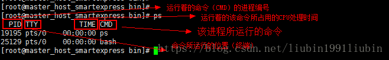
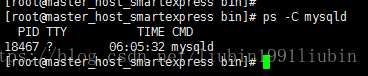
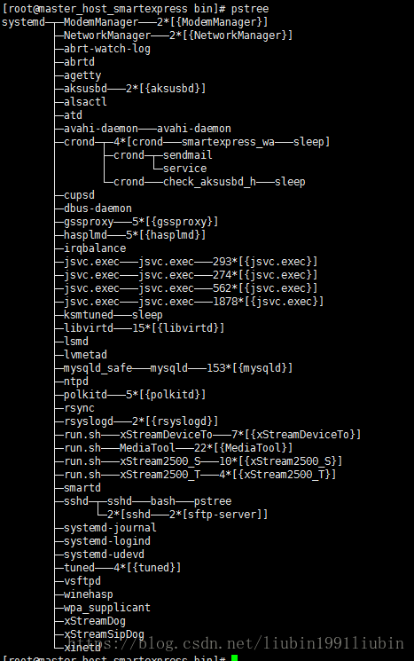
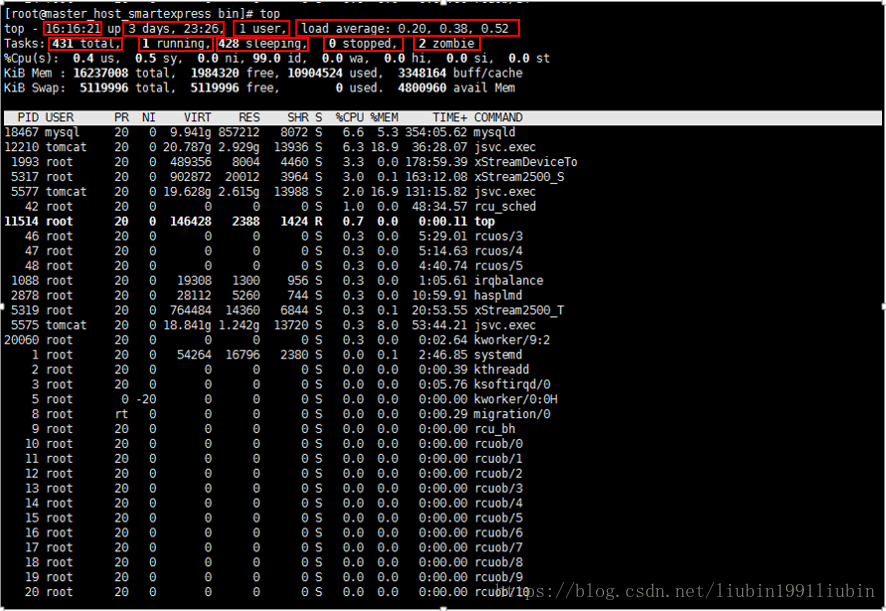
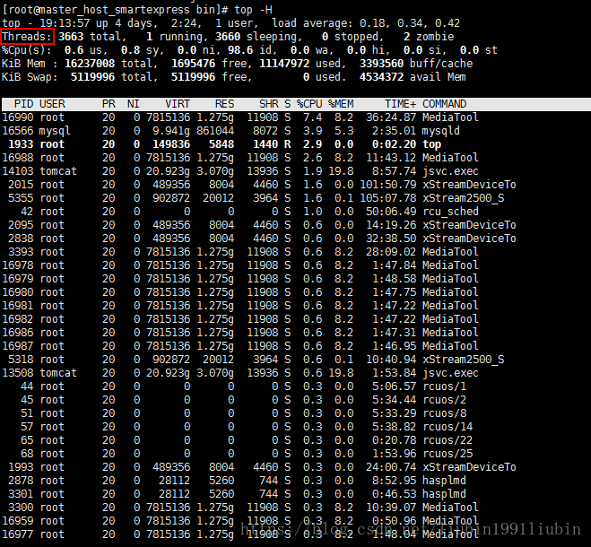
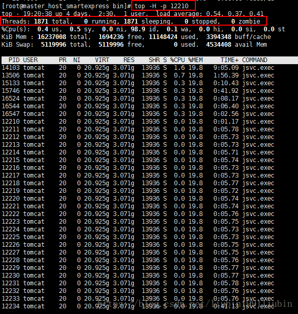
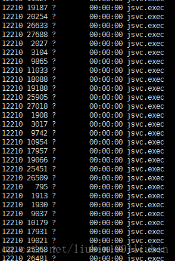
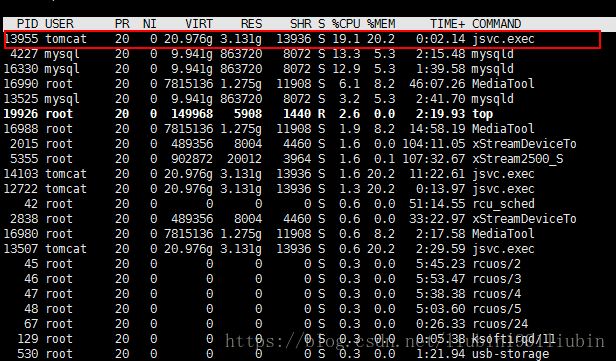
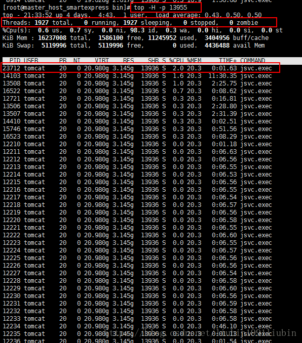
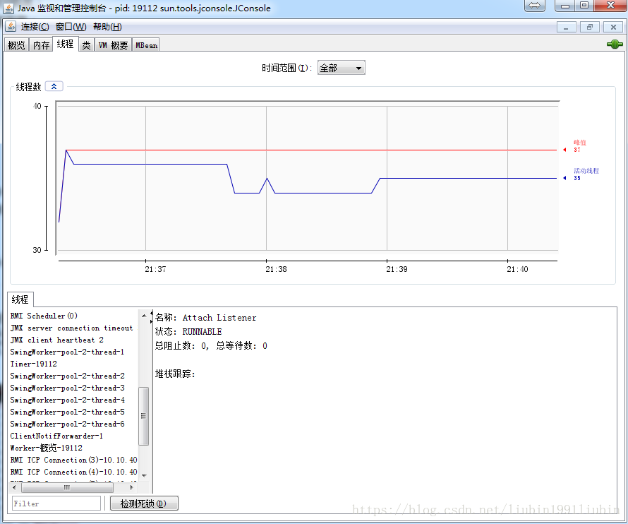

## Linux进程查看命令
### PS命令
- 1.不带参数的ps使用

	
	
- 2.显示所有的当前进程

	```
	ps –ax  -a 代表 all。同时加上x参数会显示没有控制终端的进程。
	ps -ax | less 可以结合less命令和管道来使用以方便查看。
	```
- 3.通过cpu和内存使用来过滤进程

	```
	ps -aux | less
	默认的结果集是未排好序的。可以通过 –sort命令来排序。
	根据 CPU 使用来升序排序
	ps -aux --sort -pcpu | less
	根据 内存使用 来升序排序
	ps -aux --sort -pmem | less
	我们也可以将它们合并到一个命令，并通过管道显示前10个结果：
	ps -aux --sort -pcpu,+pmem | head -n 10

	```
- 4.通过进程名和PID过滤

	```
	ps -f -C [进程名]
	ps -f -C mysqld
	```
	
	
	
- 5.树形显示进程

	
	
- 6.查看所有关于java的进程

	```
	ps -ef | grep java
	```
	
### top命令
- 1.top命令经常用来监控Linux的系统状况，比如cpu、内存的使用。




- 2.第一行：

	```
	第一块：当前系统时间
	第二块：系统已经运行了3天23小时26分
	第三块：当前有1个用户登录系统
	第四块：load average后面的三个数分别是1分钟、5分钟、15分钟的负载情况。load average数据是每隔5秒钟检查一次活跃的进程数，然后按特定算法计算		出的数值。如果这个数除以逻辑CPU的数量，结果高于5的时候就表明系统在超负荷运转了。
	```
	
- 3.第二行：

	```
	第一块：系统现在有431个进程
	第二块：有一个进程处于运行状态
	第三块：428个进程处于休眠状态
	第四块：0个进程处于stopped状态
	第五块：2个进程处于zombie状态
	```
	
- 4.第三行：cpu状态

	```
	0.4 us — 用户空间占用CPU的百分比。
	0.5 sy — 内核空间占用CPU的百分比。
	0.0 ni — 改变过优先级的进程占用CPU的百分比
	99.0 id — 空闲CPU百分比
	0.0 wa — IO等待占用CPU的百分比
	0.0 hi — 硬中断（Hardware IRQ）占用CPU的百分比
	0.0 si — 软中断（Software Interrupts）占用CPU的百分比
	用户空间就是用户进程所在的内存区域，相对的，系统空间就是操作系统占据的内存区域。用户进程和系统进程的所有数据都在内存中。
	```
	
	

- 5.第四行：内存状态（单位k）

	```
	16237008 total — 物理内存总量（16.2GB）
	10904524 used — 使用中的内存总量（10.9GB）
	1984320  free — 空闲内存总量（2.0G）
	3348164  buffers — 缓存的内存量 （3.3G）
	```


- 6.第五行：swap交换分区
	
	```
	5119996 total — 交换区总量（5GB）
	0       used — 使用的交换区总量（0）
	5119996 free — 空闲交换区总量（5GB）
	4800960 cached — 缓冲的交换区总量（4.8GB）
	```

	可用内存数的近似的计算公式：第四行的free + 第四行的buffers + 第五行的cached。
我们最关心的内存监控是第五行swap（类似于虚拟内存）交换分区的used，如果这个数值在不断的变化，说明内核在不断进行内存和swap的数据交换，这是可以判定服务器的内存不够用了。

- 7.第六行：各进程（任务）的状态监控

	```
	PID — 进程id
	USER — 进程所有者
	PR — 进程优先级
	NI — nice值。负值表示高优先级，正值表示低优先级
	VIRT — 进程使用的虚拟内存总量，单位kb。VIRT=SWAP+RES
	RES — 进程使用的、未被换出的物理内存大小，单位kb。RES=CODE+DATA
	SHR — 共享内存大小，单位kb
	S — 进程状态。D=不可中断的睡眠状态 R=运行 S=睡眠 T=跟踪/停止 Z=僵尸进程
	%CPU — 上次更新到现在的CPU时间占用百分比
	%MEM — 进程使用的物理内存百分比
	TIME+ — 进程使用的CPU时间总计，单位1/100秒
	COMMAND — 进程名称（命令名/命令行）
	```

## 线程查看命令
### top –H（列出所有的线程）
	

	
### 让top输出某个特定进程[pid]并检查该进程内运行的线程状况

	```
	让top输出某个特定进程[pid]并检查该进程内运行的线程状况：
	top -H -p [pid]

	```


	
### 查看由进程号为[pid]的进程创建的所有线程

	```
	ps -T -p [pid]
	```



## Java线程监控分析（一般流程）
### 1.先用top命令找出占用资源比较多的java进程id


	
我们以第一个进程为例，对该进程的所有线程进行监控
### 2.查看相关进程的所有线程


	
接下来我们以第一个线程为例，对其进行监控分析
### 3.然后借助JVM的 jconsole.exe  工具对相应线程进行具体分析



jconsole具体使用细节可以参考[这篇文章](https://blog.csdn.net/ithomer/article/details/9923311)，这里就不做过多的介绍了。
